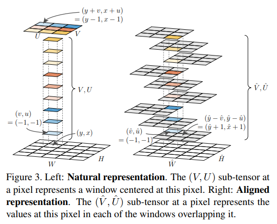
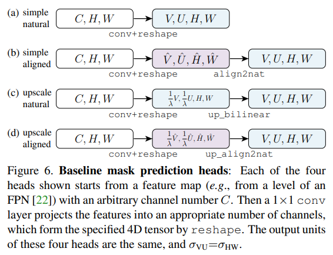
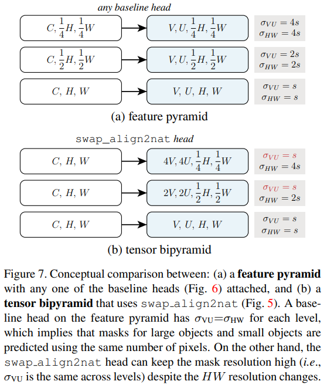
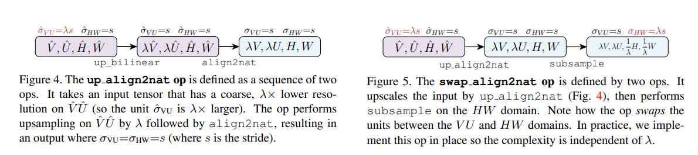
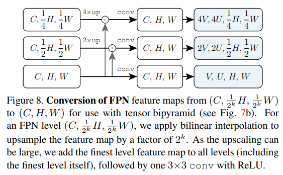

time: 20191101
pdf_source: https://arxiv.org/pdf/1903.12174.pdf
code_source: https://github.com/CaoWGG/TensorMask
short_title: TensorMask-Instance Seg
# TensorMask: A Foundation for Dense Object Segmentation

这篇文章提出了one-stage instance segmentation的算法。传统来说，state of the art 的instance segmentation的做法基本上是先进行object detection得到2D框，然后在框内进行Semantic Segmentation。这样的two-stage甚至是Multi-stage的做法(object detection可能就two-stage).还有一种做法是先生成label pixel然后进行聚类。

本文核心思路就是将整个问题转换为一个四维张量$(V, U, H, W)$的回归or分类问题。对每一个坐标点$(h, w)$对应一个矩阵$(V, U)$，设$\alpha$为单位转换比例，则矩阵中的元素$(v, u)$指代原图$(h + \alpha v, w + \alpha u)$是mask的概率，或其他参数。这样整个网络的训练目标就和一个[SSD](../object_detection_2D/SSD&#32;Single&#32;Shot&#32;MultiBox&#32;Detector.md)或者说Yolo差不多了,这同时又和DeepMask不同，显式地表达$U, V$坐标，并为此适配更多的运算方式.

## 主要表达方式的定义

### Natural Representation

表达为$(V, U, H, W)$,对于一个4D$(V,U,H,W)$的张量，它在$(v, u, y, x)$的值代表在一个中心在$(y,x)$的大小为$\alpha V \times \alpha U$窗口的点$(y + \alpha v, x + \alpha u)$的mask值。

### Aligned Representation

对一个4D$(\hat V, \hat U, \hat H, \hat W)$的张量，它在$(\hat v, \hat u, \hat y, \hat x)$的值代表在一个中心在$(\hat y, \hat x)$的大小为$\hat\alpha \hat V \times \hat\alpha \hat U$窗口的点$(\hat y - \hat\alpha \hat v, \hat x - \hat\alpha \hat u)$的mask值。

关键的理解是在坐标$(\hat y, \hat x)$上的子矩阵$(\hat V, \hat U)$，上的所有值都是在描述这个坐标$(\hat y, \hat x)$的，所以称为为$aligned$

两者的定义可以由这张图显示

两者的转换：

$$
\begin{aligned}
  \mathcal{F}(v, u, y, x) &= \hat\mathcal{F}(v, u, y+\alpha v, x + \alpha u) \\
  \hat\mathcal{F}(\hat v, \hat u, \hat y, \hat x)
  &=
  \mathcal{F}(\hat v, \hat u, \hat y - \alpha\hat v, \hat x- \alpha\hat u)
\end{aligned}
$$

## 网络结构, 输出Head, 细节结构, 训练细节

网络采用FPN输出多个不同尺度的feature maps,形状$(C, \frac{1}{2^k} H, \frac{1}{2^k}W$

### 输出Head

本文比较了5种输出Head. 4种是baseline,

区别在于不同Scale上的图，第五个head会输出相同精确度的网格

其中的细节运算如图

这些细节运算本质上都是坐标变换以及采样

### 训练细节

对FPN的微调

Label分配

1. Fully Contain
2. center of m is close to center of windows
3. unique