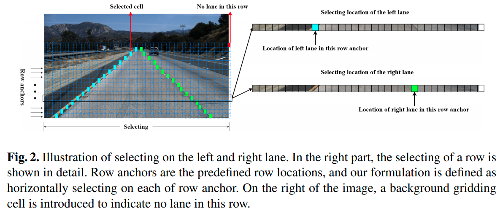
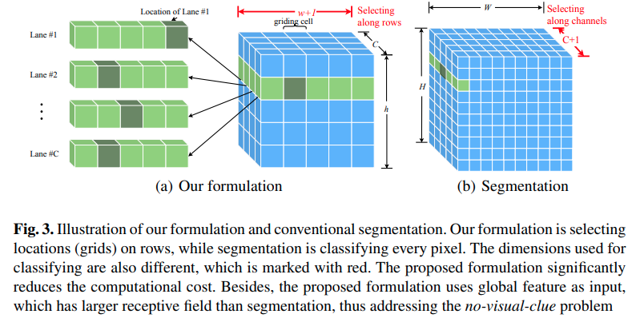
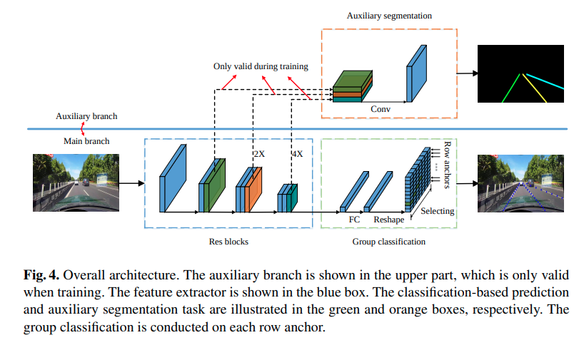

time: 20200709
pdf_source: https://arxiv.org/pdf/2004.11757.pdf
code_source: https://github.com/cfzd/Ultra-Fast-Lane-Detection

# Ultra Fast Structure-aware Deep Lane Detection

这篇paper使用新的思路进行道路线的检测，达到了300+FPS.

## 道路检测问题定义

本文对路线检测的定义是有所不同的，定义为，"基于全局图片特征的row-based selection".或者说在每一个预设定的行上选择行单元。

图中$w$为一行内列anchor的数量。

$$P_{i, j,:}=f^{i j}(X), \text { s.t. } i \in[1, C], j \in[1, h]$$
其中$C$为最大道路线数，$h$为row anchor的数量，每一个lane在一个row-anchor上只有一个分类结果，所以损失loss为：

$$L_{c l s}=\sum_{i=1}^{C} \sum_{j=1}^{h} L_{C E}\left(P_{i, j,:}, T_{i, j, i}\right)$$

## 辅助损失

相邻行之间道路有连续性:
$$L_{s i m}=\sum_{i=1}^{C} \sum_{j=1}^{h-1}\left\|P_{i, j,:}-P_{i, j+1,:}\right\|_{1}$$

相邻道路斜率具有连续性:

$$\begin{aligned}
L_{s h p}=\sum_{i=1}^{C} \sum_{j=1}^{h-2} \| &\left(\operatorname{Loc}_{i, j}-\operatorname{Loc}_{i, j+1}\right) \\
&-\left(\operatorname{Loc}_{i, j+1}-\operatorname{Loc}_{i, j+2}\right) \|_{1}
\end{aligned}$$

由于location位置如果使用一行上的argmax来取的话不可导，所以采用 softmax得到一行每个点的概率后加权平均，这样损失函数就可导了。

## 网络结构

