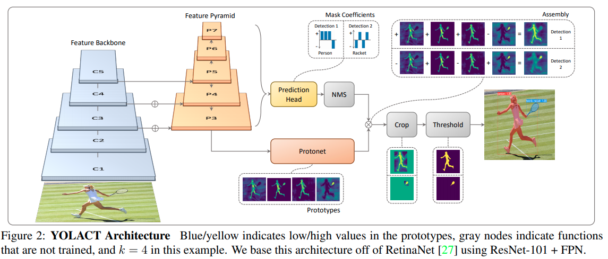
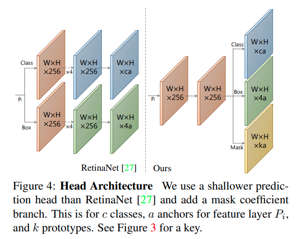
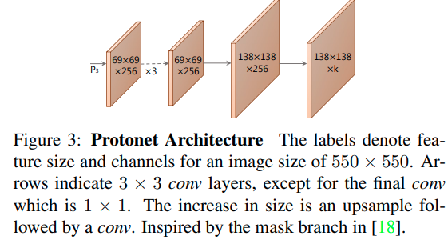

time: 20191212
pdf_source: https://arxiv.org/pdf/1904.02689.pdf
code_source: https://github.com/dbolya/yolact
short_title: YOLOACT
# YOLACT Real-time Instance Segmentation

这篇论文尝试解决的是one stage instance segmentation的问题。本文有成熟的开源代码以及较快的inference速度，值得了解学习。本文主要的两个贡献，一个是提出了YOLOACT，基于prototype mask以及coefficient的解决方式，另一个是FastNMS

## 总体流程

本文的backbone选择了基于ResNet的 Feature Pyramid network,这里有一个基于retina的网络[pytorch实现]，也有一个[魔改过的].

### Prediction head
每一个scale包含三个部分

分别为分类、2D框回归以及mask 参数

### Protonet
这里从P3引出，采用了FCN的方式，作者的理念是，CNN可以产生 spatially coherent的特征，而Fully connected layer便于产生语义特征，因而让FC layers(conv 1*1)产生mask，用FCN产生mask

### 融合

$$
M=\sigma\left(P C^{T}\right)
$$ 

其中 $P: h\times w \times k, C:n\times k$，P代表k个prototype，C代表n个长度为k的nms后的key vector.

整个网络用分类与回归loss端到端训练

## Fast NMS

思路就是允许被删除的bounding box去抑制其他网格，在原版的nms中，box的抑制与iou的计算需要一定迭代计算，这里可以直接并行运算并且用[pytorch API直接快速实现](https://github.com/dbolya/yolact/blob/master/layers/functions/detection.py)，只不过会多suppress一些bbox。

[pytorch实现]:https://github.com/yhenon/pytorch-retinanet
[魔改过的]:https://git.ram-lab.com/yuxuan/retina_net
