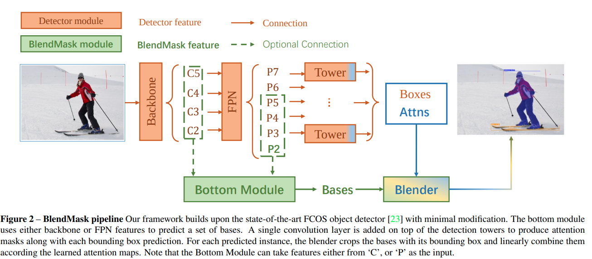
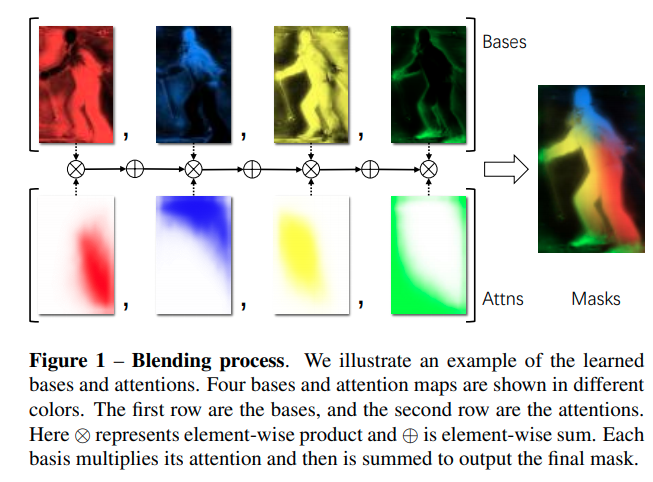

time: 20200311
pdf_source: https://arxiv.org/pdf/2001.00309.pdf
short_title: BlendMask
# BlendMask: Top-Down Meets Bottom-Up for Instance Segmentation

这篇paper从[YOLOACT]出发，进行了多个提升细节。

## 总体pipeline

在[YOLOACT]中，所谓"顶层"detection结果是一系列2D detection的结果，由于需要输出$a$个anchors, 因而输出channel里面有$k\times a$个channels负责给$a$个anchors分别预测$k$个参数，这些参数用来给$k$个attention mask作线性组合。因而每一个mask只能有一个常数。

本文采用了[FCOS]的 anchor-free detection方案，在[FCOS]中，每一个tower只需要输出6个channel来完成2D detection，而有了更多的channel用了预测新的信息，作者这里设置$K \times M \times M$个参数，用来作blending，这里K指的就是mask数量，M指的是参数分辨率。

Bottom Module， 选择DeepLabV3+的decoder.输出$K$个mask.

## Blender Module

作者将Bottom Module的输出，根据顶层detection结果，用RoiPooling取得$K$个$R\times R$的特征图，将顶层输出的$M\times M$个参数interpolate 到$R\times R$，

$$
\mathbf{a}_{d}^{\prime}=\text { interpolate }_{M \times M \rightarrow R \times R}\left(\mathbf{a}_{d}\right), \quad \forall d \in\{1 \ldots D\}
$$

$$
\mathbf{s}_{d}=\operatorname{softmax}\left(\mathbf{a}_{d}^{\prime}\right), \quad \forall d \in\{1 \ldots D\}
$$

最后用点乘与累加，如上图一样叠加起来
$$
\mathbf{m}_{d}=\sum_{k=1}^{K} \mathbf{s}_{d}^{k} \circ \mathbf{r}_{d}^{k}, \quad \forall d \in\{1 \ldots D\}
$$

[YOLOACT]:YOLACT.md
[FCOS]:../object_detection_2D/FCOS.md