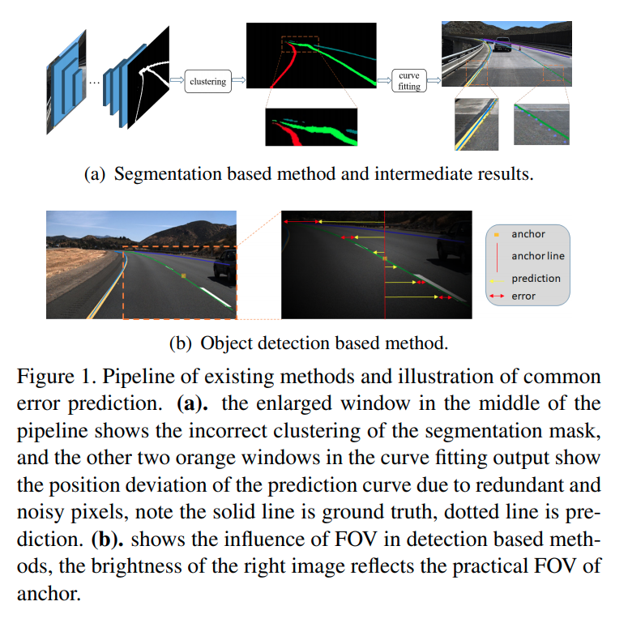
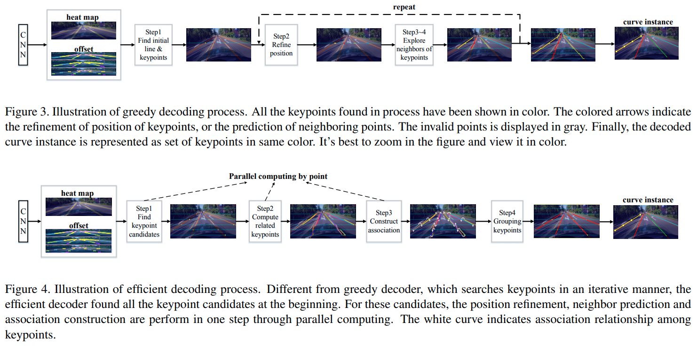
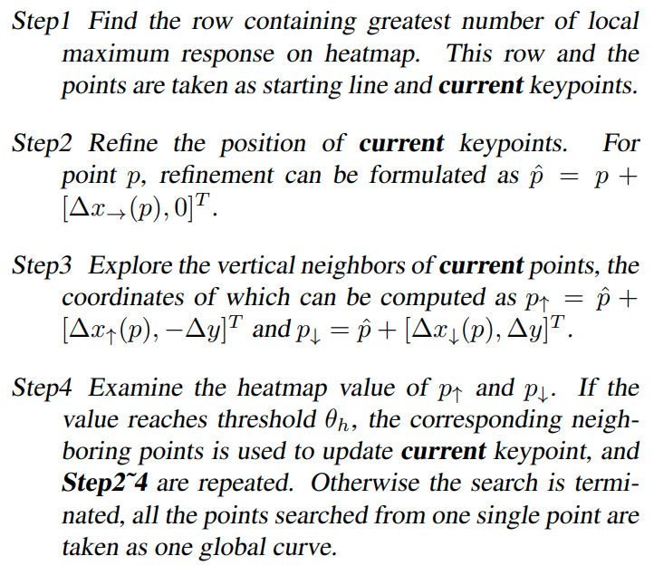

time: 20210601
pdf_source: https://arxiv.org/pdf/2105.13680.pdf

# Focus on Local: Detecting Lane Marker from Bottom Up via Key Point

这篇paper的特点在于将object detection以及pose estimation的一些思路引入了车道线的检测。

