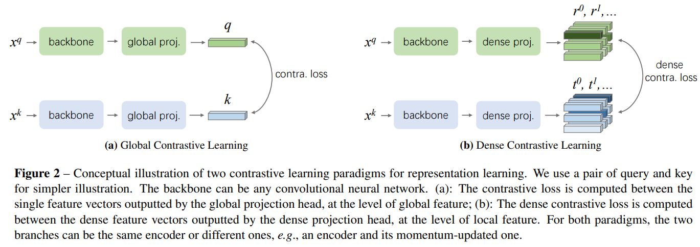
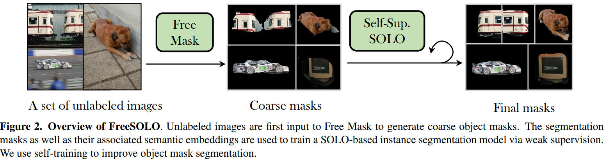
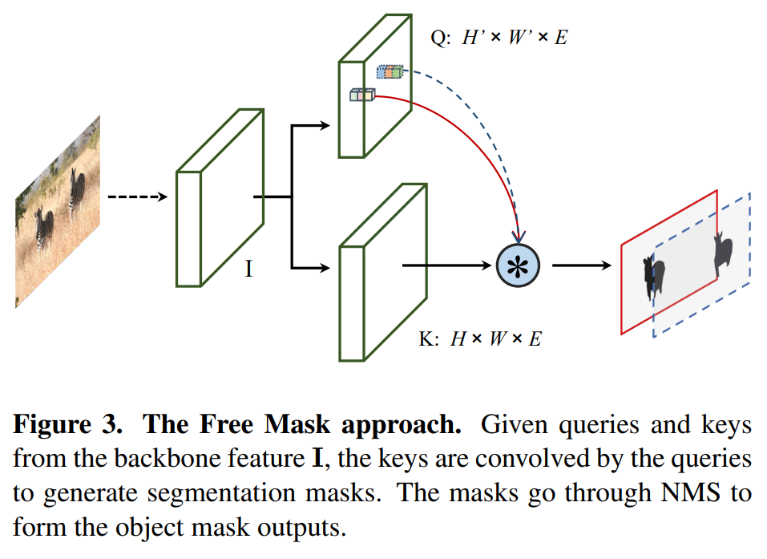

time:20220726
pdf_source: https://arxiv.org/pdf/2202.12181.pdf
code_source: https://github.com/NVlabs/FreeSOLO

# FreeSOLO

这篇paper讨论的任务是使用完全无label的图片数据集，自监督地进行instance segmentation。本文有一个比较清晰的[知乎介绍](https://zhuanlan.zhihu.com/p/472762052). 

这篇paper的主要思路来源于三篇文章。

- SOLO
- DenseCL
- BoxInst

## SOLO

这篇paper在本站有收录 [SOLO](SOLO.md). SOLO是一个稠密预测、稠密监督的instance seg网络，其特征在于把图像空间分解为$S_x, S_y$个小块，每一个小块目标预测一个mask并分类，这一部分有分支Category Branch预测一个$(S_x, S_y, C)$的矩阵完成，另一个分支Mask Branch预测一个 $(H, W, S_x\cdot S_y)$的矩阵，为每一个小块预测$(H,W)$的全局mask.

后来作者提出了很多改进的点，主要集中在处理Mask Branch的稀疏性，

## DenseCL
[pdf](https://openaccess.thecvf.com/content/CVPR2021/papers/Wang_Dense_Contrastive_Learning_for_Self-Supervised_Visual_Pre-Training_CVPR_2021_paper.pdf) 

[知乎](https://zhuanlan.zhihu.com/p/357152388)

DenseCL是基于MoCo的，解决的是为了稠密估计的视觉预训练。MoCo的做法是把整个图片压缩成一个单一特征；contrastive loss中正样本的来源是同一张图不同的数据增强后提取的特征，负样本的来源则是不同图片提取的特征。

DenseCL针对的则是稠密预测，使用纯CNN网路，输出一个稠密的 $(H', W', C)$ 的特征图。contrastive loss中的负样本同来是不同图片提取的特征，但是正样本不只是不同数据增强后的特征全体，作者提出的方案是让同一张图不同增强结果 $x^{q1},x^{q2}$ 分别输出两组$S \cdot S$稠密特征。

然后计算它们的相似度矩阵$S^2 \times S^2$，把每一行和每一列相似度最大的那个值对应的特征作为正样本对。

## BoxInst
[pdf](https://openaccess.thecvf.com/content/CVPR2021/papers/Tian_BoxInst_High-Performance_Instance_Segmentation_With_Box_Annotations_CVPR_2021_paper.pdf)  [code](https://github.com/aim-uofa/AdelaiDet/blob/master/configs/BoxInst/README.md)

这篇paper解决的问题是通过2D bounding boxes的数据弱监督，输出instance segmentation.

BoxInst设计的两个损失。

第一个是要求bounding box的边缘和mask的边缘要一致。这里的做法计算mask在 x/y轴上的max投影，和bounding box的边缘直接计算loss. 这个损失用于控制mask的边界。

第二个是则是利用颜色相近的点应当有相同的特征，两个点根据预测结果，他们在同一类的概率为$P(y_e = 1) = m_{i,j} \cdot m_{k,l} + (1 - m_{i,j}) \cdot (1 - m_{k,l})$框外的一定不是目标点。框内颜色差在阈值内的两个像素要么同时是mask，要么同时不是mask. 从而弱监督地找出mask.

Free SOLO本文则由Free Mask 和 self-supervised SOLO组成。
Free Mask采取与SOLO相当统一的操作。 从图片中提取特征$I$, 把$I$下采样 1/2, 1/4, 1/8 到$Q:(H' \times W' \times E)$, 这个Q与K计算相似性矩阵$H\times W \times (H' \times W')$ 类似于SOLO中的mask branch.

这里采用的backbone则是经过DenseCL训练的backbone，DenseCL backbone正是用相似性矩阵选正样本的，在这方面的属性比较好，可以得到比较高的预训练质量。

输出courase Mask label之后训练一个SOLO.采用的是BoxInst的损失，而投影损失改为Avg而不是Mean.
