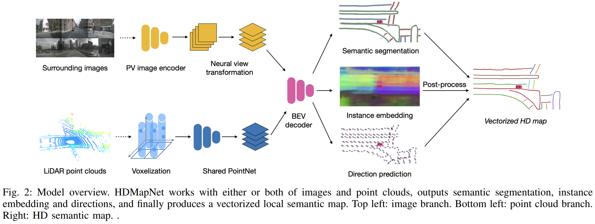

time: 20220506
pdf_source: https://arxiv.org/pdf/2107.06307.pdf
code_source: https://github.com/Tsinghua-MARS-Lab/HDMapNet

# HDMapNet: An Online HD Map Construction and Evaluation Framework

这篇论文尝试解决的是局部HDMap的构建问题.输入是环绕的六个(多个)摄像头,输出是BEV中矢量化的高精地图.

论文与代码中各个部分的做法:

1. PV image encoder 采用同一个[efficientnet backbone](../../Building_Blocks/EfficientNet:_Rethinking_Model_Scaling_for_Convolutional_Neural_Network.md)
2. Neural View Transformer 首先用一个不同摄像头之间不共享的全连接网络将FV映射到每个相机的前面区域的小BEV中.然后根据相机的外参将相机前的小BEV区域的特征,通过旋转和平移转移到以车身为中心的大BEV上. 对不同摄像机在大BEV上的特征图取maxpooling.
3. 激光雷达数据采用PointPillar 网络提取特征并压缩到BEV上.使用torch_scatter后本文的代码更为干净.
4. instance embedding对每一组车道线像素位置上的特征进行计算.计算每一条车道线的特征均值,损失则是自监督的对抗性损失.
5. direction指的是车道线在各个点上的方向,由于前进与后退不区分,所以每个点预测的都是一个$N_d$的矢量,而监督他们的是一个有两个$1$ label的矢量.