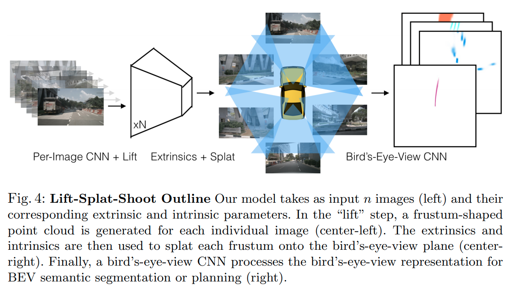
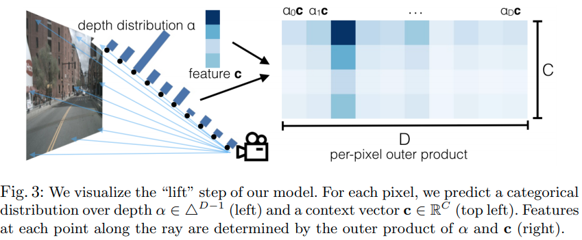

time: 20200924
pdf_source: https://arxiv.org/pdf/2008.05711.pdf
# Lift, Splat, Shoot: Encoding Images From Arbitrary Camera Rigs by Implicitly Unprojecting to 3D

这篇paper的[官方网站](https://nv-tlabs.github.io/lift-splat-shoot/), youtube 视频,视频中提供了不少paper里面没有提及的motivation以及更具体的算法:

<iframe width="1110" height="624" src="https://www.youtube.com/embed/oL5ISk6BnDE" frameborder="0" allow="accelerometer; autoplay; clipboard-write; encrypted-media; gyroscope; picture-in-picture" allowfullscreen></iframe>

这篇paper完成的任务是基于环视摄像头的语义分割+投影到地面+路径规划。

## 结构

主要思路

- 对每一张图片使用CNN提取特征
- 用lift 将图片特征提升为点云
- splat 结合了point-pillar以及[OFT](../../3dDetection/Orthographic_Feature_Transform_3D_detection.md)的思路将多图的点云融合到BEV上
- shoot 进行端到端cost-map learning以及路径规划。

### Lift

输出的结果为$D\cdot H \cdot W$的矩阵，且深度也有一个预测，可以理解为OFT转换中在深度方向有一个加权。

### Splat

这里采用的是类似于 point-pillar的方案，在每一个平面voxel上的所有feature会被融合成当前单元的特征。这里提到了一些模仿OFT的coding 技巧(本人没能看懂，等待其code)

### Shoot: Motion Planning

往前采样K条轨迹,根据 costmap以及 [Neural Motion Planner](http://www.cs.toronto.edu/~wenjie/papers/cvpr19/nmp.pdf)的做法实现。是一个模仿学习的思路。
