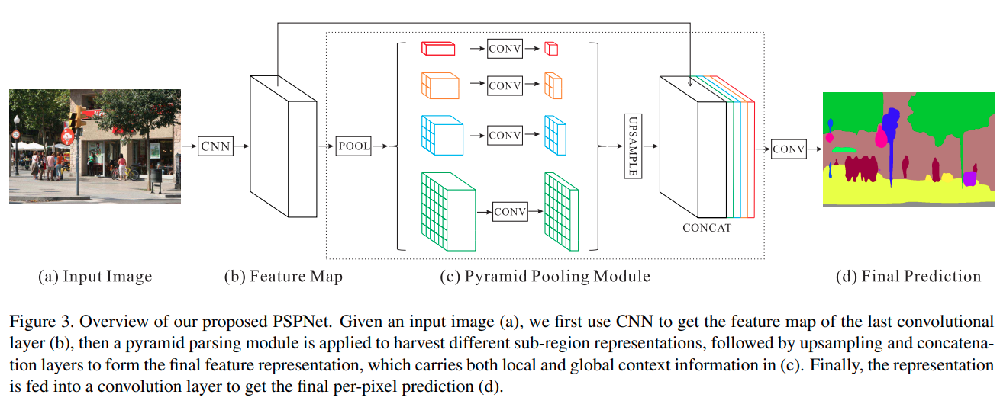
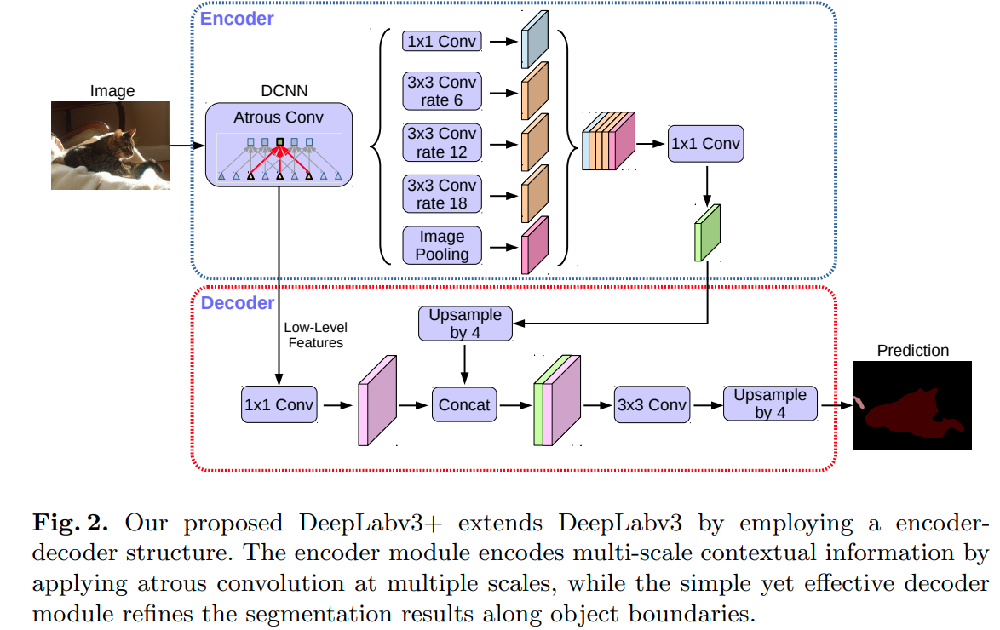
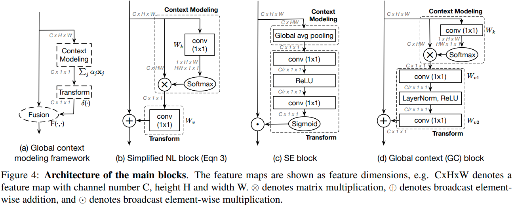
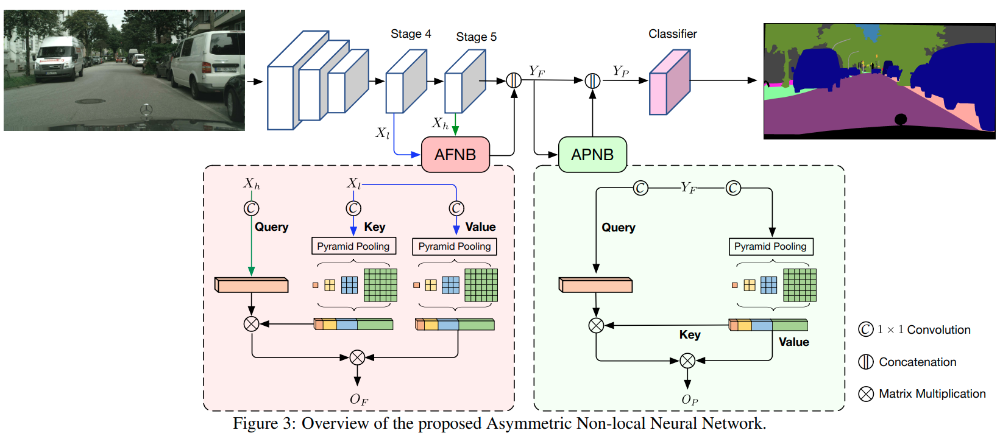
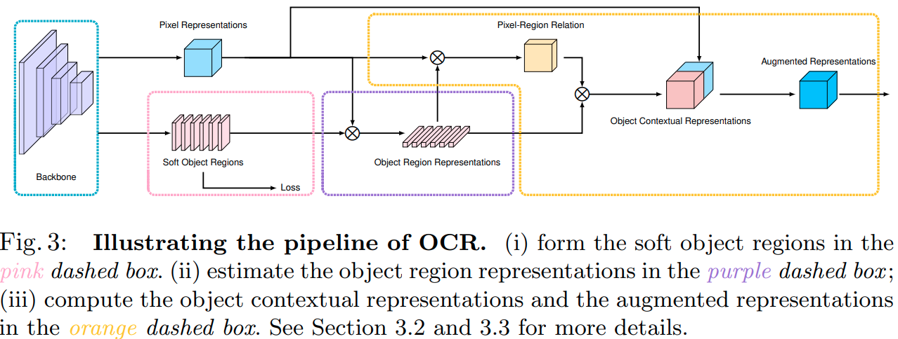
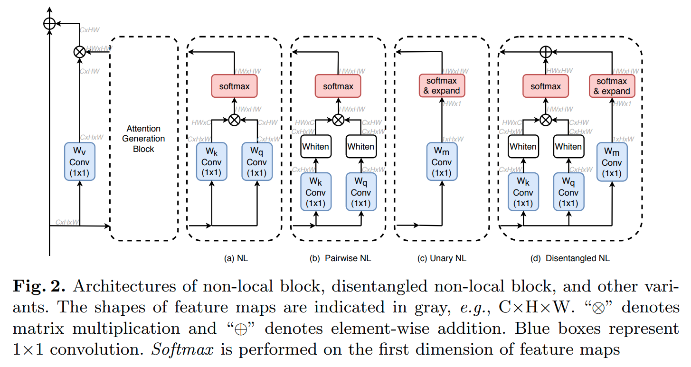

time: 20210126
code_source: https://github.com/open-mmlab/mmsegmentation
short_title: MMSegmentation

# Some Collections Around MMSegmentation

本文收集一系列 [MMSegmentation]收录的网络结构.

以Res50-D8 $512 \times 1024$ 在cityscapes上的性能

|   Methods  | mIoU |  FPS | 
|---------------|:-----:|:-----:|
| [DeepLabV3+]  | 79.61 | 3.94  |
| [DNLNet]      | 78.61 | 2.56  |
| [NonLocal]    | 78.24 | 2.72  |
| [PSPNet]      | 77.85 | 4.07  |
| [GCNet]       | 77.69 | 3.93  |
| [ANN]         | 77.40 | 3.71  |
| [OCRNet]      | 74.30 | 10.45 |
| FCN           | 72.25 | 4.17  | 

## Pyramid Scene Parsing Network (PSPNetwork)

[pdf](https://arxiv.org/pdf/1612.01105.pdf) [code](https://github.com/open-mmlab/mmsegmentation/blob/master/mmseg/models/decode_heads/psp_head.py)

## Encoder-Decoder with Atrous Separable Convolution for Semantic Image Segmentation
[pdf](https://arxiv.org/pdf/1802.02611.pdf) [code](https://github.com/open-mmlab/mmsegmentation/blob/master/mmseg/models/decode_heads/aspp_head.py)

## GCNet: Non-local Networks Meet Squeeze-Excitation Networks and Beyond
[pdf](https://arxiv.org/pdf/1904.11492.pdf) [code](https://github.com/open-mmlab/mmsegmentation/blob/master/mmseg/models/decode_heads/gc_head.py)

## Asymmetric Non-local Neural Networks for Semantic Segmentation (ANN)

[pdf](https://openaccess.thecvf.com/content_ICCV_2019/papers/Zhu_Asymmetric_Non-Local_Neural_Networks_for_Semantic_Segmentation_ICCV_2019_paper.pdf) [code](https://github.com/open-mmlab/mmsegmentation/blob/master/mmseg/models/decode_heads/ann_head.py)

## Object-Contextual Representations for Semantic Segmentation
[pdf](https://arxiv.org/pdf/1909.11065.pdf) [code](https://github.com/open-mmlab/mmsegmentation/blob/master/mmseg/models/decode_heads/ocr_head.py)

## Disentangled Non-Local Neural Networks (DNL)
[pdf](https://arxiv.org/pdf/2006.06668.pdf) [code](https://github.com/open-mmlab/mmsegmentation/blob/0264de0bb000e09a4dc348fc1759d0834a4af940/mmseg/models/decode_heads/dnl_head.py)

图中whiten的操作指的是减去关于channel通道的均值.

## 

[MMSegmentation]:https://github.com/open-mmlab/mmsegmentation
[NonLocal]:../../Building_Blocks/Non-local_Neural_Networks.md
[PSPNet]:#pyramid-scene-parsing-network-pspnetwork
[DeepLabV3+]:#encoder-decoder-with-atrous-separable-convolution-for-semantic-image-segmentation
[GCNet]:#gcnet-non-local-networks-meet-squeeze-excitation-networks-and-beyond
[ANN]:#asymmetric-non-local-neural-networks-for-semantic-segmentation-ann
[OCRNet]:#object-contextual-representations-for-semantic-segmentation
[DNLNet]:#disentangled-non-local-neural-networks-dnl
