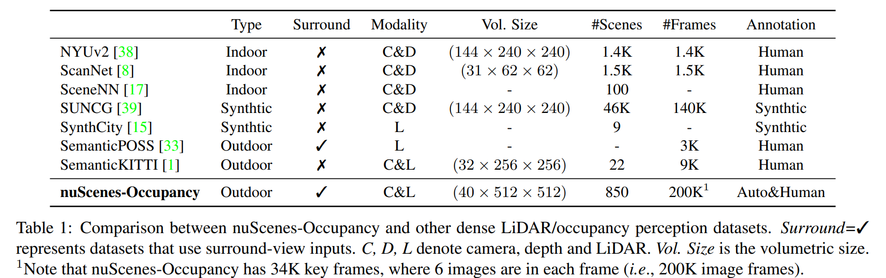
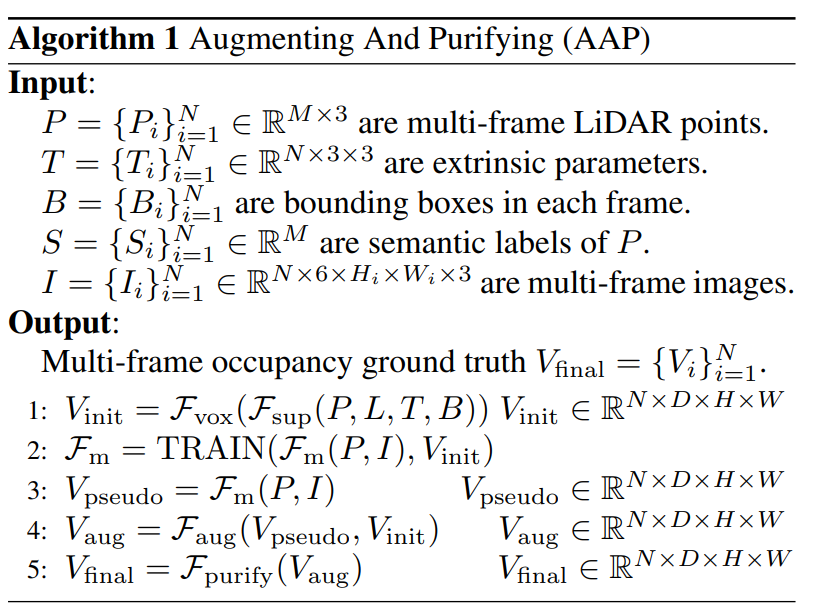
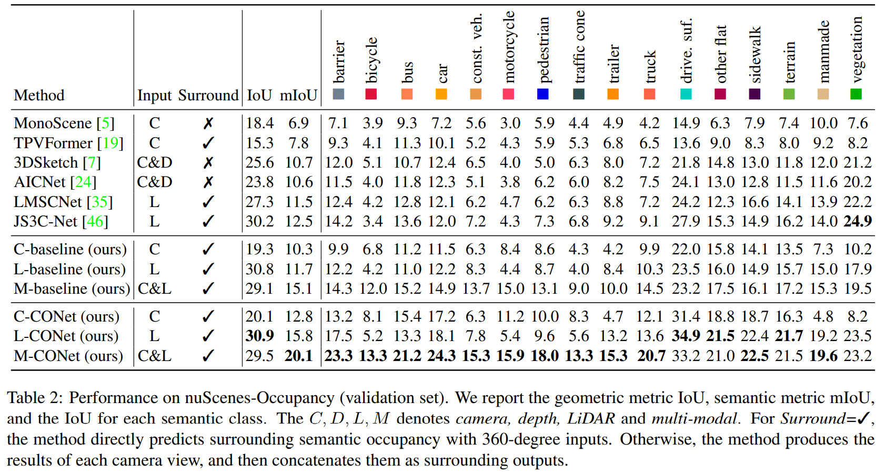

time: 20230309
pdf_source: https://arxiv.org/pdf/2303.03991.pdf
code_source: https://github.com/JeffWang987/OpenOccupancy

# OpenOccupancy: A Large Scale Benchmark for Surrounding Semantic Occupancy Perception

这篇paper介绍了基于nuscenes + 人工优化形成的occupancy dataset benchmark. 并给出了各个modal的一个baseline.

现有相关数据集之间的相互比较：

## Augmenting and Purifying (AAP)
作者提出了一个Augmenting and Purifying (AAP) pipeline 作为真值的生成方案：

1. 对于多帧带标注的雷达数据，静态点直接通过 related pose 转移到当前帧。动态点根据 associated instance ID 关联，找到两帧 target object在世界坐标下的绝对位移， 把3D bounding box内的点云都按照dynamic object的这个绝对位移align到当前帧。
2. 使用雷达在数据上进行训练，补充被遮挡得部分。生成pseudo label进行augment
3. 人工清理增强后的label形成最终的ground truth.

## Comparison
不同模态算法在open occupancy上的横向比较:

