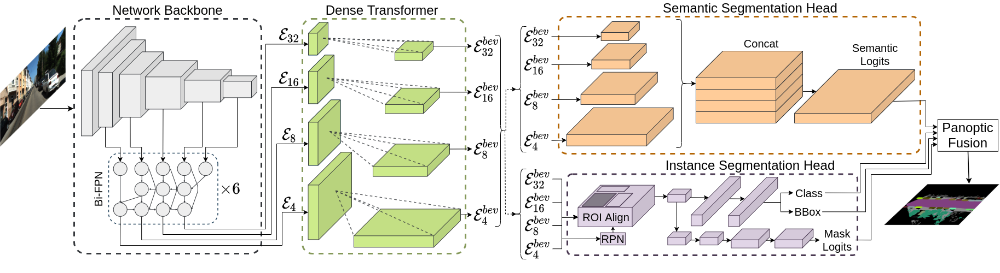
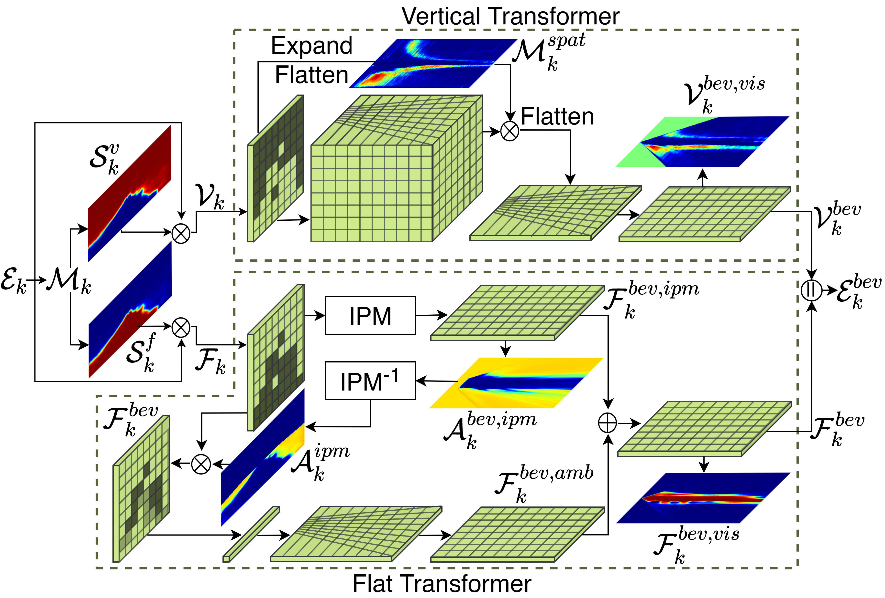

time:20220428
pdf_source: https://arxiv.org/abs/2108.03227
code_source: https://github.com/robot-learning-freiburg/PanopticBEV
short_title: PanopticBEV

# Bird's-Eye-View Panoptic Segmentation Using Monocular Frontal View Images

[官方资源网站](http://panoptic-bev.cs.uni-freiburg.de/)

这篇论文实现的是端到端的前向摄像头图像到BEV全景分割。作者在KITTI-360和nuscenes两个数据集上设计了完整的label数据集。

主要网络结构如下图:

1. 使用efficientDet作为 backbone & neck.
2. 设计了Dense Transformer转移Front View -> BEV
3. 使用anchor based 基础的panoptic seg

视角转换这个核心问题上，作者提供了两种转换方法，让网络选择(softmax)一种使用。

第一种也就是 vertical transformer, 对每一个像素点预测其深度(multi bin classification)，使用相机内参将特征扩展成相机坐标系下的特征图，并使用3D grid_sample转到BEV上.

第二种则是IPM, 假设每一个像素都在地面上,利用相机的内参以及外参(离地面高度以及几何旋转),计算图片坐标以及BEV坐标之间的Homography Matrix, 把图片坐标直接转到BEV上.

