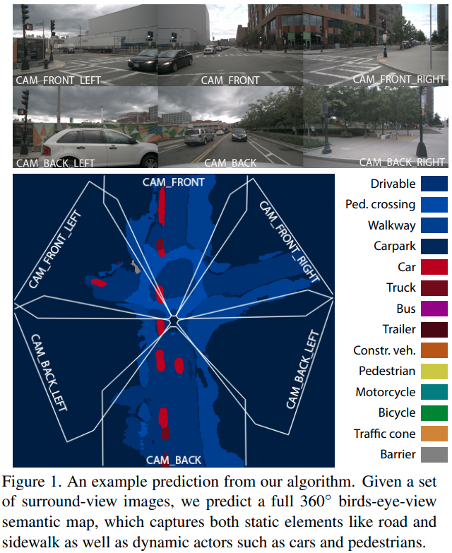
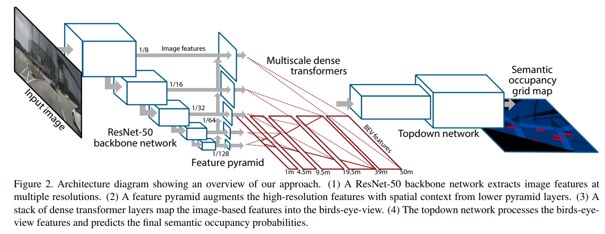

time: 20200923
pdf_source: https://arxiv.org/pdf/2003.13402.pdf
code_source: https://github.com/tom-roddick/mono-semantic-maps
short_title: PyrOccNet for BEV Segmentation
# Predicting Semantic Map Representations from Images using Pyramid Occupancy Networks

这篇paper是与[OfT](../../3dDetection/Orthographic_Feature_Transform_3D_detection.md)同一一作的作品，两者有很强的相似性，这篇paper的目标是输入环视单目摄像头，输出周围360°的BEV语义分割地图:

## 网络结构

这篇paper与[oft](../../3dDetection/Orthographic_Feature_Transform_3D_detection.md)在使用OFT同款的feature transformation上有很大的进步，

- 使用FPN网络得到multi-scale的特征，对每一个特征都转成BEV
- 不同scale的特征对应不同的BEV上的距离(这点很intuitive又很聪明，在OFT实际训练的时候会发现受制于分辨率，OFT沿着一条射线上的格点几乎就是很长的区域都是同一个值，使用不同特征对应不同的距离，一方面可以打破这个不良的特性，增强BEV上的信息裕度，另一方面也很符合不同scale上感受野与物体大小的特性).

由于转到了BEV上，作者自然地进一步想到了对时序信息上进行融合，这样预测出来的BEV上的occupancy map就可以用贝叶斯方法直接更新。

## 数据生成
作者使用 Nuscenes还有 Argoverse数据进行训练，作者称他将标注好的地图以及3D bounding box投影到相机坐标系的xz平面上，同时作者还标注了一个visibility mask,方法是对图上面的每一点，如果他在FOV中且至少有一个lidar 射线穿过它。

最终模型的性能的绝对值还是有限的，但是visualization效果很好。