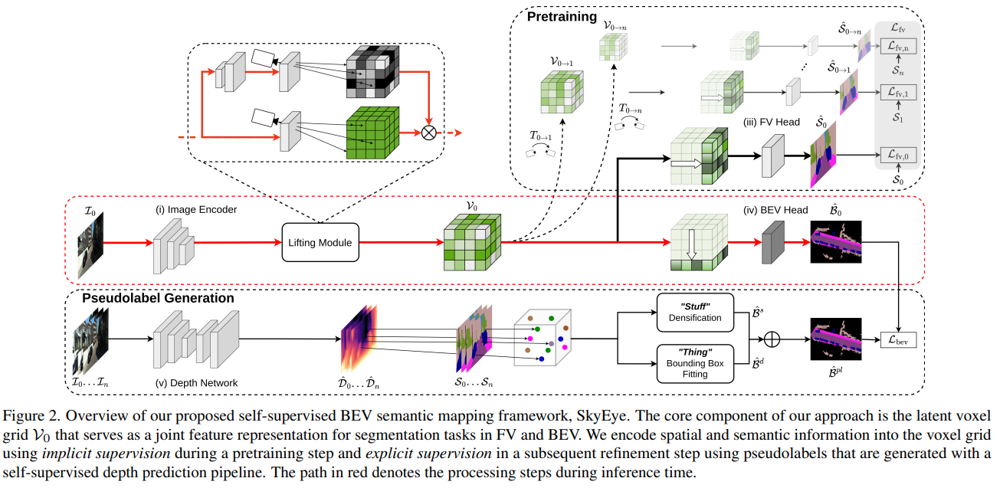

time: 20230220
pdf_source: https://arxiv.org/pdf/2302.04233.pdf

# SkyEye: Self-Supervised Bird’s-Eye-View Semantic Mapping Using Monocular Frontal View Images

这篇paper探索了弱监督的BEV语义分割任务。假设我们只有图片序列以及在图片上的语义分割标注，如何训练一个网络从一个相机输出BEV上的语义分割结果。

论文中贴了[官方页面](http://skyeye.cs.uni-freiburg.de/)，不过在发本文之前尚未完成建设。

## Basic Framework

工作流程:

1. 使用预训练的单目深度估计网络(采用的是在kitti360上双目训练的)
2. 在有gt label的图片上面，把Front view 转到BEV上，经过densification (图形学操作erode) + bounding box fitting (填满object). 生成BEV上的pseudo label.
3. 主网络结构包含 encoder, lifting module (LSS)， 形成voxel, 分别投影到不同相机坐标系下，预测对应的 image frame 语义分割形态,添加multi-frame consistency的loss。同时投影到BEV上，在BEV上输出结果，并使用psuedolabel 进行监督。