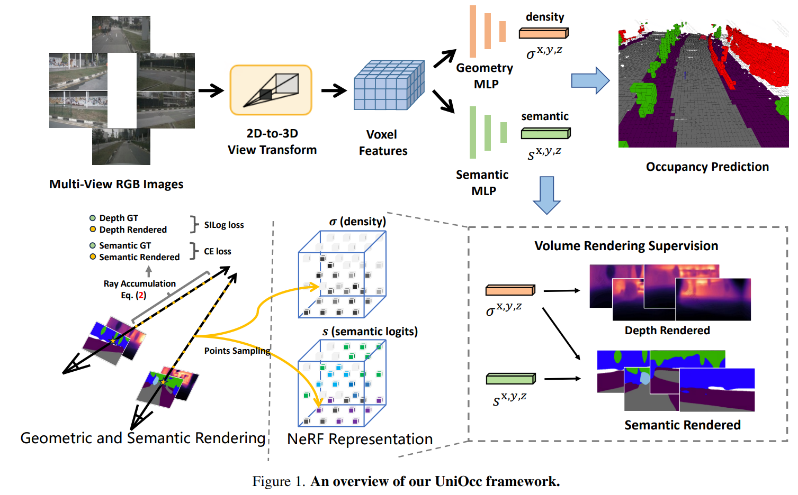

time: 20230617
pdf_source: https://arxiv.org/pdf/2306.09117.pdf

# UniOcc: Unifying Vision-Centric 3D Occupancy Prediction with Geometric and Semantic Rendering

这篇paper提出了不使用3D occupancy labeling 完成 3D occupancy Prediction训练的方案, 基本思路是用NeRF对相邻帧进行语义分割与深度渲染。然后使用雷达点在图片上的投影完成监督。

## Rendering Supervision
使用LSS输出一个三维体素$V^{x,y,z}$, 使用两个分开的MLP网络对每一个点预测occupancy prediction 和 Segmentation label.

渲染采用NeRF中常用的光线采样方案：

$$
\begin{aligned}
T\left(z_k\right) & =\exp \left(-\sum_{t=1}^{k-1} \sigma\left(z_t\right) \beta_t\right) \\
\alpha\left(z_k\right) & =1-\exp \left(-\sigma\left(z_k\right) \beta_k\right) \\
D & =\sum_{k=1}^N T\left(z_k\right) \alpha\left(z_k\right) z_k \\
S & =\sum_{k=1}^N T\left(z_k\right) \alpha\left(z_k\right) s\left(z_k\right) \\
\beta_k &= z_{k+1} - z_{k}
\end{aligned}
$$

使用SILoss 和 CELoss分别监督深度渲染和语义分割渲染。

## Depth Aware Teacher Student

对于没有标注的数据，使用一个自监督方案补充监督如图:

## Other Settings

- Using Semantic label，去除时序过程中可能的动态物体(车和人)
- 使用 visibility mask, 判断当前要推断的点是否超出了现有Voxel的范围，并减少对这部分点的监督。可以提升点数，但是会损失可视化效果(相当于没有对天空部分的点作正确监督)。
