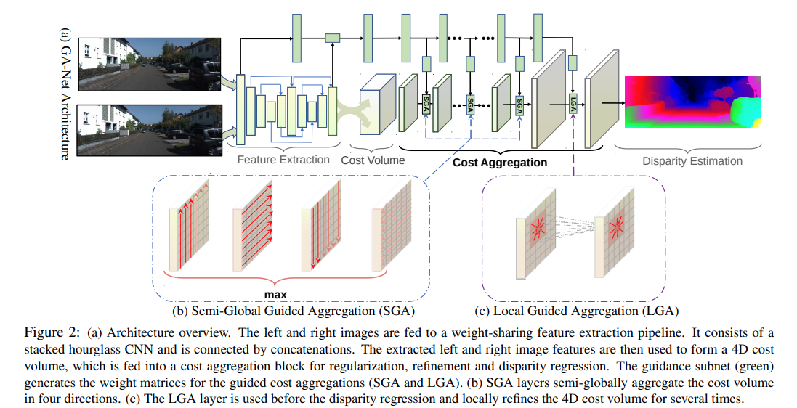
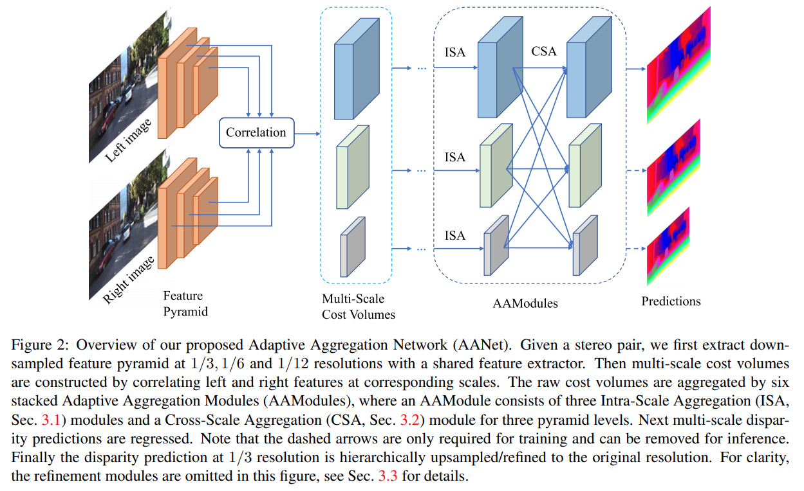
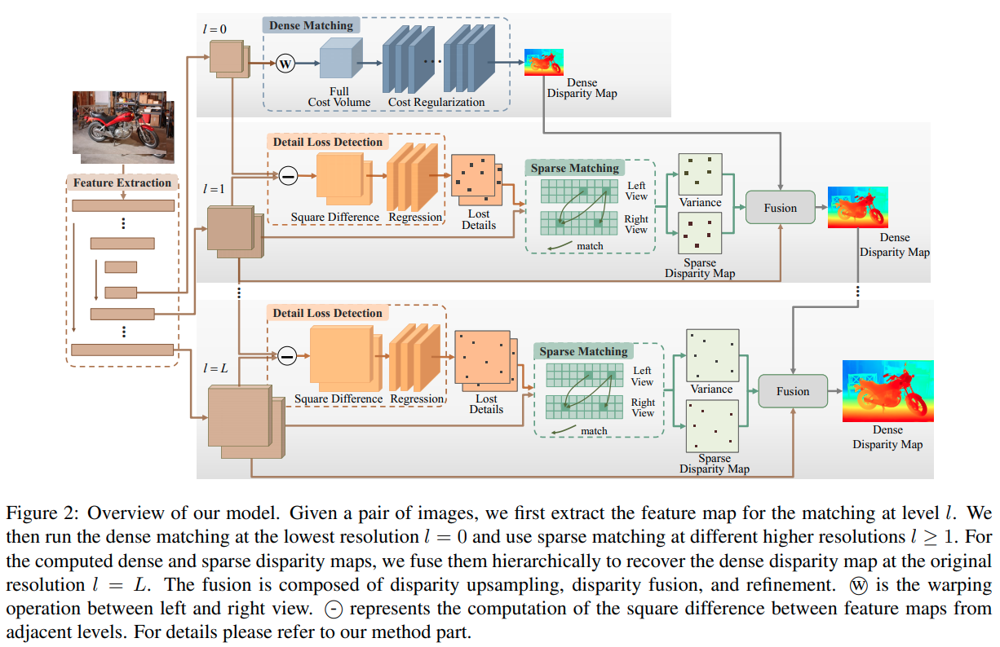
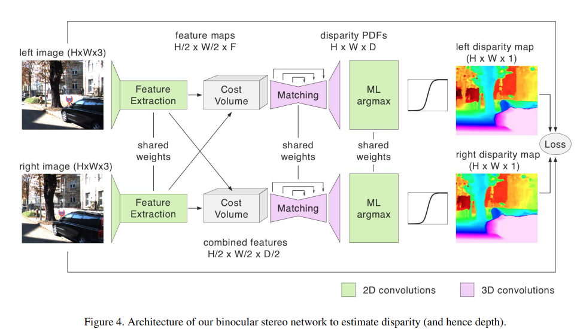
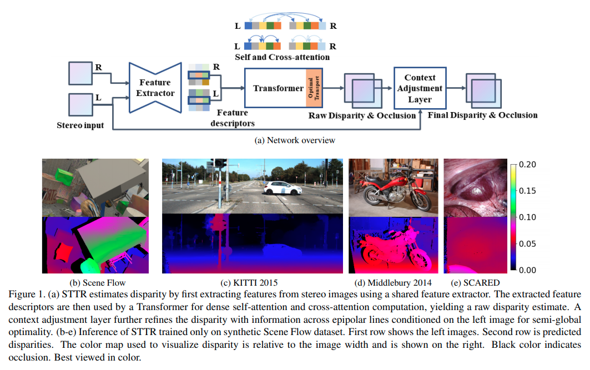
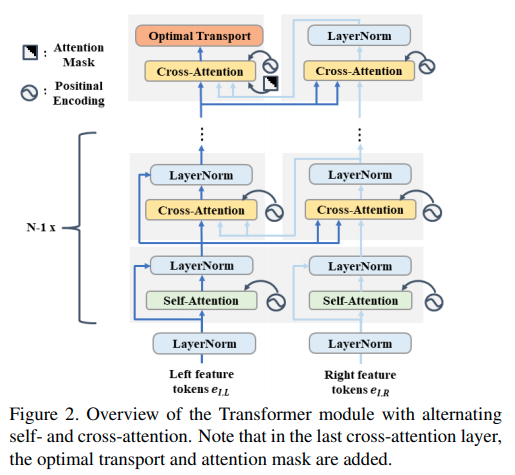

time: 20210415

# Collections of Stereo Matching from KITTI

本文记录了 Stereo Matching 有文章/有code实现的主要paper.将会持续update


| Methods        | D1-all | D1-bg | D1-fg | Time  |
| -------------- | :----: | :---: | :---: | :---: |
| [CSPN]         |  1.74  | 1.51  | 2.88  |  1.0  |
| [GANet-deep]   |  1.81  | 1.48  | 3.46  |  1.8  |
| [AcfNet]       |  1.89  | 1.51  | 3.80  | 0.48  |
| [CDN-GANet]    |  1.92  | 1.66  | 3.20  | 0.40  |
| [AANet+]       |  2.03  | 1.65  | 3.96  | 0.06  |
| [DecomposeNet] |  2.37  | 2.07  | 3.87  | 0.05  |
| [DeepPruner]   |  2.15  | 1.87  | 3.56  | 0.18  |
| [PSMNet]       |  2.32  | 1.86  | 4.62  | 0.21  |
| [FADNet]       |  2.82  | 2.68  | 3.50  | 0.05  |
| [NVStereoNet]  |  3.13  | 2.62  | 5.69  |  0.6  |
| [RTS2Net]      |  3.56  | 3.09  | 5.91  | 0.02  |
| [SsSMnet]      |  3.40  | 2.70  | 6.92  |  0.8  |
| [STTR]         |  3.73  | 3.23  |  6.2  |  0.6  |

其中本站其他页面已有的文章为[CSPN],[AcfNet], [CDN-GANet], [DeepPruner], [PSMNet], [FADNet], [SsSMnet], [RTS2Net].

目录:

- [Collections of Stereo Matching from KITTI](#collections-of-stereo-matching-from-kitti)
  - [GANet](#ganet)
  - [AANet](#aanet)
  - [DecomposeNet](#decomposenet)
  - [NVStereoNet](#nvstereonet)
  - [STTR: Revisiting Stereo Depth Estimation From a Sequence-to-Sequence Perspective with Transformers](#sttr-revisiting-stereo-depth-estimation-from-a-sequence-to-sequence-perspective-with-transformers)
    - [整体结构](#整体结构)
    - [Optimal Transport](#optimal-transport)


## GANet
[pdf](http://openaccess.thecvf.com/content_CVPR_2019/papers/Zhang_GA-Net_Guided_Aggregation_Net_for_End-To-End_Stereo_Matching_CVPR_2019_paper.pdf) [code](https://github.com/feihuzhang/GANet)



Feature Extraction使用的是stacked hourglass network. Cost Volume的形成与[PSMNet]一致。然后接数个SGA模块，以及LGA模块。左图会接上"guidance subnet"使用数个简单卷积生成权重矩阵提供到GA模块中。

GA层对应scanline optimization方法 [ref1](https://core.ac.uk/download/pdf/11134866.pdf) [ref2](https://www.tugraz.at/fileadmin/user_upload/Institute/ICG/Documents/courses/robotvision/2019/RV_StereoMatching.pdf),可以理解为一个动态规划算法,其中本文的$\mathbf{r}$为四个方向的矢量。里面的权重是每一个像素不一致的，通过subnet提供guidance.

Semi-Global Guided Aggregation(SGA) 需要的guidence权重大小为$H\times W \times K\times F(K=5)$，不同disparity使用的权重一致:
$$C_{\mathbf{r}}^{A}(\mathbf{p}, d)=\operatorname{sum}\left\{\begin{array}{l}
\mathbf{w}_{0}(\mathbf{p}, \mathbf{r}) \cdot C(\mathbf{p}, d) \\
\mathbf{w}_{1}(\mathbf{p}, \mathbf{r}) \cdot C_{\mathbf{r}}^{A}(\mathbf{p}-\mathbf{r}, d) \\
\mathbf{w}_{2}(\mathbf{p}, \mathbf{r}) \cdot C_{\mathbf{r}}^{A}(\mathbf{p}-\mathbf{r}, d-1) \\
\mathbf{w}_{3}(\mathbf{p}, \mathbf{r}) \cdot C_{\mathbf{r}}^{A}(\mathbf{p}-\mathbf{r}, d+1) \\
\mathbf{w}_{4}(\mathbf{p}, \mathbf{r}) \cdot \max _{i} C_{\mathbf{r}}^{A}(\mathbf{p}-\mathbf{r}, i)
\end{array}\right.$$
$$\text {s.t.} \quad \sum_{i=0,1,2,3,4} \mathbf{w}_{i}(\mathbf{p}, \mathbf{r})=1$$
$$C^{A}(\mathbf{p}, d)=\max _{\mathbf{r}} C_{\mathbf{r}}^{A}(\mathbf{p}, d)$$

Local Aggregation(LGA),需要的guidence权重大小为$H\times W\times 3K^2 \times F$:
$$\begin{array}{c}
C^{A}(\mathbf{p}, d)=\operatorname{sum}\left\{\begin{array}{l}
\sum_{\mathbf{q} \in N_{\mathrm{p}}} \omega_{0}(\mathbf{p}, \mathbf{q}) \cdot C(\mathbf{q}, d) \\
\sum_{\mathbf{q} \in N_{\mathrm{p}}} \omega_{1}(\mathbf{p}, \mathbf{q}) \cdot C(\mathbf{q}, d-1) \\
\sum_{\mathbf{q} \in N_{\mathrm{p}}} \omega_{2}(\mathbf{p}, \mathbf{q}) \cdot C(\mathbf{q}, d+1)
\end{array}\right. \\
\text { s.t. } \sum_{\mathbf{q} \in N_{\mathrm{p}}} \omega_{0}(\mathbf{p}, \mathbf{q})+\omega_{1}(\mathbf{p}, \mathbf{q})+\omega_{2}(\mathbf{p}, \mathbf{q})=1
\end{array}$$


## AANet
[pdf](https://arxiv.org/pdf/2004.09548.pdf) [code](https://github.com/haofeixu/aanet)



本文使用coorelation的方式生成3D Cost Volume.

Adaptive Intra-Scale Aggregation本质上是分组的可变卷积：

$$\tilde{\boldsymbol{C}}(d, \boldsymbol{p})=\sum_{k=1}^{K^{2}} w_{k} \cdot \boldsymbol{C}\left(d, \boldsymbol{p}+\boldsymbol{p}_{k}+\Delta \boldsymbol{p}_{k}\right) \cdot m_{k}$$

多scale融合，这里采用的是[HRNet](../../Building_Blocks/HRNet.md)的方法
$$\hat{\boldsymbol{C}}^{s}=\sum_{k=1}^{S} f_{k}\left(\tilde{\boldsymbol{C}}^{k}\right), \quad s=1,2, \cdots, S$$

$$f_{k}=\left\{\begin{array}{l}
\mathcal{I}, \quad k=s \\
(s-k) \text { stride }-2\oplus 3 \times 3 \text { convs, } \quad k<s \\
\text { upsampling } \oplus 1 \times 1 \text { conv, } \quad k>s
\end{array}\right.$$

## DecomposeNet
[pdf](https://arxiv.org/pdf/2104.07516.pdf)



这篇paper的思路还是降低复杂度，在最低的分辨率下计算 Full Stereo Matching 的 Cost Volume. 在高分辨率下进行 Sparse Matching.

一张图概念上可以分为两种区域，一种是粗分类区域$CA$，这里的双目匹配结果可以从低分辨率上采样后refine出来；一种是细分类区域$FA$，这里的双目由高分辨率的sparse matching还原.

$$
\begin{array}{c}
\hat{D}_{L}=\widehat{\mathcal{F}}\left(\mathrm{FA}_{L}, \mathrm{FA}_{L}\right) \\
\vdots \\
\hat{D}_{1}=\widehat{\mathcal{F}}\left(\mathrm{FA}_{1}, \mathrm{FA}_{1}\right) \\
D_{0}=\mathcal{F}\left(\dot{\mathrm{A}}_{0}, \dot{\mathrm{A}}_{0}\right) \\
\tilde{D}=\hat{D}_{L} \cup \cdots \cup \hat{D}_{1} \cup D_{0}
\end{array}
$$

本文提出一个自监督的方案训练一个小网络识别图中被downsampling破坏的特征, 其输入是本层的特征$F_l$以及下层上采样的$F'_{l-1}$的特征差$F_l - F'_{l-1}$, 输出的网络可以被训练，训练目标是增加 $FA$区域的特征差，同时要求其稀疏.

$$
\mathcal{L}_{l}^{\mathrm{DLD}}=\left|F A_{l}\right|-\alpha \frac{\sum_{(h, w) \in F A_{l}}\left\|F_{l}(h, w)-F_{l-1}^{\prime}(h, w)\right\|_{2}}{\left|F A_{l}\right|}
$$

在稀疏Mask上直接计算disparity:

$$
\begin{aligned}
C_{l}(h, w, d)&=<{F}_{l}^{left}(h, w), {F}_{l}^{right}(h, w-d)> \\
P_{l}(h, w, d) &=\frac{\mathrm{e}^{C_{l}(h, w, d)-C_{l}^{\max }(h, w)}}{\sum_{d=0} \mathrm{e}^{C_{l}(h, w, d)-C_{l}^{\max }(h, w)}} \\
C_{l}^{\max }(h, w) &=\max _{d} C_{l}(h, w, d) \\

\hat{D}_{l}(h, w)&=\sum_{d=0} P_{l}(h, w, d) * d
\end{aligned}
$$


## NVStereoNet

[pdf](http://openaccess.thecvf.com/content_cvpr_2018_workshops/papers/w14/Smolyanskiy_On_the_Importance_CVPR_2018_paper.pdf)
[code](https://github.com/NVIDIA-AI-IOT/redtail/tree/master/stereoDNN)



损失与[monodepth](../others/Unsupervised_depth_prediction.md)相似

$$L=\lambda_{1} E_{\text {image}}+\lambda_{2} E_{\text {lidar}}+\lambda_{3} E_{l r}+\lambda_{4} E_{d s}$$

$$\begin{aligned}
E_{\text {image}} &=E_{\text {image}}^{l}+E_{\text {image}}^{r} \\
E_{\text {lidar}} &=\left|d_{l}-\bar{d}_{l}\right|+\left|d_{r}-\bar{d}_{r}\right| \\
E_{l r} &=\frac{1}{n} \sum_{i j}\left|d_{i j}^{l}-\tilde{d}_{i j}^{l}\right|+\frac{1}{n} \sum_{i j}\left|d_{i j}^{r}-\tilde{d}_{i j}^{r}\right| \\
E_{d s} &=E_{d s}^{l}+E_{d s}^{r}
\end{aligned}$$

$$\begin{aligned}
E_{\text {image}}^{l} &=\frac{1}{n} \sum_{i, j} \alpha \frac{1-\operatorname{SSIM}\left(I_{i j}^{l}, \tilde{I}_{i j}^{l}\right)}{2}+(1-\alpha) | I_{i j}^{l}-\tilde{I}_{i j}^{l} \\
E_{d s}^{l} &=\frac{1}{n} \sum_{i, j}\left|\partial_{x} d_{i j}^{l}\right| e^{-\left\|\partial_{x} I_{i, j}^{l}\right\|}+\left|\partial_{y} d_{i j}^{l}\right| e^{-\| \partial_{y} I_{i, j}^{l}} \|
\end{aligned}$$

## STTR: Revisiting Stereo Depth Estimation From a Sequence-to-Sequence Perspective with Transformers
[pdf](https://arxiv.org/pdf/2011.02910.pdf) [code](https://github.com/mli0603/stereo-transformer)

这篇paper用Sequence/Transformer的角度重新理解双目pixel-wise matching. 作者指出主要有三大优势:

- 不再强约束要求一个固定的disparity上限
- 能识别遮挡区域，给出confidence
- 给出uniqueness约束 (这个是通过求解一个最优化问题实现的)

### 整体结构





本文的网络结构的每一个部件都是基础部件，设计上或者代码上主要的不同点:

- backbone网络采用的是类似于U-Net的结构,但是在最后一层采样后加了一个[DeepLabv3](https://arxiv.org/pdf/1706.05587.pdf)的ASPP
- multiheader transformer里面交错使用self-attention与cross attention.而代码上两者分别只有一个multi-head的ModuleList, 也就是图中重复的模块使用的是相同的参数.
- attention是先调整形状$[1, C, H, W] \rightarrow [H, W, C]$, 输出相当于是在$W$上展开一个个像素匹配，也就是理解为只在水平 epipolar line上进行匹配, 输出形状 $[H, W, W]$
- Position Embedding 采用的是作者提出的相对位置encode, 这个encoding是一个$[B, C, H, \times (2W-1)]$, 的encoder.
- 由于多层multihead的transformer运算量和显存占用很大，代码实现上需要用 [checkpoint](https://pytorch.org/docs/stable/checkpoint.html) 技巧，也就是暂时不存储中间运算变量，在backward的时候再重新前传计算中间运算变量.
- 去到最后一层的时候作者指出应该考虑相机左右放置的关系，右feature与左feature计算attention的时候应该只计算部分的attention值 (上半三角).

### Optimal Transport

从网络中得到$W \times W$匹配损失矩阵后，我们希望得到每一个像素的最优的, unique的结果. 这个问题可以被formulate为一个 optimal transport的问题, [有一个从分甜品motivate的比较好的博客](https://michielstock.github.io/OptimalTransport/). 用STTR这篇paper的语言进行问题表述:

$$
\begin{aligned}
  \underset{\vec P}{\text{minimize}} \quad &\underset{i,j}{\sum}P_{ij} M_{ij} + \frac{1}{\lambda} \sum_{i,j} P_{i,j} \log P_{i,j} \\
  \text{subject to} \quad & \sum_i P_{i,j} = c_j\\
              & \sum_j P_{i,j} = r_i\\
\end{aligned}
$$
目标函数的第一项为由损失函数矩阵决定的线性函数，第二项为交叉熵。约束函数要求每一个左图的像素只会对应一个右图的像素(概率和为1)， 每一个右图的像素也只会对应一个左图的像素.

Optimal Transport是一个 凸优化中的LP问题，使用[KKT](../../The_theory/ConvexOptimization.md)条件中对$P$的导数为零可以得到:
$$
  P_{ij} = \alpha_i \beta_j e^{-\lambda M}
$$
其中 $\alpha$和$\beta$与拉格朗日乘子和超参数$\lambda$有关，从约束中求解获得.

Sinkhorn Distances的原始代码则是:

```python
def compute_optimal_transport(M, r, c, lam, epsilon=1e-8):
    """
    Computes the optimal transport matrix and Slinkhorn distance using the
    Sinkhorn-Knopp algorithm. From https://michielstock.github.io/OptimalTransport/

    Inputs:
        - M : cost matrix (n x m)
        - r : vector of marginals (n, )
        - c : vector of marginals (m, )
        - lam : strength of the entropic regularization
        - epsilon : convergence parameter

    Outputs:
        - P : optimal transport matrix (n x m)
        - dist : Sinkhorn distance
    """
    n, m = M.shape
    P = np.exp(- lam * M)
    P /= P.sum()
    u = np.zeros(n)
    # normalize this matrix
    while np.max(np.abs(u - P.sum(1))) > epsilon:
        u = P.sum(1)
        P *= (r / u).reshape((-1, 1)) # normalize in first dimension
        P *= (c / P.sum(0)).reshape((1, -1)) #normalize in second dimension
    return P, np.sum(P * M)
```

本文的代码则是默认$\lambda$为1，在 $\log$空间中进行迭代计算。

[CSPN]:../../Building_Blocks/SPN_CSPN.md
[DecomposeNet]:#decomposenet
[AcfNet]:../others/Adaptive_Unimodal_Cost_Volume_Filtering_for_Deep_Stereo_Matching.md
[CDN-GANet]:../../3dDetection/CDN.md
[DeepPruner]:../../Building_Blocks/deepPruner.md
[PSMNet]:../others/PSMNet.md
[FADNet]:../others/FADNet.md
[SsSMnet]:../others/self_supervised_stereo.md
[GANet-deep]:#ganet
[AANet+]:#aanet
[NVStereoNet]:#nvstereonet
[RTS2Net]:Summary_of_ICRA_2020.md
[STTR]:#sttr-revisiting-stereo-depth-estimation-from-a-sequence-to-sequence-perspective-with-transformers