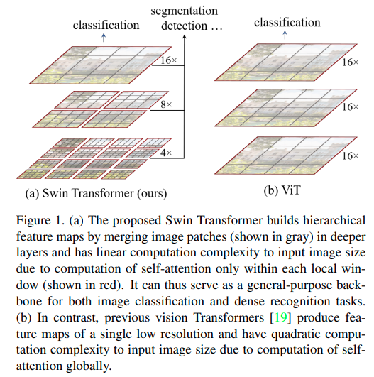

code_source: https://github.com/epfml/attention-cnn
pdf_source: https://arxiv.org/pdf/1911.03584.pdf
time: 20220124
short_title: Self-Attention & CNN
# Summary of Self Attention / Transformer in Vision System (Last update 2021-07-14)

这是一份描述数篇关于在CNN系统中使用self-attention的小统计.

对于在NLP取得很好表现的self-attention机制，本网站在论文[Attention is all you need](../../Building_Blocks/Attention_is_all_you_need.md)有详细的介绍。

2019年上半年，Google 提出了 [Attention Augmented Convolution](../../Building_Blocks/Attention_Augmented_Conv.md), 这是一个类似[Non-local](../../Building_Blocks/Non-local_Neural_Networks.md)模块的思路，借用self-attention的机制加上positional-encoding，设计出一个提供全局attention的模块，这个模块的缺点在于在图片很大的时候会需要一个很大的矩阵乘法，所以这个模块必须只能在多次下采样后使用，且还需要注重显存管理，可以理解为是一个难以scale up的方案。

本文接下来会介绍两篇paper，一篇paper提出了一个轻量级的图片局部attention的模块，用略少于传统Conv的运算与参数，在imagenet和Coco分别得到了与传统CNN几乎一致的性能。另一篇阐述了局部Attention与Convolution的关系，表明Multi-head 局部Attention可以实现传统Convolution的性能。

## Stand-Alone Self-Attention in Vision Models
[pdf](https://arxiv.org/pdf/1906.05909.pdf) [code](https://github.com/leaderj1001/Stand-Alone-Self-Attention)

$$
y_{i j}=\sum_{a, b \in \mathcal{N}_{k}(i, j)} \operatorname{softmax}_{a b}\left(q_{i j}^{\top} k_{a b}+q_{i j}^{\top} r_{a-i, b-j}\right) v_{a b}
$$

这个模块的设计可以直接CNN，同时运算量并没有显然提升，性能则相近。

作者通过实验发现除了第一个Conv建议用Convolution，模型的其余卷积模块就可以用Attention替代。作者还做了更多的其他实验，证明attention替代CNN是大有可为的。

## On The Relationship Between Self-Attention and Convolution Layers

[pdf](https://arxiv.org/pdf/1911.03584.pdf) [code](https://github.com/epfml/attention-cnn)

本文还有一个[官方网站](https://epfml.github.io/attention-cnn/)以及[官方英文博客](http://jbcordonnier.com/posts/attention-cnn/)

理论结论是局部Attention是CNN的扩展，具体implementation有区别。

## Swin Transformer: Hierarchical Vision Transformer using Shifted Windows

[pdf](https://arxiv.org/pdf/2103.14030.pdf) [code](https://github.com/microsoft/Swin-Transformer)

这篇paper其实有点回到local了，但是更加可靠了，每次只对窗口内的跑transformer, 依靠多层级逐渐提升感受野.

## Scaling Vision Transformers
[pdf](https://arxiv.org/pdf/2106.04560.pdf)

这篇google的paper在JFT-3B以及数千TPU的加持下训练了一个SOTA的Transformer.改进了ViT的架构和训练，减少了内存消耗并提高了模型的准确性.

[BLOG](https://blog.csdn.net/amusi1994/article/details/117827006)

方案

- Decouple weight decay for the head. 让输出头的weight decay更大。
- Save memory by removing the [class] token
- Scale up data
- Memory-efficient optimizers: adafactor optimizer
- Learning-rate schedule: Reciprocal-square root

## VOLO: Vision Outlooker for Visual Recognition

[PDF](https://arxiv.org/pdf/2106.13112.pdf) [code](https://github.com/sail-sg/volo)

这篇paper在不使用额外数据的情况下首次突破了87%的ImageNet准确率.

与其他paper相比，本文更专注于对local feature的形成。
outlook的方法就是将$K\times K$的核展开，对每一个点，计算其附近$K\times K$个像素的自相似矩阵$(K\times K) \times (K\times K)$, 然后融合这些近邻的features.

## A Survey on Visual Transformer

[pdf](https://arxiv.org/pdf/2012.12556.pdf)

## A Comprehensive Study of Vision Transformers on Dense Prediction Tasks

[pdf](https://arxiv.org/pdf/2201.08683.pdf)

这篇论文比较了CNN与Transformer的性能以及扩展性区别，关注于2D检测以及语义分割。

结论：

- ViT与CNN相比，在原数据集上精度更低，理论运算复杂度更低，但是速度更慢。 作者认为如果GPU为Transformer优化，则Transformer有在速度上超越CNN的潜力。
- ViT在跨数据集测试中表现更好，语义分割上比目标检测更明显。分析其收敛的Local minima损失landscape, 认为ViT收敛到的local minima更平滑。(做法上扰动网络的权重，损失在训练集上测试)
- ViT才测试集更well-calibrated。
- ViT对噪声以及对抗攻击的抵抗性更强。
- 对于高分辨输入，CNN的性能保存比ViT更好，尽管ViT理论上有更大的感受野，但是性能反而不行，作者认为和Positional Embedding有关系。
