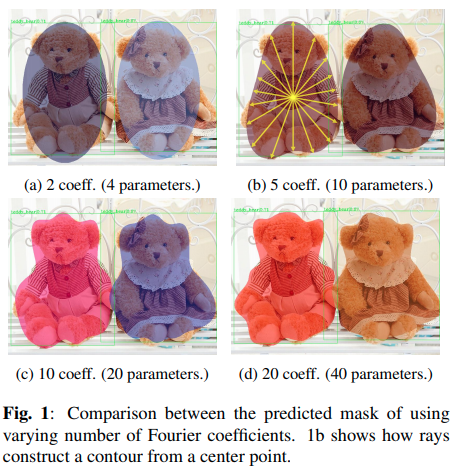

time: 20200503

# Summary of Single Stage Instance Segmentation

这篇文章主要是根据Medium上一个博主的[review](https://towardsdatascience.com/single-stage-instance-segmentation-a-review-1eeb66e0cc49).

这个review在分类上将单阶段实例分割分为基于local mask与global mask

## Local Mask

local mask指输出一个个bounding box，并且对局部instance的contour或者mask进行编码与预测。文中提到了多篇paper，其中[TensorMask](../Segmentation/TensorMask:_A_Foundation_for_Dense_Object_Segmentation.md), [PolarMask](../Segmentation/PolorMask.md) 是本网站已经有简介的paper.这里进行一些补充

### Fourier Net
[pdf](https://arxiv.org/pdf/2002.02709.pdf) [code](https://github.com/cogsys-tuebingen/FourierNet)

这篇paper代码以及思想上基于PolarMask,对于这一周射线的长度，我们只需要预测其傅里叶变换值的前$M$项，这个$M$决定网络训练的超参，这种方法得到的输出一般来说比PolarMask同等参数量的结果更加精细。但是这篇paper的作者没有train出一个令人信服的点数。
$$p_{n, i}=\frac{1}{N} \sum_{k=0}^{N-1} x_{k, i} e^{\frac{j 2 \pi k n}{N}}$$

## Global Mask

global mask指网络直接输出整个图大小的mask，并后期进行整合或者组合以形成每一个object的mask。文中提到了多篇paper，最近SOTA水平的主要为其中的[YOLOACT](../Segmentation/YOLACT.md),[SOLO](../Segmentation/SOLO.md)，本网站也有相关的介绍。
