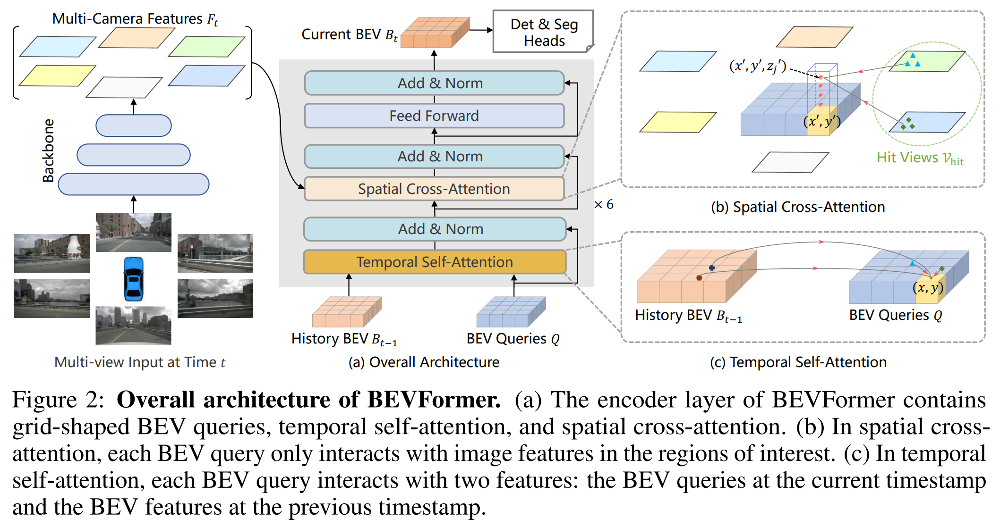
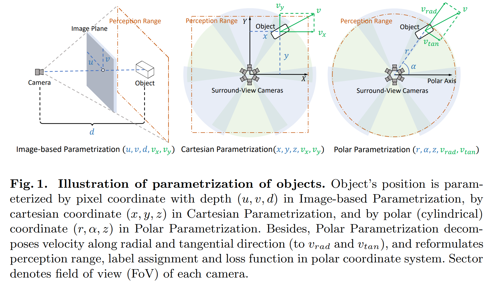
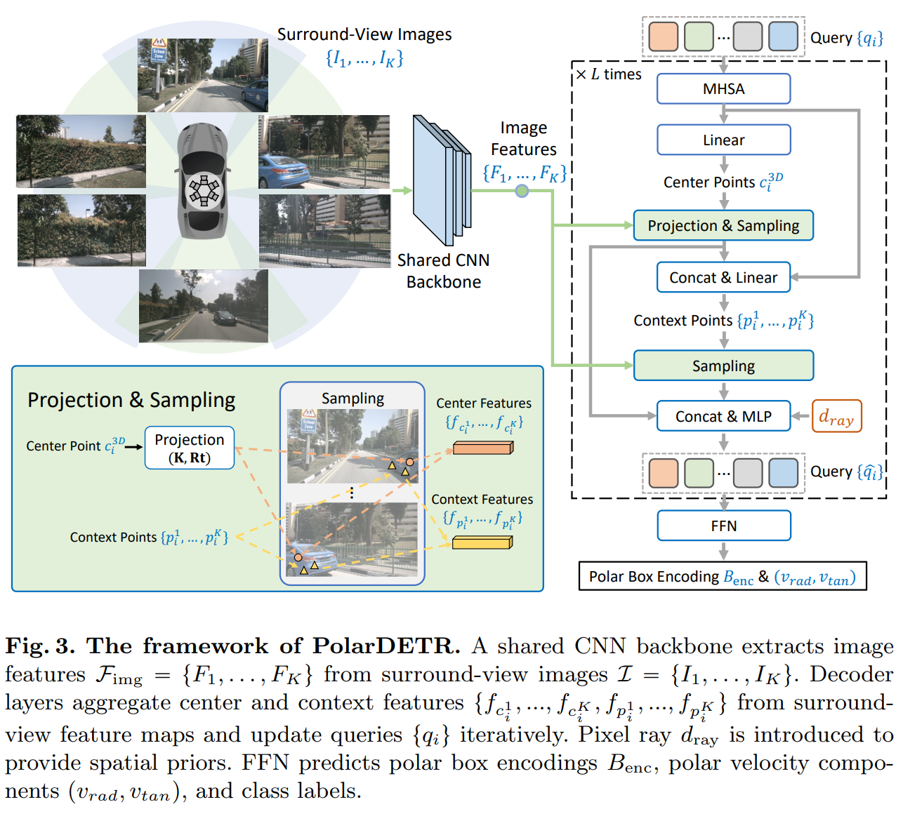

time: 20221207

# Summary of Temperal BEV

这里遵从[公众号](https://mp.weixin.qq.com/s/WyU8HDGEUklFU0-Mx78QoA)提供的方向进行研究。由于微信公众号的历史内容链接并不稳定，这里我们将原页面[打印出来](res/TemperalBEVReview_wechat.pdf)。

直觉上来说，如果我们想要对多帧的BEV feature进行融合，最简单的想法是首先需要根据前帧与当前帧之间的相对位移将特征通过grid_sampling提取到当前帧下，实现坐标的对齐(alignment)。然后对多帧的BEV feature concat起来conv,或者是跑attention融合。

但是如 [deformable attention](../object_detection_2D/deformable_detr.md)的操作，我们可以只把reference points进行坐标转换，而不需要对全特征进行处理就可以抽象地实现前文的alignment的效果。

另外也需要注意，如果直接使用帧之间地temperal attention，由于attention本质上的无序性, 理论上可以通过处理positional embedding也都能抽象地实现alignment效果。

总而言之Attention机制的特殊性给帧间不同坐标的BEV feature的融合带来了更多新的可能。

## BEVFormer: Learning Bird’s-Eye-View Representation from Multi-Camera Images via Spatiotemporal Transformers

[pdf](https://arxiv.org/pdf/2203.17270.pdf) [code](https://github.com/fundamentalvision/BEVFormer)

这篇paper主要的框架是使用Transformer融合不同视角的特征，形成BEV feature。 并且在时序上，读取上一个时刻的融合后的BEV feature使用Attention机制进行时序上的融合(类似于RNN的形式)。

具体而言:

1. 使用ResNet101 提取每个相机的特征。
2. Spatial Cross-Attention的思路是在BEV上每个Pillar生成$N_{ref}$个参考点(3D reference point)，把参考点投影到每个相机上，获得 二维参考点 (2D reference points). 然后用BEV query生成offset, 
$$
\operatorname{SCA}\left(Q_p, F_t\right)=\frac{1}{\left|\mathcal{V}_{\text {hit }}\right|} \sum_{i \in \mathcal{V}_{\text {hit }}} \sum_{j=1}^{N_{\text {ref }}} \operatorname{DeformAttn}\left(Q_p, \mathcal{P}(p, i, j), F_t^i\right)
$$
3. Temperal Cross-Attention则要融合前帧的BEV feature,如果是首帧，则退化为self-attention, 否则是正常的Temperal self-attention. 而deformable attention中的偏移量$\Delta p$改为由$Q, B$的concat预测，而不是只用$Q$预测。
$$
\operatorname{TSA}\left(Q_p,\left\{Q, B_{t-1}^{\prime}\right\}\right)=\sum_{V \in\left\{Q, B_{t-1}^{\prime}\right\}} \operatorname{DeformAttn}\left(Q_p, p, V\right)
$$

本文最后输出直接采用DETR的输出形态，作为三维检测的输出。

训练的时候是从之前两秒的数据中随机选择三帧，作为前帧。前面三帧的BEV特征生成不产生梯度。

## Polar Parametrization for Vision-based Surround-View 3D Detection

[pdf](https://arxiv.org/pdf/2206.10965.pdf) [code](https://github.com/hustvl/PolarDETR)

本文指出一点在于使用极坐标来表达物体，对于六个相机的设计情况来说更为对称。

在矩形坐标系下，两辆距离相等的车，一个在正前方，一个在侧前方，可能在正前方的车子因为距离 $ d > z_{max}$ 就被过滤掉，但是在侧前方的车子因为 $ d < \sqrt{2}z_{max}$ 却被保留，但是由于两个车子到相机距离一致，他们在两个相机上的投影是一致的。如果给出的label却不一致，会影响模型的收敛。

本文把前文的BEV query， BEV label assignment全部换到了极坐标系下，而网络结构上仅仅需要改变 polar box encoding (这个在实际coding中没有改变，只是逻辑上发生了变化)。

在时序融合的时候，这里的采样是投影点 + 可学习偏移，性质上类似于前文的deformable attention.可学习偏移由当前点特征与query concat + linear输出。

融合多帧数据的时候，本文的方案是把当前帧的 polar pillar 点投影到过去的 image frame上面，用上文的方法进行信息融合。

