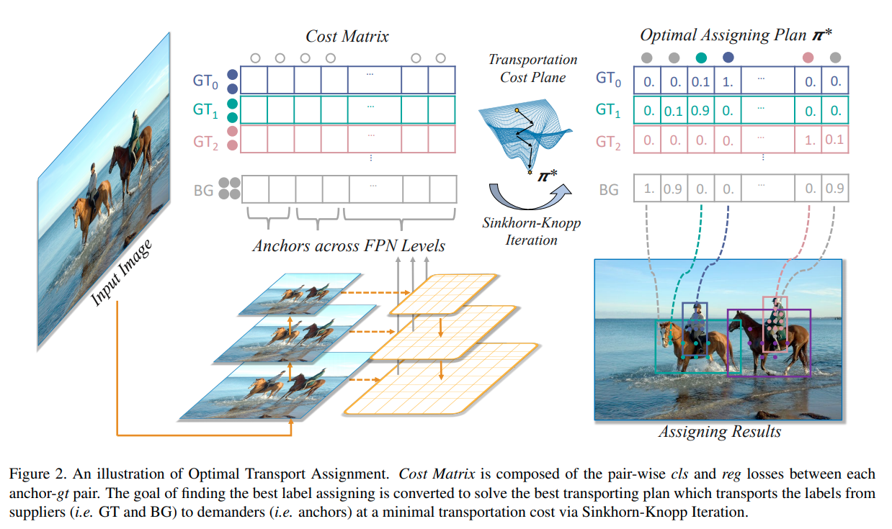
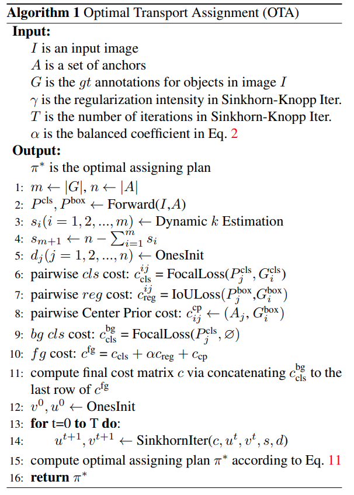
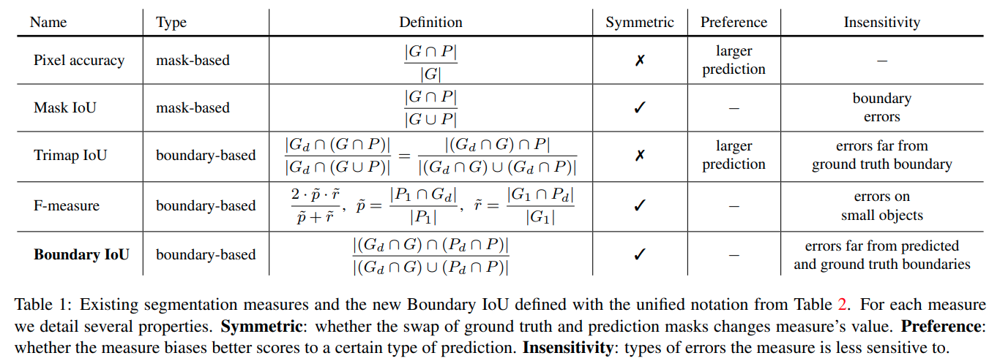
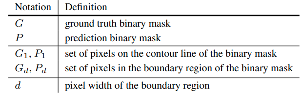
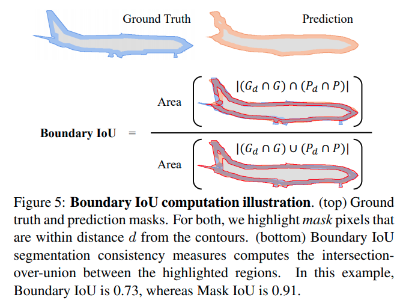
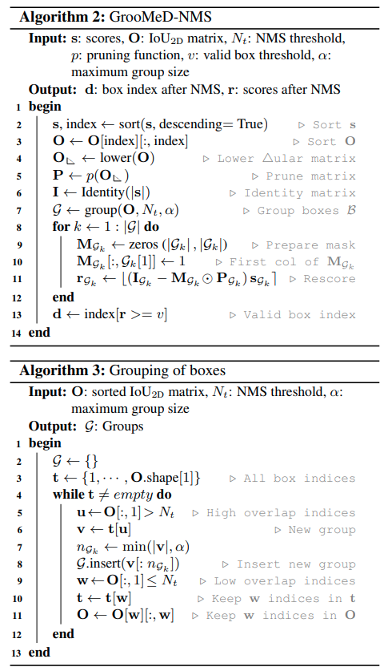
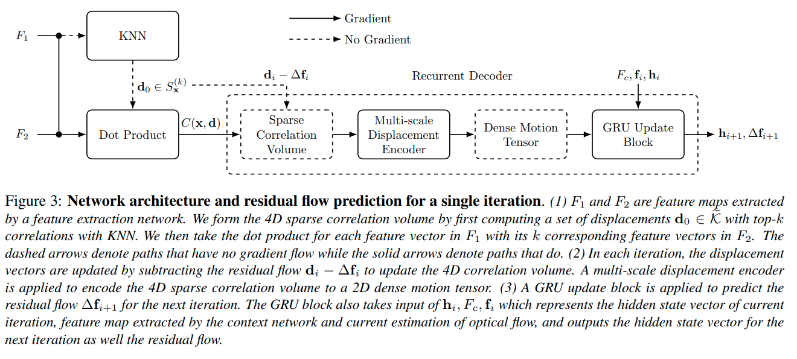
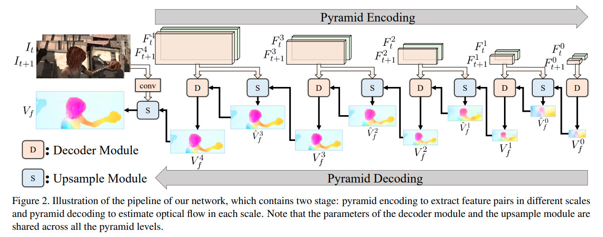

time: 20210814
short_title: CVPR 2021 clips

# Summaries for several CVPR 2021 papers

## OTA: Optimal Transport Assignment for Object Detection

[pdf](https://arxiv.org/pdf/2103.14259.pdf) [code](https://github.com/Megvii-BaseDetection/OTA)

OTA 这篇paper提出使用optimal transport assignment 做 ground truth label assignment.

前一年的CVPR一篇paper [ATSS](Summary_of_serveral_cvpr2020.md) 说明RetinaNet和FCOS之间的差距只要在于label的分配上. 这篇paper使用 [最优运输](Collections_StereoMatching_KITTI.md). 

理解上来说，每一个ground truth作为一个 optimal transport 的 supplier 提供 $k$个正样本, 剩下的由background提供负样本. 然后每一个anchor 作为demander. 分配成本由损失函数决定

$$
\begin{aligned}
c_{i j}^{f g}=& L_{c l s}\left(P_{j}^{c l s}(\theta), G_{i}^{c l s}\right)+\\
& \alpha L_{r e g}\left(P_{j}^{b o x}(\theta), G_{i}^{b o x}\right)
\end{aligned}
$$

这个assign 过程代码上是屏蔽反传的。

## Boundary IoU: Improving Object-Centric Image Segmentation Evaluation

[pdf](https://arxiv.org/pdf/2103.16562.pdf) [code](https://github.com/bowenc0221/boundary-iou-api)

$G_d, P_d$定义为距离ground truth与预测的contours距离在$d$以内的像素.

实现上是使用cv2.copyMakeBorder以及cv2.erode。 [核心代码](https://github.com/bowenc0221/boundary-iou-api/blob/master/boundary_iou/utils/boundary_utils.py)

## GrooMeD-NMS: Grouped Mathematically Differentiable NMS for Monocular 3D Object Detection

[pdf](https://arxiv.org/pdf/2103.17202.pdf) [code](https://github.com/abhi1kumar/groomed_nms)

这篇paper提出了一个新的NMS算法，但是仅仅使用了2D等信息，但是仅evaluate在3D算法上.思路是让NMS变得可以训练

## Learning Optical Flow From a Few Matches
[pdf](https://openaccess.thecvf.com/content/CVPR2021/papers/Jiang_Learning_Optical_Flow_From_a_Few_Matches_CVPR_2021_paper.pdf)

这篇文章的作者指出新的光流框架，比如[RAFT](Summary_of_serveral_eccv2020.md), 会计算每一个像素与整个特征图计算匹配以及光流。但是作者认为这个占用存储太多，不好，但是原来的邻域匹配也还是不尽如人意。作者提出在RAFT的基础上，只存储每个像素的tok-k个匹配。最终形成一个离散的匹配。存储方法也从密集存储变为\{值，坐标\}存储

## UPFlow: Upsampling Pyramid for Unsupervised Optical Flow Learning
[pdf](https://openaccess.thecvf.com/content/CVPR2021/papers/Luo_UPFlow_Upsampling_Pyramid_for_Unsupervised_Optical_Flow_Learning_CVPR_2021_paper.pdf) [code](https://github.com/coolbeam/UPFlow_pytorch)

这篇paper改善了无监督的光流。

- self-guided upsample. 
- Loss guidance at pyramid levels. 其他无监督光流的低分辨率输出层是用GT训练的。本文则是用高分辨率的输出下采样进行训练，

## AutoFlow: Learning a Better Training Set for Optical Flow
[pdf](https://openaccess.thecvf.com/content/CVPR2021/papers/Sun_AutoFlow_Learning_a_Better_Training_Set_for_Optical_Flow_CVPR_2021_paper.pdf) [project-page](https://autoflow-google.github.io/)

这篇paper的任务是根据少量非连续图片数据，合成光流训练用的数据。