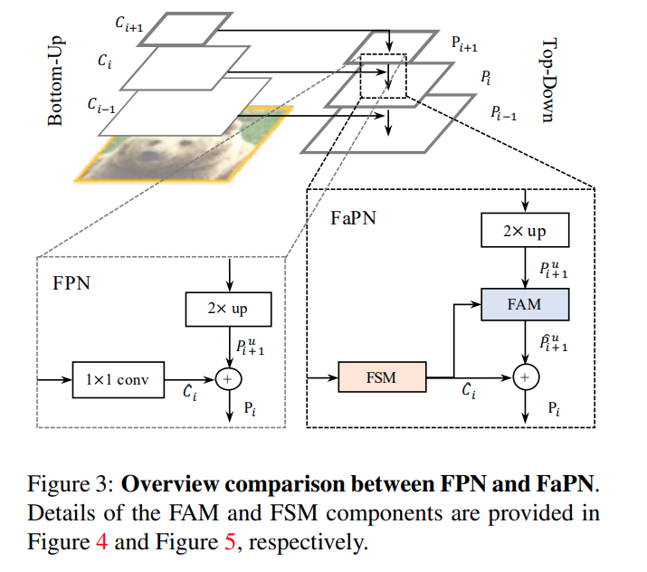
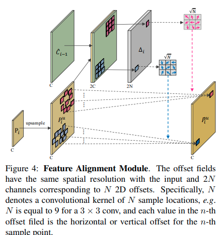
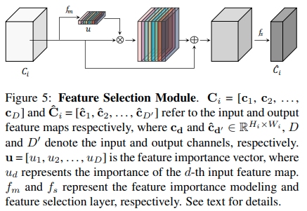
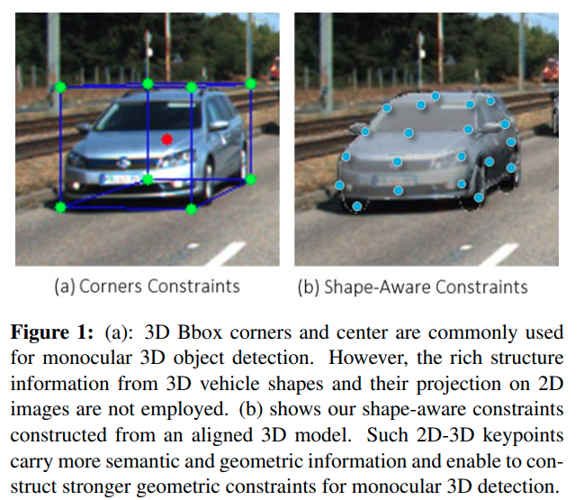
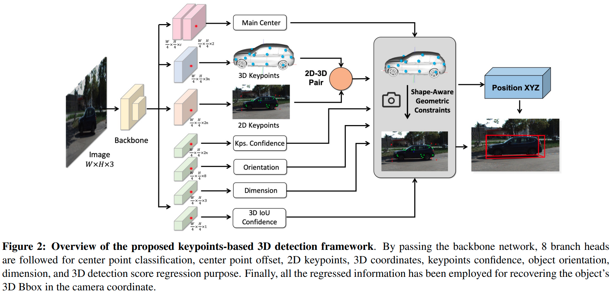
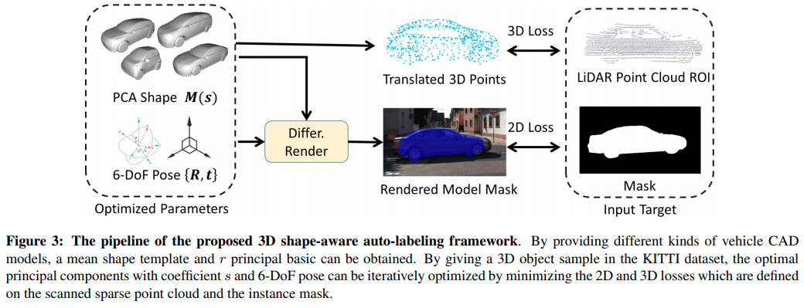
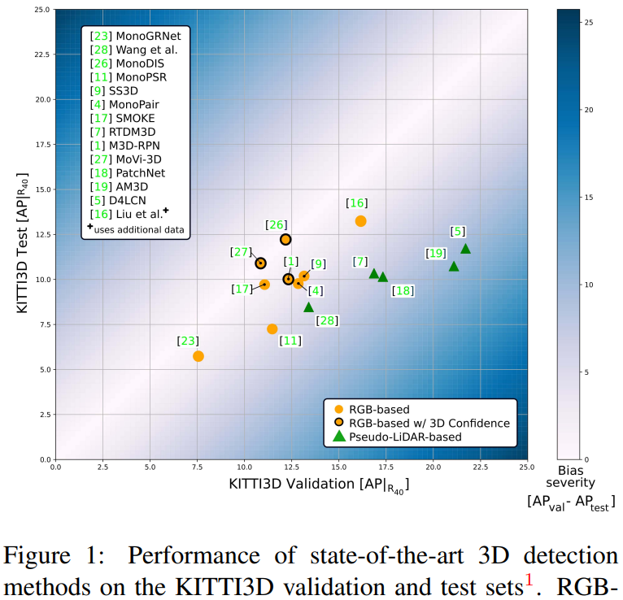
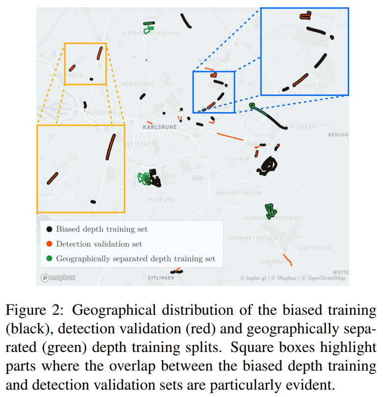

time: 20211230
short_title: ICCV 2021 clips

# Summaries for several ICCV 2021 papers

## Rank & Sort Loss for Object Detection and Instance Segmentation
[pdf](https://arxiv.org/pdf/2107.11669.pdf) [code](https://github.com/kemaloksuz/RankSortLoss)

这篇paper的作者与[aLRPLoss](../object_detection_2D/aLRPLoss.md)是同一个作者，这篇paper在理论以及方法上也是会有一定的连续性。

前文的设定没有考虑在$L* \neq 0$的时候无法解释。且没有只有$i\in \mathcal{P} \& j \in \mathcal{N}$的时候存在损失，也忽略了类之间的损失。

损失的定义:

$$
\mathcal{L}=\frac{1}{Z} \sum_{i \in \mathcal{P} \cup \mathcal{N}}\left(\ell(i)-\ell^{*}(i)\right)
$$

计算方法转换为:

$$
L_{ij} = (l(i) - l*(i))p(j|i)
$$

## FaPN: Feature-aligned Pyramid Network for Dense Image Prediction
[pdf](https://arxiv.org/pdf/2108.07058.pdf) [code](https://github.com/EMI-Group/FaPN)

直觉上来说解决的是低分辨率特征上采样时候的alignment问题。方法上主要是deformable conv and attention.

## AutoShape: Real-Time Shape-Aware Monocular 3D Object Detection
[pdf](https://arxiv.org/pdf/2108.11127.pdf) [code](https://github.com/zongdai/AutoShape)

这篇paper在 [MonoFlex]等文章的基础上，提出基于车辆的CAD的模型提取对应的keypoints, 这样就不需要对这空白的背景提取车辆包络框的关键点了。

本文实现了目前SOTA的性能。 参考[表格](../../3dDetection/RecentCollectionForMono3D.md)

## SOTR: Segmenting Objects with Transformers
[pdf](https://arxiv.org/pdf/2108.06747.pdf) [code](https://github.com/easton-cau/SOTR)

这篇paper使用Transformer 处理 Instance Segmentation 如[YOLOACT](../Segmentation/YOLACT.md)中的分类头，并提供动态卷积核输出不同得instances.

## Are we Missing Confidence in Pseudo-LiDAR Methods for Monocular 3D Object Detection?
[pdf](https://openaccess.thecvf.com/content/ICCV2021/papers/Simonelli_Are_We_Missing_Confidence_in_Pseudo-LiDAR_Methods_for_Monocular_3D_ICCV_2021_paper.pdf)

这篇文章正面分析了Pseudo LiDAR在validation set上与在test set上巨大的性能偏差.

比较显然的是,depth prediction的训练集和检测的训练集和验证集之间有很大的交集.这使得在一部分的validation set上,预训练的深度预测网络能预测出不真实的高精确度.大幅度地提升了validation的点数.

上图说明了现在PLiDAR路径很强的validation结果但是不是特别强的test set结果.

通过描画detection sequence和depth prediction sequence的GIS重叠度.可以得到下图

本文提出增加预测3D bounding box的置信度.同时控制在validation training的时候使用的depth prediction split. 得到了更加平衡的PLiDAR结果.

*性能和网络结构上的创新并不是很巨大, 但是系统地正面说明了PLiDAR目前在validation set上失真的事实.*
