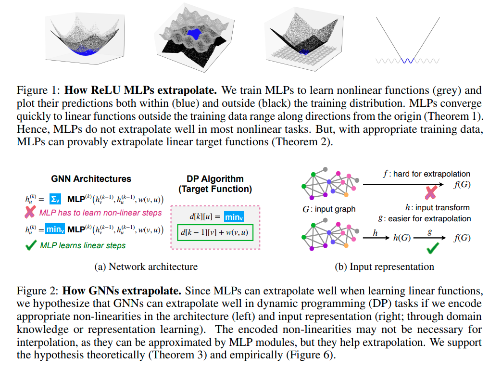
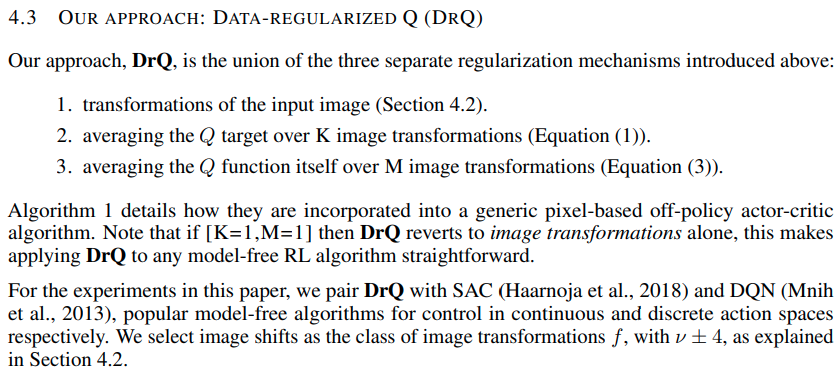

time: 20210518
short_title: ICLR 2021 clips

# Summaries for several ICLR 2021 papers

## An Image is Worth 16x16 Words: Transformers for Image Recognition at Scale
[pdf](https://openreview.net/pdf?id=YicbFdNTTy) [code](https://github.com/google-research/vision_transformer) [pytorch-code](https://github.com/lucidrains/vit-pytorch)

这篇paper使用transformer进行视觉分类。

具体做法上，对于224x224的图片可以分成16x16的一系列小块，每一个小块带上一维的positional encoding放入transformer中，单层连接:

$$
\begin{aligned}
\mathbf{z}_{0} &=\left[\mathbf{x}_{\text {class }} ; \mathbf{x}_{p}^{1} \mathbf{E} ; \mathbf{x}_{p}^{2} \mathbf{E} ; \cdots ; \mathbf{x}_{p}^{N} \mathbf{E}\right]+\mathbf{E}_{\text {pos }}, & \mathbf{E} \in \mathbb{R}^{\left(P^{2} \cdot C\right) \times D}, \mathbf{E}_{\text {pos }} \in \mathbb{R}^{(N+1) \times D} \\
\mathbf{z}_{\ell}^{\prime} &=\operatorname{MSA}\left(\operatorname{LN}\left(\mathbf{z}_{\ell-1}\right)\right)+\mathbf{z}_{\ell-1}, & \ell=1 \ldots L \\
\mathbf{z}_{\ell} &=\operatorname{MLP}\left(\operatorname{LN}\left(\mathbf{z}_{\ell}^{\prime}\right)\right)+\mathbf{z}_{\ell}^{\prime}, & \ell=1 \ldots L \\
\mathbf{y} &=\mathrm{LN}\left(\mathbf{z}_{L}^{0}\right) &
\end{aligned}
$$

整个网络不使用卷积，但是能在大大小小的分类数据集上达到卷积的水平.

## What Matters for On-Policy Deep Actor-Critic Methods? A Large-Scale Study

[pdf](https://openreview.net/pdf?id=nIAxjsniDzg)

这篇文章综合做了很细致很大规模的实验，认真地分析了究竟是哪些因素促进了on-policy 深度强化学习 AC算法的性能。本文规范化地实现了50多个设计因素，然后再五个不同的环境下进行了大量的实验。

一个[知乎博客](https://zhuanlan.zhihu.com/p/359283983)收集了其中的实验结论

## How Neural Networks Extrapolate: From Feedforward to Graph Neural Networks

[pdf](https://openreview.net/pdf?id=UH-cmocLJC)

这篇paper尝试解答了全连接ReLU网络以及GNN是如何extrapolate的，也就是在什么情况下，全连接以及GNN能学习到training distribution之外的正确结果，并给出了理论证明.

## Image Augmentation Is All You Need: Regularizing Deep Reinforcement Learning from Pixels 

[pdf](https://openreview.net/pdf?id=GY6-6sTvGaf)

这篇paper发现简单的数据增强也能实现增强学习的SOTA.

