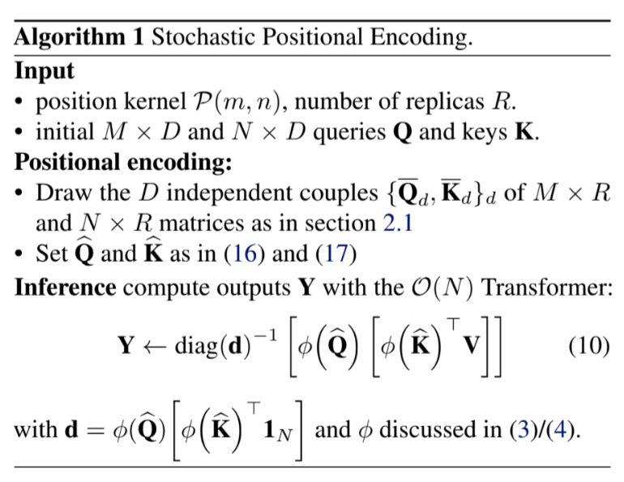
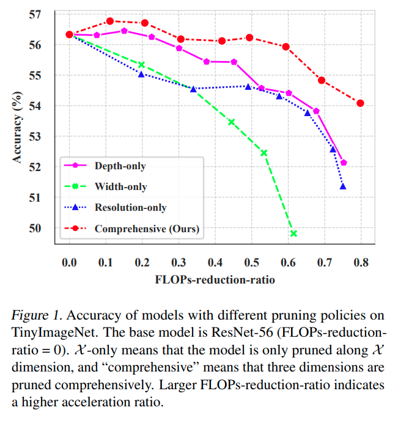
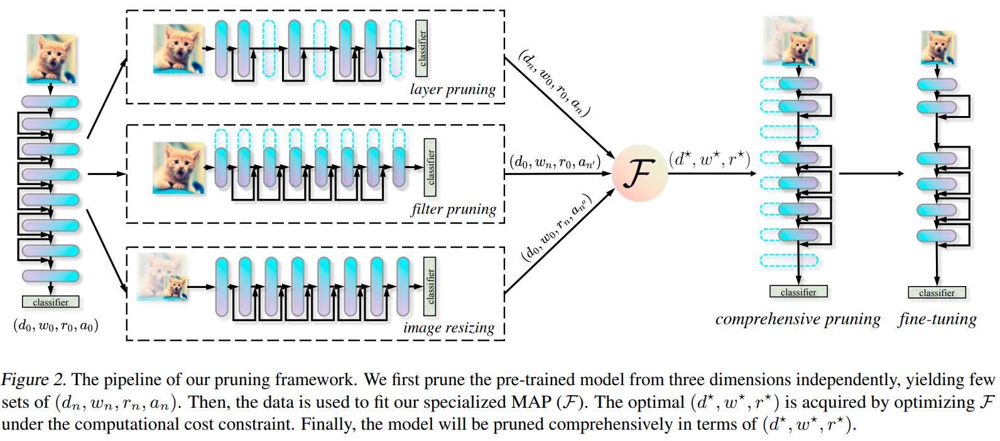
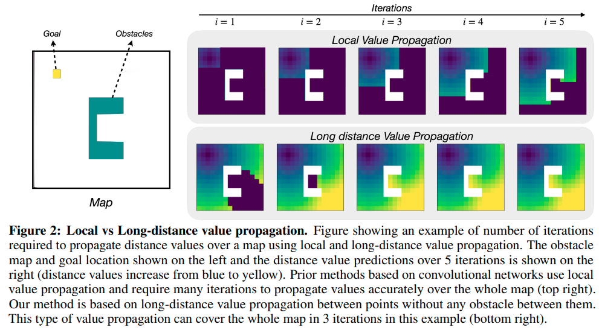
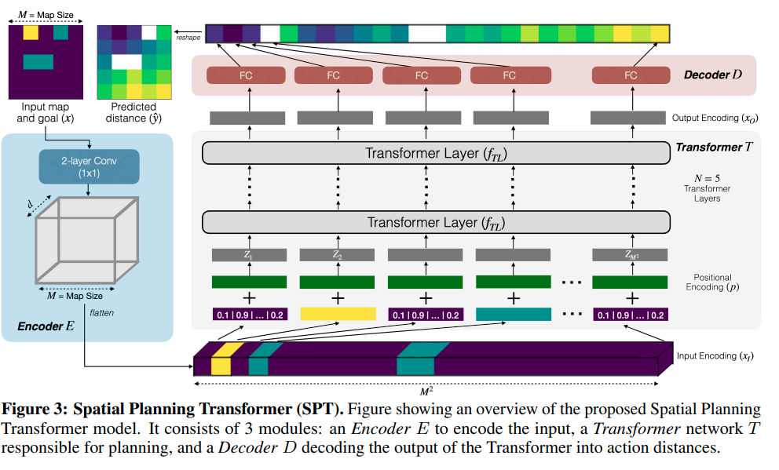

time: 20210603
short_title: ICML 2021 clips

# Summaries for several ICML 2021 papers

## ViLT: Vision-and-Language Transformer Without Convolution or Region Supervision

[pdf](https://arxiv.org/pdf/2102.03334.pdf)

本文是第一篇使用Transformer，不使用CNN feature 实现的VLP模型

## Relative Positional Encoding for Transformers with Linear Complexity
[pdf](https://arxiv.org/abs/2105.08399) [code](https://github.com/aliutkus/spe/tree/main/src/pytorch)

这篇paper提出了 Stochastic Positional Encoding (SPE)，重点的思路在于将准确的positional Attention理解为一个covariance(因为它设计两个feature以及positional encoding的点乘)因而可以用采样去学习。

## Accelerate CNNs from Three Dimensions: A Comprehensive Pruning Framework

[pdf](https://arxiv.org/pdf/2010.04879.pdf)

本文有一个很好的[CSDN blog](https://blog.csdn.net/weixin_49457347/article/details/116780995)

这篇paper提出了一个很全面的剪枝框架，从三个维度对CNN进行加速。有一点像是Efficient Net对深度，宽度，分辨率一组系数为基准然后去放大网络，这篇paper则是确定一组参数去prune网路.

本文主要的观点:

- 以往的方法，要么是对layer进行剪枝，要么是对filter进行剪枝，甚至是缩小resolution.
- 如果同时着眼多个维度，可以有更高的性能效果.
- 同时的pruning可以理解为一个优化问题，而精度可以被建模成深度宽度以及分辨率的一个多项式.

$$
\begin{aligned}
d^{\star}, w^{\star}, r^{\star}=& \underset{d, w, r}{\arg \max } \mathcal{F}(d, w, r ; \Lambda) \\
\text { s.t. } \mathcal{C}(d, w, r)&=T \times \mathcal{C}\left(d_{0}, w_{0}, r_{0}\right), \\
\mathcal{C}(d,w,r) &= dw^2r^2 \\
\mathcal{F}(d, w, r, \Lambda) &= \sum^\mathcal{K}_{i,j,k=0}{\lambda_{i,j,k}d^iw^jr^k}
\end{aligned}
$$

## Differentiable Spatial Planning using Transformers

[pdf](https://openreview.net/references/pdf?id=1ca9iAsu1w) 

这篇paper提出用transformer进行value iteration来加速planning的value扩散.