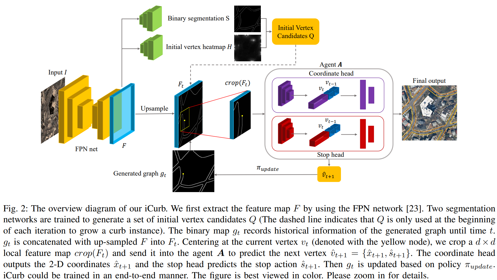

time: 20220109

# Summary of Several Map Extraction Papers

本blog收集一系列关于从空中图片提取地面地图的paper.本质上来说属于从图片提取由路线(edge)与交叉点(node)组成的图(graph)

传统的思路:
1. 语义分割分割出路面和非路面的binary map
2. 像素收缩,使得binary map只剩下单线的路面.
3. 求连通域,并修剪地图.

## RoadTracer: Automatic Extraction of Road Networks from Aerial Images
[pdf](https://arxiv.org/abs/1802.03680) [code](https://github.com/mitroadmaps/roadtracer)

这篇论文开启了以迭代为baseline方法的图生成. 在给出起点之后,网络在每一个step, crop出附近的RGB图,预测下一步edge的生长方向.

本文的生长距离是固定长度(fix-step)的.网络的预测是是否停止以及预测角度.

在一定程度下可以理解为模仿学习的训练模式.如果使用GT地图的路线生成生长方向,让网络在训练的时候模仿GT地图的生长方式,网络在推理过程中会因为噪音偏离开正确的路线并无法复原. 人造的噪声也无法实际地模仿网络的噪声分布.本文提取使用动态生成label的方式.

对每一个cropped出来的子图以及现有的序列,生成标签的方法.
### 路线分配
用map-matching算法判断目前的"序列"属于地图上的哪一条路径(不能用当前点的最近路线就确定, 否则因为噪音会偏航). 
这个问题在GPS/手机信号分析时有用到,如[此文](https://www.researchgate.net/publication/221091787_VTrack_Accurate_Energy-aware_Road_Traffic_Delay_Estimation_Using_Mobile_Phones). 这篇文章里面研究的是手机信号点(GPS)位置序列与地图路线的匹配问题.被设计为一个[HMM](https://www.wikiwand.com/en/Hidden_Markov_model)模型,每一个时刻观测值是GPS位置,隐变量是所处的路线edge. 状态转移矩阵的特点在于两次测量要么在同一个路线edge上,要么在一个相互连接的路线edge上.从而形成马尔科夫链. 这里的任务相当于已知序列观测,求解最大似然的隐变量序列. 使用的[Viterbi](https://www.wikiwand.com/en/Viterbi_algorithm)算法. 

本文的标签就是在已知路线的分配的情况下,投影到最近的点上,然后往前一个固定的步长作为目标.

## VecRoad: Point-based Iterative Graph Exploration for Road Graphs Extraction
[pdf](https://openaccess.thecvf.com/content_CVPR_2020/html/Tan_VecRoad_Point-Based_Iterative_Graph_Exploration_for_Road_Graphs_Extraction_CVPR_2020_paper.html) [code](https://github.com/tansor/VecRoad)

这篇论文在上文的基础上提出新的提升.

- 使用预测下一个点的方法,替代方向.从而实现在路口位置的灵活地控制步长，从而网络可以在交点处得到比较准确。
- 使用语义分割+交点语义分割作为决策小网络的输入。这些关键的数据cues提升了网络的准确度。

## iCurb: Imitation Learning-based Detection of Road Curbs using Aerial Images for Autonomous Driving

[pdf](https://arxiv.org/pdf/2103.17118.pdf) [code](https://github.com/TonyXuQAQ/Topo-boundary)

