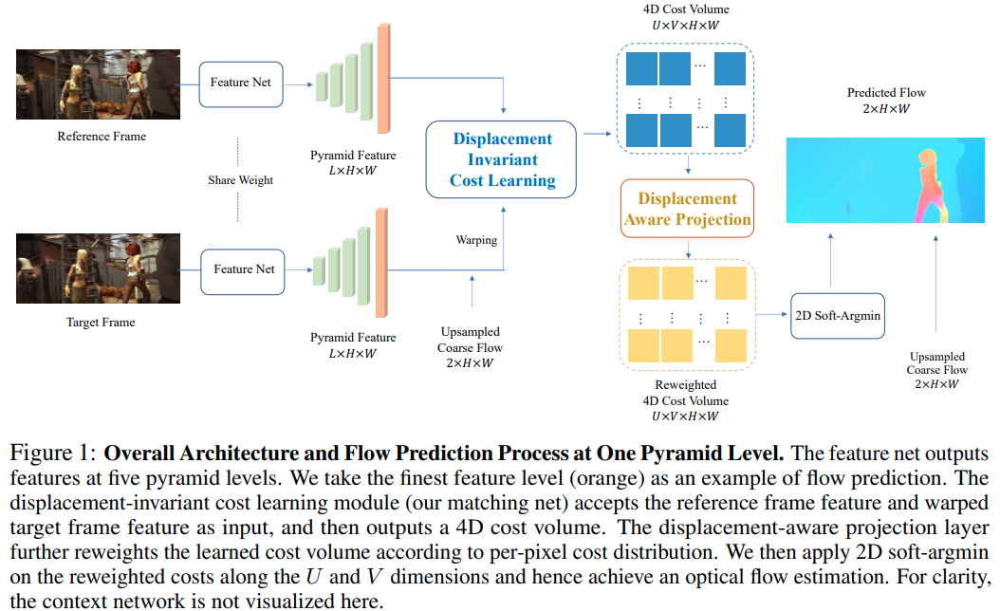
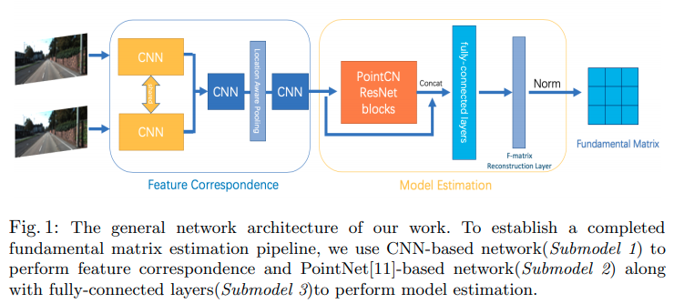
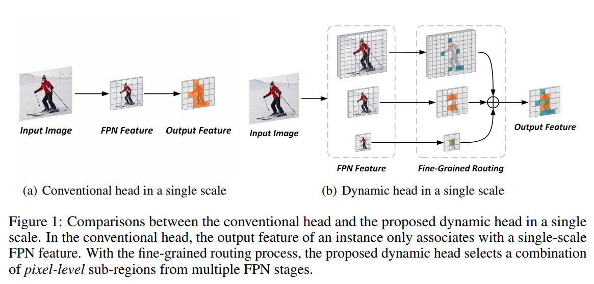
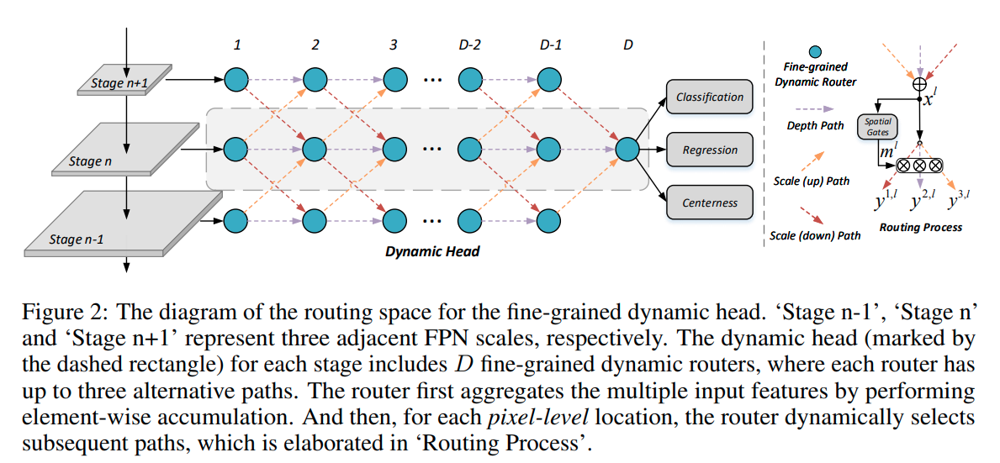
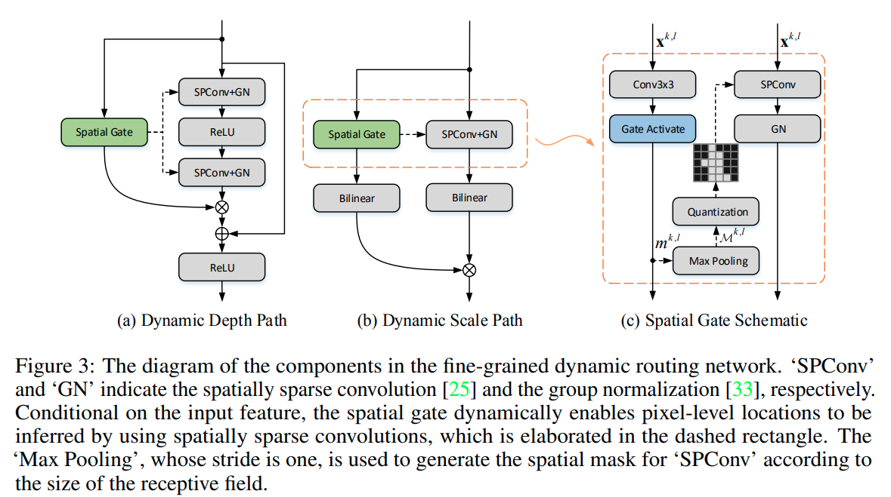

time: 20201101

# Summary of NIPS 2020 for application

这个页面和 [NIPS 2020 for NN](../../The_theory/NIPS2020_networks.md)相比，看的更多是网络具体应用上的实验，而不是理论.

## Displacement-Invariant Matching Cost Learning for Accurate Optical Flow Estimation (DICL)

[pdf](https://arxiv.org/pdf/2010.14851.pdf) [code](https://github.com/jytime/DICL-Flow)

这篇paper提出的是使用concat的结构去进行光流的估计. 这个方法在[双目](Collections_StereoMatching_KITTI.md)中很常见，但是在光流中不常见。主要原因是光流中需要在二维平面内进行大规模的搜索，因而用concat-based的cost volume内存占用很大，也会很慢。

这篇paper使用的是 concat-based的cost volume.

这个cost volume的输入为两张$(B, C, H, W)$的图片特征, 将target图多次平移(x, y, 正负)并与reference图concat 输出的大小为 $[B, 2C, 2U+1, 2V+1, H, W]$其中$U, V$分别为竖直与水平的搜索范围.

然后将 $(B, 2U+1, 2V+1)$全部merge到一个维度$B'$上，对$[B', 2D, H, W]$作卷积，输出cost $[B', 1, H, W]$, 再复原到$[B, 2U+1, 2V+1, H, W]$.

###  An End to End Network Architecture for Fundamental Matrix Estimation

[pdf](https://arxiv.org/pdf/2010.15528.pdf)

立体视觉中两个相机拍到的图片中的对应点满足 $x'Fx = 0$, 其中$Fx$为epipolar line. $F=K_2^{-T}\hat tRK_1^{-1}$就是 fundamental matrix ($\hat t$指三维矢量叉乘转点乘).

传统来说需要keypoint detection, matching, eight-point estimation这样的流程.

这篇paper采取的是比较暴力运算的方案(并非完全新，但是有新意).

- contractive learning, 用CNN学习，让两张图对应keypoint距离近，不对应keypoint距离远，参考[UCN](https://arxiv.org/pdf/1606.03558.pdf).LAP是[Location Aware Pooling](https://arxiv.org/pdf/1810.01575.pdf),这篇也是重要的前置论文.
- 对每一个pixel算全连接，这边称为pointnet结构,得到每个pixel成为可靠keypoint的概率, 用于所谓去除out-lier
- 最后的估计采用的是全连接，回归的参数有八个 $[f_1, f_2, \alpha, \beta]$,F的预测值是$[f_1; f_2; \alpha f_1 + \beta f_2]$.
- 训练loss, 一个是对$F$的$l_1, l_2$ loss，另一个是所有keypoint的残差$l_e = \gamma \frac{1}{N} \sum^N_i|m'^T_i\hat F m_i|$

## Fine-Grained Dynamic Head for Object Detection

[pdf](https://papers.nips.cc/paper/2020/file/7f6caf1f0ba788cd7953d817724c2b6e-Paper.pdf) [code](https://github.com/StevenGrove/DynamicHead)

Motivation就是想在FPN的基础上不同Scale的特征能够互相融合:

结构上就是多层地给使得相邻scale之间feature能够互通，作者额外添加了 一个routing模块;设计了一下各个path;添加一个gate.

图中gate factor $m$在理想情况下应该使用离散值，且理论上可以用policy gradient的方法优化[0, 1]设置，但是这里按照深度学习的传统将离散值连续化, 

$$
\delta(v)=\max \left(0, \frac{\tanh (v-\tau)+\tanh (\tau)}{1+\tanh (\tau)}\right) \in[0,1], \forall v \in \mathbb{R}
$$

