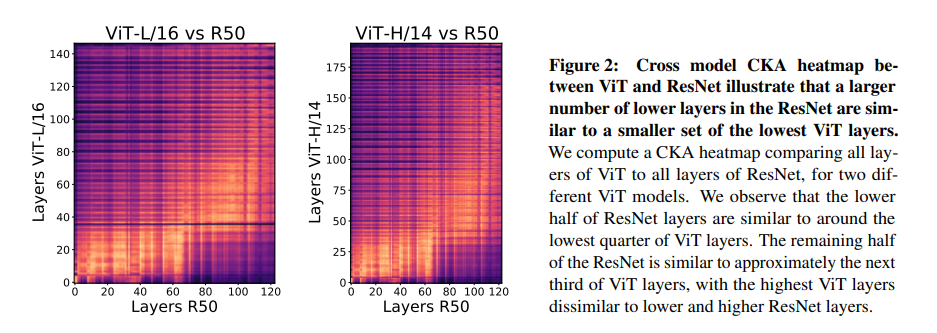
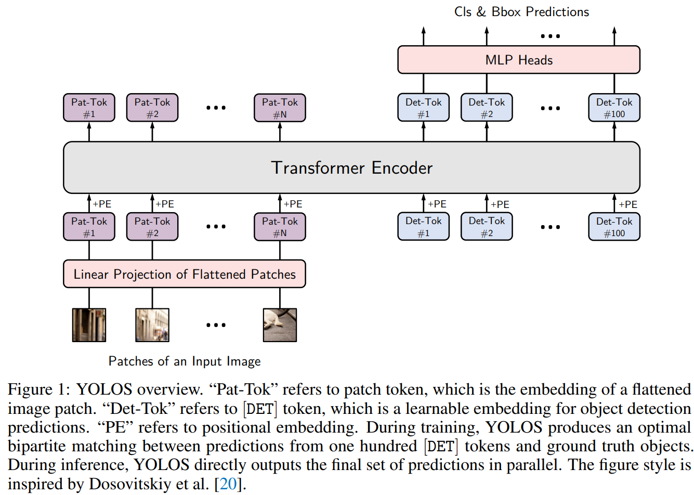
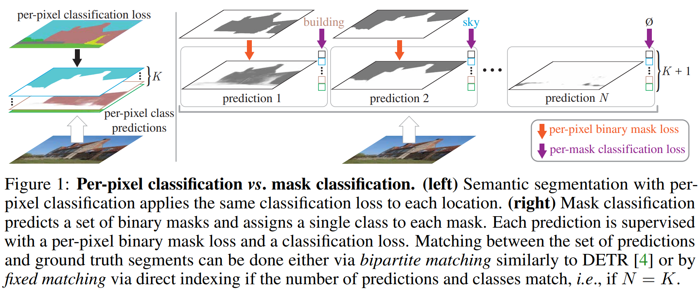
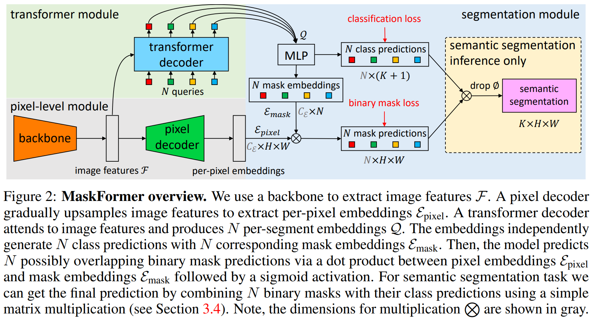

time: 20211004
short_title: NeurIPS 2021 clips

# Summaries for several NeurIPS 2021 papers

## Do Vision Transformers See Like Convolutional Neural Networks?

[pdf](https://arxiv.org/abs/2108.08810)

这篇paper,尝试从ViT以及CNN的中间特征进行分析，尝试理解ViT学习到的特征，学习的方法与CNN相比有什么不同。

结论来说:

- ViT的浅层与深层之间的"相似性更大"，一大原因是贯穿整个ViT的残差连接.
- ViT在浅层的时候就有ResNet深层的特性，且更早获取全局特征。
- 低层网络中的局部信息依然非常重要，ViT需要大量的训练数据来帮助网络学习这个，这也是它对数据的要求更高的一个表现.
- 我们发现ViT同样能很好的保存局部位置信息.

方法上来说，本文采用 Centred Kernel Alignment (CKA)来分析神经网络的特征。[code](https://github.com/yuanli2333/CKA-Centered-Kernel-Alignment):

定义由$m$个数据产生的两层网络的特征$X\in \mathbb{R}^{m\times p_1}$ $Y\in \mathbb{R}^{m\times p_2}$. 定义两组数据的格拉姆(Gram)矩阵  $K = XX^T, L = YY^T$.

$$\operatorname{CKA}(\boldsymbol{K}, \boldsymbol{L})=\frac{\operatorname{HSIC}(\boldsymbol{K}, \boldsymbol{L})}{\sqrt{\operatorname{HSIC}(\boldsymbol{K}, \boldsymbol{K}) \operatorname{HSIC}(\boldsymbol{L}, \boldsymbol{L})}}$$

其中: HSIC 是 Hilbert-Schmidt independence criterion
$H = I_n - \frac{1}{n} \bold{1} \bold{1}^T, K' = HKH, L'=HLH$, $\text{HSIC}(K,L) = \text{vec}(K') \dot \text{vec}(L') / (m - 1)^2$.

## You Only Look One Sequence

[pdf](https://arxiv.org/pdf/2106.00666.pdf) [code](https://github.com/hustvl/YOLOS)

这篇论文的有几个主要的论点:

- Transformer应该重视预训练效果。这篇paper的网络结构就很依赖预训练，且与CNN不同, from scratch training通过增长训练时间也难以获得fine-tuning的水平.
- 结构上本文接近于无CNN基础的DETR, 作者认为需要将序列重整回2D的都不符合Transformer去除inductive bias的精神，因而不推荐。
- 为了检测输出，去除了CLS Token,而加入重新随机初始化的DET Token.

## Per-Pixel Classification is Not All You Need for Semantic Segmentation

[pdf](https://arxiv.org/abs/2107.06278) [code](https://github.com/facebookresearch/MaskFormer) [知乎](https://zhuanlan.zhihu.com/p/389457610)

这篇paper主要的新思想在于使用instance segmentation的mask prediction思路尝试解决了语义分割的问题。使得语义分割不仅仅是一个对每一个像素进行分类的方法.

输出结构从$K$个密集的分类热图($K$与分类类别数一致)。 变为 $N$个二分类的mask热图， 与$N$个$K+1$维的mask分类。$N$与$K$可以不同.

又提出了mask-former的结构。

有人指出这篇论文与[max-deeplab](https://arxiv.org/abs/2012.00759)很像,事实如此，max-deeplab用类似的方法直接完成了全景分割，而本文一定程度上可以理解为max-deeplab的子问题。