time: 20200608
short_title: ICRA 2020 clips

# Summaries for several ICRA 2020 papers

本届ICRA有数篇paper在之前已经有review, ["A General Framework for Uncertainty Estimation in Deep Learning"](../../The_theory/Framework_Uncertainty_Propagation.md), ["FADNet: A Fast and Accurate Network for Disparity Estimation"](../others/FADNet.md) ["Object-Centric Stereo Matching for 3D Object Detection"](../../3dDetection/RecentCollectionForStereo3D.md)

目录:

- [Summaries for several ICRA 2020 papers](#summaries-for-several-icra-2020-papers)
  - [Event-Based Angular Velocity Regression with Spiking Networks](#event-based-angular-velocity-regression-with-spiking-networks)
  - [Pedestrian Planar LiDAR Pose (PPLP) Network for Oriented Pedestrian Detection Based on Planar LiDAR and Monocular Images](#pedestrian-planar-lidar-pose-pplp-network-for-oriented-pedestrian-detection-based-on-planar-lidar-and-monocular-images)
  - [CNN Based Road User Detection Using the 3D Radar Cube](#cnn-based-road-user-detection-using-the-3d-radar-cube)
  - [PST900: RGB-Thermal Calibration, Dataset and Segmentation Network](#pst900-rgb-thermal-calibration-dataset-and-segmentation-network)
  - [Instance Segmentation of LiDAR Point Clouds](#instance-segmentation-of-lidar-point-clouds)
  - [SegVoxelNet: Exploring Semantic Context and Depth-aware Features for 3D Vehicle Detection from Point Cloud](#segvoxelnet-exploring-semantic-context-and-depth-aware-features-for-3d-vehicle-detection-from-point-cloud)
  - [Radar as a Teacher: Weakly Supervised Vehicle Detection using Radar Labels](#radar-as-a-teacher-weakly-supervised-vehicle-detection-using-radar-labels)
  - [Self-supervised linear motion deblurring](#self-supervised-linear-motion-deblurring)
  - [Fast Panoptic Segmentation Network](#fast-panoptic-segmentation-network)
  - [Real-Time Semantic Stereo Matching](#real-time-semantic-stereo-matching)
  - [MultiDepth: Single-Image Depth Estimation via Multi-Task Regression and Classification](#multidepth-single-image-depth-estimation-via-multi-task-regression-and-classification)
  - [MPC-Net: A First Principles Guided Policy Search](#mpc-net-a-first-principles-guided-policy-search)
  - [MapLite: Autonomous Intersection Navigation Without a Detailed Prior Map](#maplite-autonomous-intersection-navigation-without-a-detailed-prior-map)

这里继续搜集多篇有趣的ICRA 2020 papers.

## Event-Based Angular Velocity Regression with Spiking Networks

[pdf](https://arxiv.org/pdf/2003.02790.pdf) [code](https://github.com/uzh-rpg/snn_angular_velocity)

这篇paper利用了2018NeurIPS的一篇关于[spiking neural network](http://papers.nips.cc/paper/7415-slayer-spike-layer-error-reassignment-in-time.pdf)的文章，这篇文章提出了SNN的一个训练方法，并且介绍了相关的概念，同时给出了[pytorch库/cuda](https://github.com/bamsumit/slayerPytorch)代码用于加速运算.

本文利用了NIPS paper的这个库，输入为序列的image-like event sequence,输出为序列的三轴角速度，

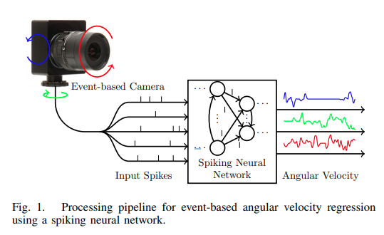

仿真数据来自于[esim仿真器](https://github.com/uzh-rpg/rpg_esim)

## Pedestrian Planar LiDAR Pose (PPLP) Network for Oriented Pedestrian Detection Based on Planar LiDAR and Monocular Images

[pdf](https://ieeexplore.ieee.org/stamp/stamp.jsp?tp=&arnumber=8943147) [code](https://github.com/BoomFan/PPLP)

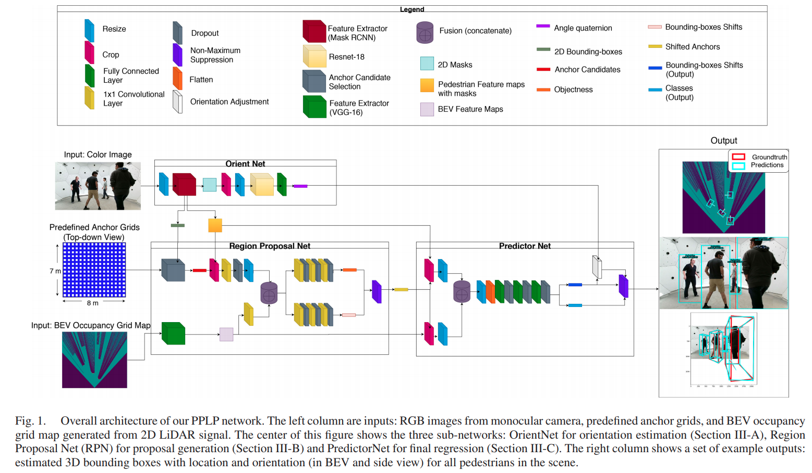

## CNN Based Road User Detection Using the 3D Radar Cube

[pdf](https://ieeexplore.ieee.org/stamp/stamp.jsp?tp=&arnumber=8962258) [code](https://github.com/tudelft-iv/RTCnet)

这篇paper调用底层的radar数据，同时使用底层的radar cube数据以及radar target数据，在纯radar的条件下实现了 3D object detection.

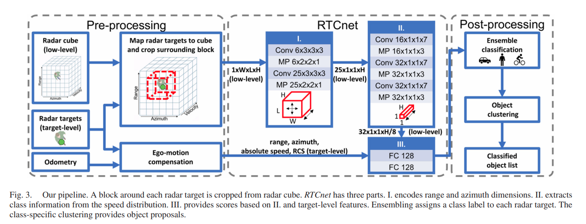

## PST900: RGB-Thermal Calibration, Dataset and Segmentation Network

[pdf](https://arxiv.org/pdf/1909.10980.pdf) [code](https://github.com/ShreyasSkandanS/pst900_thermal_rgb)

本文提出的主要贡献是 RGB-Thermal的校正(利用一个双目RGB相机得到深度估计，再回投到Thermal上)以及一个语义分割数据集，

## Instance Segmentation of LiDAR Point Clouds

[pdf](http://www.feihuzhang.com/ICRA2020.pdf) [code](https://github.com/feihuzhang/LiDARSeg)

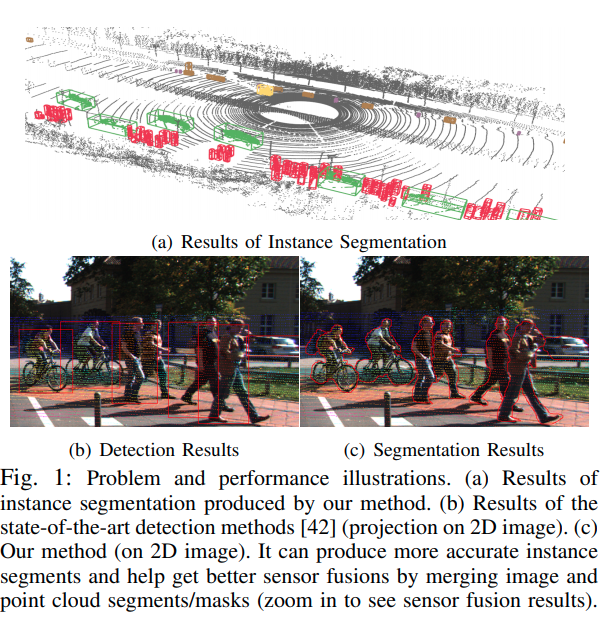

## SegVoxelNet: Exploring Semantic Context and Depth-aware Features for 3D Vehicle Detection from Point Cloud

[pdf](https://arxiv.org/pdf/2002.05316.pdf)

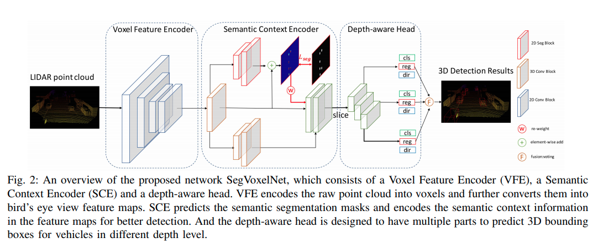

这篇paper来自于[D4LCN](../../3dDetection/RecentCollectionForMono3D.md)的组。

语义分割BEV Ground Truth来自于bbox直接的投影。Depth Aware的理解是近处、远处的点云分布密度差距较大，将BEV沿着深度轴分成带有重叠部分的几个部分，执行不同的卷积操作。在KITTI上的性能与PointPillars和PointRCNN相近。

##  Radar as a Teacher: Weakly Supervised Vehicle Detection using Radar Labels

[pdf](http://www.robots.ox.ac.uk/~mobile/Papers/Relabel_ICRA2020.pdf)

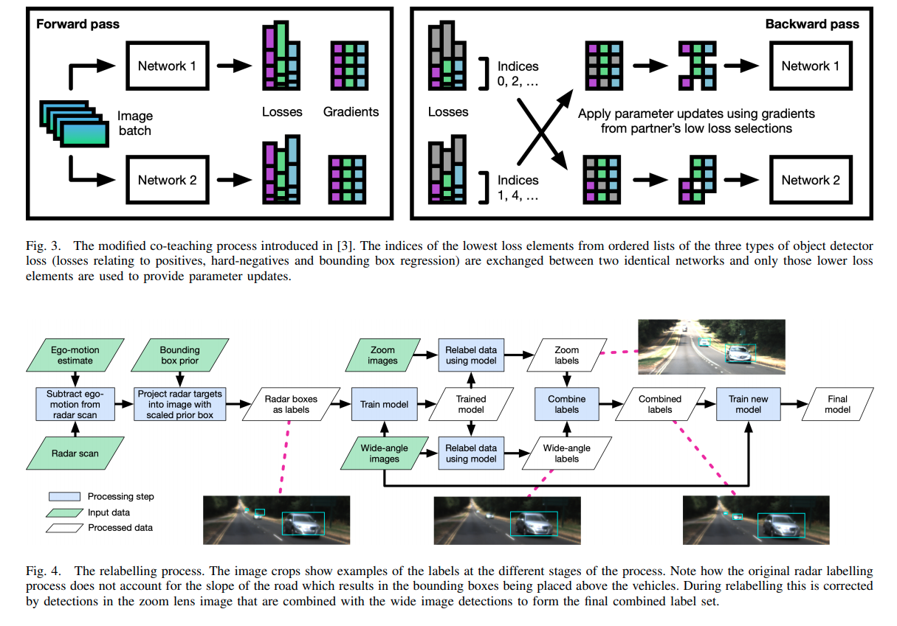

这篇paper建议参考此前NIPS的 [co-teaching的paper](https://arxiv.org/pdf/1804.06872.pdf)

## Self-supervised linear motion deblurring

[pdf](https://arxiv.org/pdf/2002.04070.pdf) [code](https://github.com/ethliup/SelfDeblur)

这篇paper出自KITTI数据集的实验室。这篇paper的主要idea是使用一个reblur module，在线性运动的假设下，利用光流与blurring之间的关系，将一个deblurred的module重新变为blurred，这样就可以形成一个自监督的体系。

本文使用现成的deblur以及光流网络结构，利用前后帧的consistence训练光流，同时对deblur结果提出隐性的要求。前面提到的自监督网络loss可以训练deblur网络，同时对光流的计算提出隐性的要求，本文的reblur是一个非学习可微分模块，因而整个网络可微分，可以端到端自监督学习。

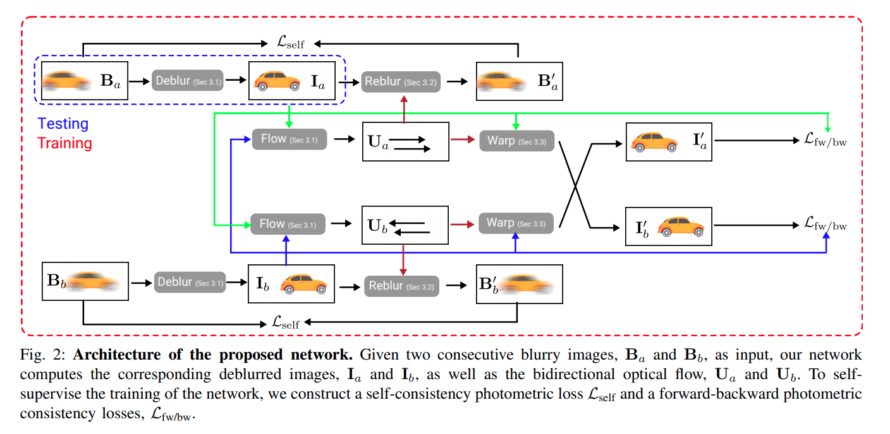

reblur模块方程:

$$\mathbf{B}(\mathbf{x}) \approx \frac{1}{2 N+1} \sum_{i=-N}^{N}\left(\mathcal{W}_{0 \rightarrow i} \circ \mathbf{I}_{0}\right)(\mathbf{x})$$

其中$\mathcal{W}$指的是将原图根据光流进行warping,

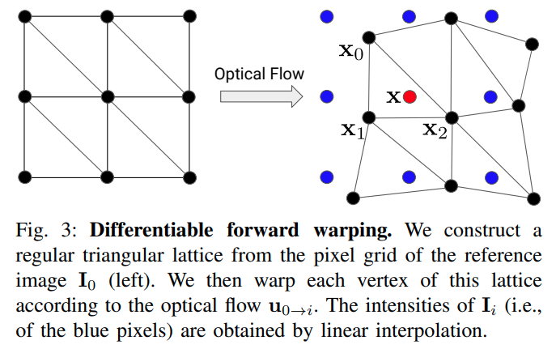

## Fast Panoptic Segmentation Network
[pdf](https://arxiv.org/pdf/1910.03892.pdf)

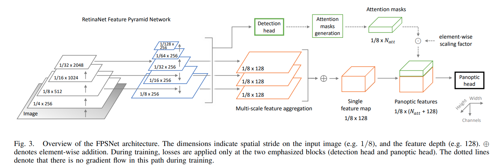
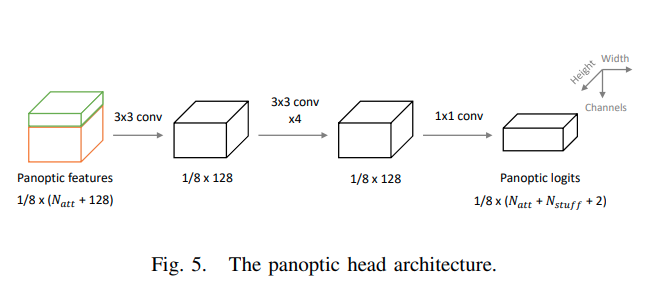

## Real-Time Semantic Stereo Matching
[pdf](https://arxiv.org/pdf/1910.00541.pdf) 

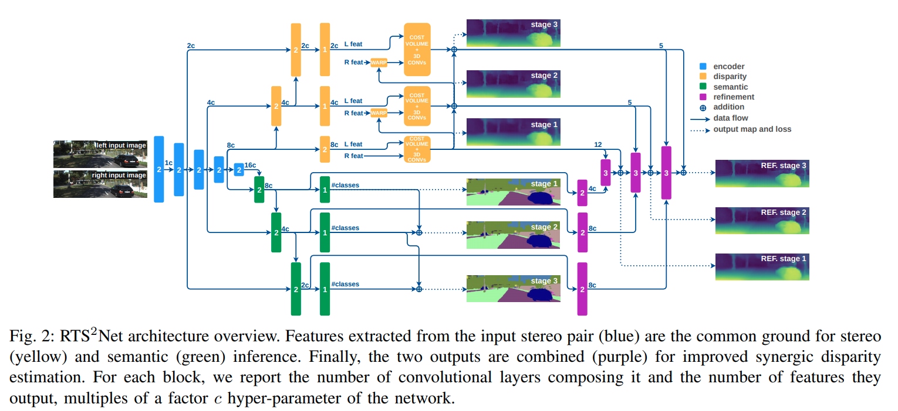

在语义分割和双目上都有不错的点数(一般般)，主要是速度比较快

## MultiDepth: Single-Image Depth Estimation via Multi-Task Regression and Classification
[pdf](https://arxiv.org/pdf/1907.11111.pdf)

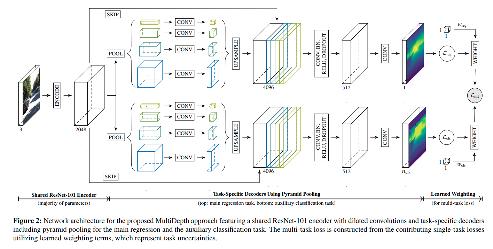

深度预测问题同时走分类与回归。

## MPC-Net: A First Principles Guided Policy Search
[pdf](https://arxiv.org/pdf/1909.05197.pdf) [code](https://github.com/leggedrobotics/MPC-Net)

这篇paper使用类模仿学习，得到一个快速的MPC approximator.本文利用最优控制解的必要条件，HJB方程，要求一下哈密顿量最小化,

$$\begin{aligned}
\boldsymbol{u}^{*}(t, \boldsymbol{x}) &=\arg \min _{\boldsymbol{u}} \mathcal{H}(\boldsymbol{x}, \boldsymbol{u}, t) \\
\mathcal{H}(\boldsymbol{x}, \boldsymbol{u}, t) &:=\mathcal{L}(\boldsymbol{x}, \boldsymbol{u}, t)+\partial_{\boldsymbol{x}} V(t, \boldsymbol{x}) \boldsymbol{f}(\boldsymbol{x}, \boldsymbol{u}, t)
\end{aligned}$$

本文提出使用SLQ(Sequential-Linear-Quadritic)最优化方法进行最优化求解(这个算法类似于连续时间的迭代LQR),通过这个求解器可以得到MPC teacher的控制命令，以及value function关于x的求导$\partial_{\boldsymbol{x}} V(t, \boldsymbol{x})$

学习方法:
1. 在每一次迭代中，使用MPC以及网络的融合信号，对系统完成一个序列的仿真，融合比重随着训练的进行逐渐由网络输出主导，在buffer中存下时间戳，state，value函数对于state的导数矢量,网络最优输出值等结果。
2. 从buffer中进行采样，使用存储中的state, dvdx, t以及网络输出的u，计算哈密顿量。对于本文实验中给出二次损失函数，$\mathcal{L}$与$u$相关的只有regularization项$uRu^T$,dvdx为常矢量，$f(x, u, t)$为模型的$\dot x$,与系统模型有关，也就会与$u$有关。
3. 把哈密顿量理解为损失函数，使用梯度下降优化网络参数，

## MapLite: Autonomous Intersection Navigation Without a Detailed Prior Map

[pdf](https://ieeexplore.ieee.org/stamp/stamp.jsp?tp=&arnumber=8936918)

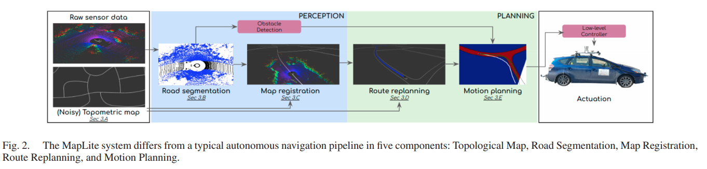

这篇paper提出了一个系统，仅利用拓扑地图完成无人车的定位与导航任务。点云的路面分割使用的做法是对每一个点提取设定的五个feature，使用linear SVM判断它是否在地面上。关键对于拓扑地图的定位，本文使用传统的概率滤波算法,有一定局限性，但是在一定范围内显然是有效的。

