time: 20200622
short_title: CVPR 2020 clips

# Summaries for several CVPR 2020 papers

目录:

- [Summaries for several CVPR 2020 papers](#summaries-for-several-cvpr-2020-papers)
  - [Bridging the Gap Between Anchor-based and Anchor-free Detection via Adaptive Training Sample Selection (ATSS)](#bridging-the-gap-between-anchor-based-and-anchor-free-detection-via-adaptive-training-sample-selection-atss)
  - [Depth Sensing Beyond LiDAR Range](#depth-sensing-beyond-lidar-range)
    - [Motivation](#motivation)
    - [硬件配置](#硬件配置)
    - [算法流程](#算法流程)
  - [RetinaTrack](#retinatrack)
  - [MUXConv: Information Multiplexing in Convolutional Neural Networks](#muxconv-information-multiplexing-in-convolutional-neural-networks)
  - [Structure Aware Single-stage 3D Object Detection from Point Cloud](#structure-aware-single-stage-3d-object-detection-from-point-cloud)
  - [Camouflaged Object Detection](#camouflaged-object-detection)
  - [Lightweight Multi-View 3D Pose Estimation through Camera-Disentangled Representation](#lightweight-multi-view-3d-pose-estimation-through-camera-disentangled-representation)
  - [Flow2Stereo: Effective Self-Supervised Learning of Optical Flow and Stereo Matching](#flow2stereo-effective-self-supervised-learning-of-optical-flow-and-stereo-matching)
  - [What You See is What You Get: Exploiting Visibility for 3D Object Detection](#what-you-see-is-what-you-get-exploiting-visibility-for-3d-object-detection)
  - [Instance Shadow Detection](#instance-shadow-detection)
  - [A Model-driven Deep Neural Network for Single Image Rain Removal](#a-model-driven-deep-neural-network-for-single-image-rain-removal)
  - [Single Image Optical Flow Estimation with an Event Camera](#single-image-optical-flow-estimation-with-an-event-camera)
  - [$\Pi$ - nets: Deep Polynomial Neural Networks](#pi---nets-deep-polynomial-neural-networks)

## Bridging the Gap Between Anchor-based and Anchor-free Detection via Adaptive Training Sample Selection (ATSS)
[pdf](https://arxiv.org/pdf/1912.02424.pdf)

[code_head](https://github.com/open-mmlab/mmdetection/blob/master/mmdet/models/dense_heads/atss_head.py) [code_assigner/core](https://github.com/open-mmlab/mmdetection/blob/master/mmdet/core/bbox/assigners/atss_assigner.py)

这篇paper做了一个相当细致对比实验来分析anchor based与anchor free模块的区别结果。另外自己提出了更好的sampling方法$\rightarrow$ATSS

传统的RetinaNet(32.5%)被anchor free的[FCOS](../object_detection_2D/FCOS.md)(37.8%)性能大幅超越，是什么引起了这些差距呢，是anchor free与anchor based本身吗？作者分析指出，对于一个每一个scale只有一个anchor box的
Retinanet模型与FCOS进行对比，训练细节的差别:1. GroupNorm 2. GIoU Loss 3. Center point should be in the Box 4. Centerness branch (also helpful in NMS)5. additional trainable scalar,
这里面比较重要的是(1),(2),(4). 

RetinaNet与FCOS的本质区别有二，第一个是分类时给定正样本的方法。
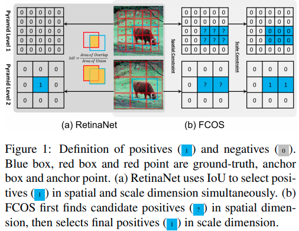

第二个是回归时框大小的回归方法.作者在下表实验说明了正负样本的分配策略才是影响点数的最重要因素。
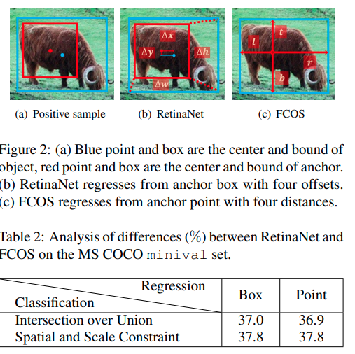

作者提出的ATSS算法.

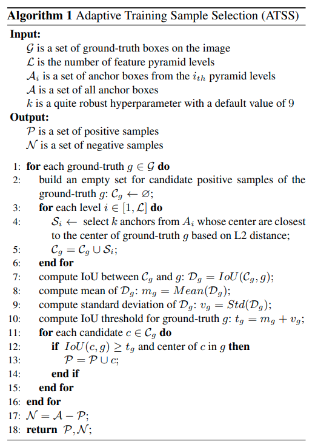

[code_assigner/core](https://github.com/open-mmlab/mmdetection/blob/master/mmdet/core/bbox/assigners/atss_assigner.py)

## Depth Sensing Beyond LiDAR Range
[pdf](https://arxiv.org/pdf/2004.03048.pdf)

这篇paper是属于值得精读的文章之一。

### Motivation

LiDAR一直以来存在着无法感知足够远的物体的问题，即使线数很大，有效的距离可能也就只能去到80米。而这个对于中速行驶的汽车来说仅仅是几秒内的里程，因而往往不够用。本文要实现超过一百米乃至本文给出的近300米范围内的深度估计，使用了特殊配置的多目摄像机(三目)。对于摄像机参数来说，就需要大分辨率，小感受野用于专注于远景，但是这个硬件配置的问题在于对微小的外参扰动非常敏感，因而需要鲁棒算法or在线补偿(本文的方案)。

### 硬件配置

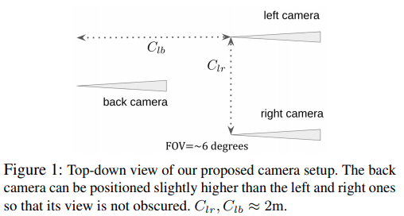

作者文中以及后面的计算同时指出，左右目的距离应该足够远，而且前后相机距离也应该尽可能远，这些都仅仅被车身大小所限制。

### 算法流程

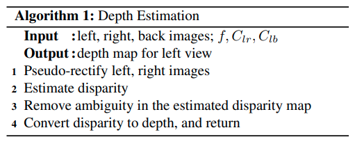
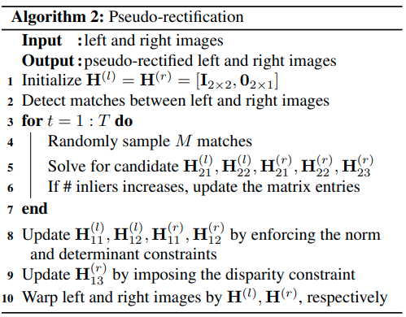
第一步进行的是retification,得到两个相机之间的一个相互转换，使得Stereo matching的epipolar line是水平的。作者简单地证明了，对于小FOV相机以及小扰动来说，关于x/y轴的微小旋转都近似等同于整个画面的平移。而画面的旋转本身就是一个Affine transform.因而实际上可以用homography transform matrix(2x3)，就可以完成对原来图片的矫正。整个算法的思路就是使用RANSAC，决定H矩阵对应的参数。要求是让尽可能多的matched point都在同一个水平线上。可以想象的是，这样的retification方式无法决定相机关于y轴的旋转，因而warped后的图片计算得到的双目匹配disparity与正确的值之间有一个bias(可以理解为对旋转的估计的bias/ambiguity)

Disparity Estimation使用的是一个pretrained的stereo matching网络.
$$\left\langle\mathbf{H}_{2,1: 3}^{(l)}, \mathbf{x}^{(l)}\right\rangle-\left\langle\mathbf{H}_{2,1: 3}^{(r)}, \mathbf{x}^{(r)}\right\rangle=0$$

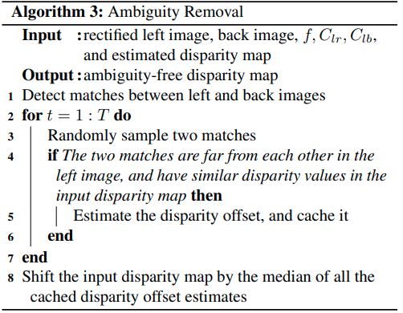

第三步是利用前后相机消除第一部分产生的ambiguity.对于左目上任意两个具有相同深度的pixel$x_1^{(l)}, x_2^{(l)}$，这两个点在3D中，相对于前后摄像机的$x$, $y$坐标的差是一致的(这里指的是相机参考系而不是图片参考系)，这里引出以下推导。
$$\begin{aligned}
    m_{l}=\left\|\mathbf{x}_{1}^{(l)}-\mathbf{x}_{2}^{(l)}\right\|&=\frac{f}{z^{(l)}} \cdot\left\|\mathbf{X}_{1}^{(l)}-\mathbf{X}_{2}^{(l)}\right\| \\
    m_{b}&=\frac{f}{z^{(b)}} \cdot\left\|\mathbf{X}_{1}^{(b)}-\mathbf{X}_{2}^{(b)}\right\| \\
    \mathbf{X}_{1}^{(l)}-\mathbf{X}_{2}^{(l)}&=\mathbf{X}_{1}^{(b)}-\mathbf{X}_{2}^{(b)}, z^{(b)}=z^{(l)}+C_{l b} \\
    \frac{m_{l}}{m_{b}}&=\frac{z^{(l)}+C_{l b}}{z^{(l)}}\\
    z=z^{(l)}&=\frac{C_{l b}}{\frac{m_{l}}{m_{b}}-1}\\
\end{aligned}
$$

对于一组符合$m_l > m_b$, $m_l > \delta$, $|d_1 - d_2| < \eta$的点，由它们的数值可以得到的对disparity bias的估计为:

$$ q=f \cdot \frac{C_{l r}}{C_{l b}} \cdot\left(\frac{m_{l}}{m_{b}}-1\right)-\frac{d_{1}+d_{2}}{2}$$

前面提到的这三个条件分别表示 (1) 这个batched是否事实上真实;靠前相机看到的两点距离理应更大 (2) 两个点的距离应该足够大，最好不要贴在一起 (3) 两个像素之间的距离几乎是相等的。

作者后面用：
1. 用仿真实验证明了很小的误差，在双目长距离匹配中就会很大的使性能退化。
2. 他们提出的retification方法与标准8点法对比在这个场景下数值更稳定；因为他们利用了这个场景下的先验知识。
3. 实验说明了ambiguity removal的过程，以及最后计算的有效性。

## RetinaTrack
[pdf](https://arxiv.org/pdf/2003.13870.pdf)

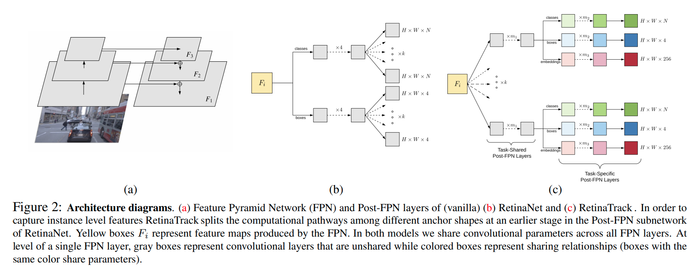

特点，不同anchor在更早期features就开始分开，每一个anchor输出一个256维度的features.

对**单一图片**用triplet loss
$$
\mathcal{L}_{B H}(\theta ; X)=\sum_{j=1}^{A} \text { SoftPlus }\left(m+\max _{p=1 \rightarrow A \atop t_{j}=t_{p}} D_{j p}-\min _{\ell=1 \ldots A \atop t_{j} \neq t_{\ell}} D_{j \ell}\right)
$$

核心思路就是相同instance的不同anchor输出相似的embedding，不同instance的不同anchor输出不同的embedding。本文用基础的euclidean distance作为loss

## MUXConv: Information Multiplexing in Convolutional Neural Networks
[pdf](https://arxiv.org/pdf/2003.13880v1.pdf) [code](https://github.com/human-analysis/MUXConv)

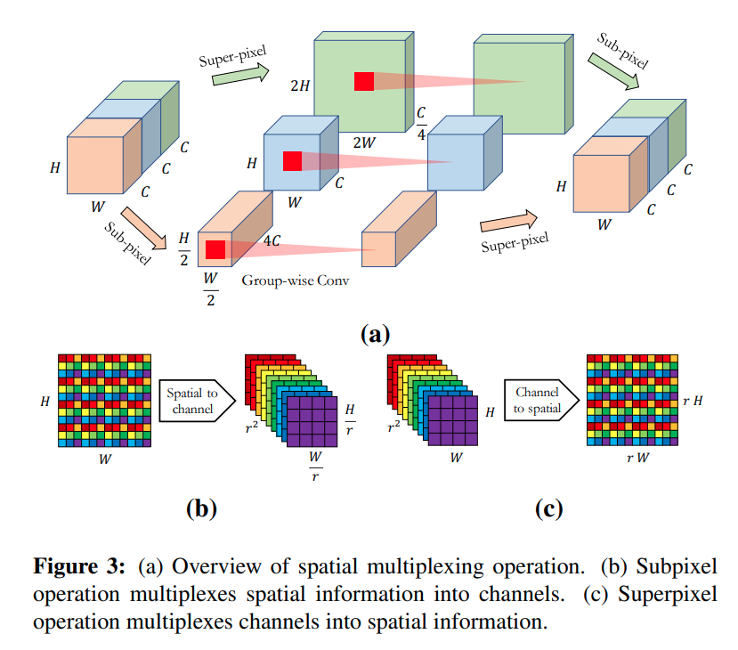
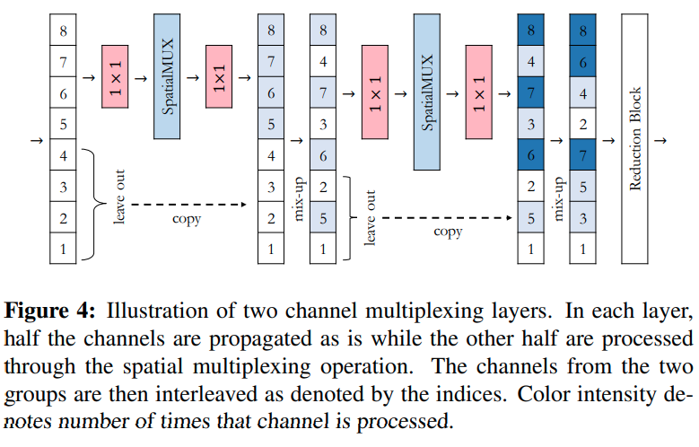

## Structure Aware Single-stage 3D Object Detection from Point Cloud
[pdf](https://www4.comp.polyu.edu.hk/~cslzhang/paper/SA-SSD.pdf) [code](https://github.com/skyhehe123/SA-SSD)

基于MMdetection开发的点云3D 检测，性能很高，重点在于附加task的设计的，能让一个接近于VoxelNet的结构得到很大的提升

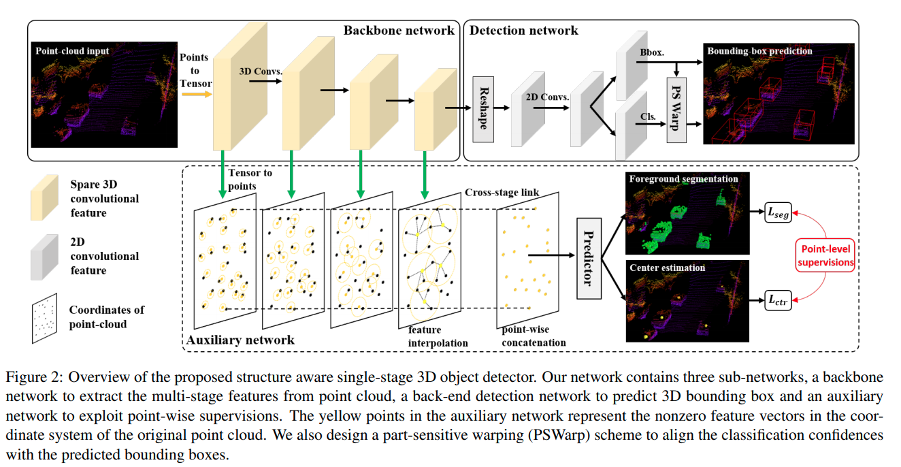

## Camouflaged Object Detection
[pdf](http://openaccess.thecvf.com/content_CVPR_2020/papers/Fan_Camouflaged_Object_Detection_CVPR_2020_paper.pdf) [code](https://github.com/DengPingFan/SINet)

本问提出了一个新的问题以及新的数据集，有[中文paper](http://dpfan.net/wp-content/uploads/CamouflagedObjectDetection_Chinese-1.pdf).
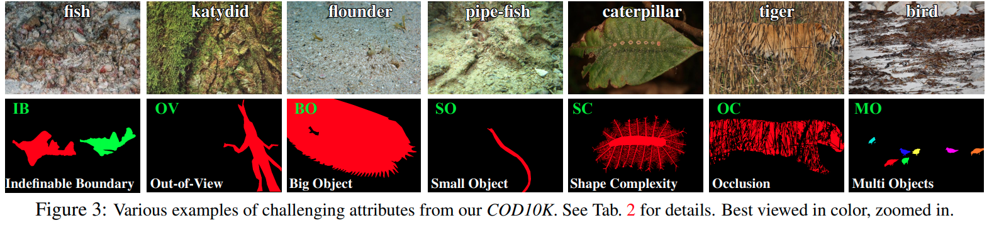

## Lightweight Multi-View 3D Pose Estimation through Camera-Disentangled Representation

[pdf](http://openaccess.thecvf.com/content_CVPR_2020/papers/Remelli_Lightweight_Multi-View_3D_Pose_Estimation_Through_Camera-Disentangled_Representation_CVPR_2020_paper.pdf)

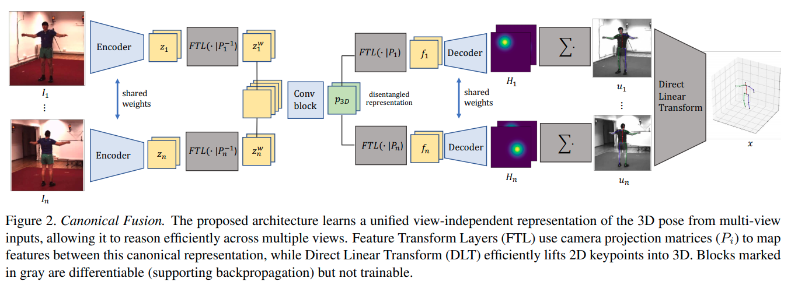

FTL层不是一个学习层，用一个全连接层，将2D预测用旋转变换转换到与camera方位无关的结果

$$\mathbf{y}=F_{T_{1}, \ldots, T_{n}}[\mathbf{x}]=\left[\begin{array}{ccc}
F_{T_{1}} & & \\
& \ddots & \\
& & F_{T_{n}}
\end{array}\right]$$

3D 位置估计采用的是SFM的formulation

$$d_{i} u_{i}=p_{i}^{1 T} \mathbf{x}, d_{i} v_{i}=p_{i}^{2 T} \mathbf{x}, d_{i}=p_{i}^{3 T} \mathbf{x}$$
$$\begin{array}{l}
\left(u_{i} p_{i}^{3 T}-p_{i}^{1 T}\right) \mathbf{x}=0 \\
\left(v_{i} p_{i}^{3 T}-p_{i}^{2 T}\right) \mathbf{x}=0
\end{array}$$

把同一个关节所有点放在一起，$A \mathbf{x}=\mathbf{0}$,原理上来说需要使用SVD找出最小特征值对应的特征向量。作者指出如果只需要求最小特征值，不需要使用SVD，使用以下迭代算法即可

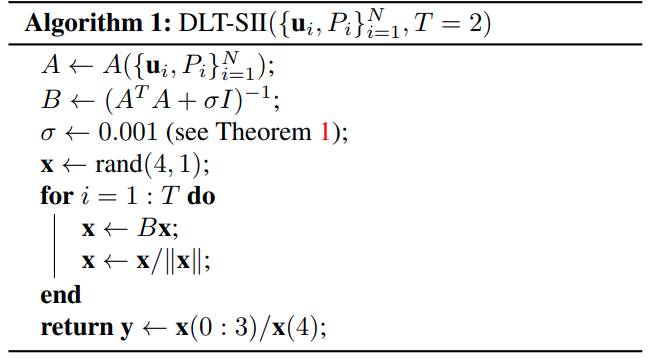

## Flow2Stereo: Effective Self-Supervised Learning of Optical Flow and Stereo Matching
[pdf](http://openaccess.thecvf.com/content_CVPR_2020/papers/Liu_Flow2Stereo_Effective_Self-Supervised_Learning_of_Optical_Flow_and_Stereo_Matching_CVPR_2020_paper.pdf)

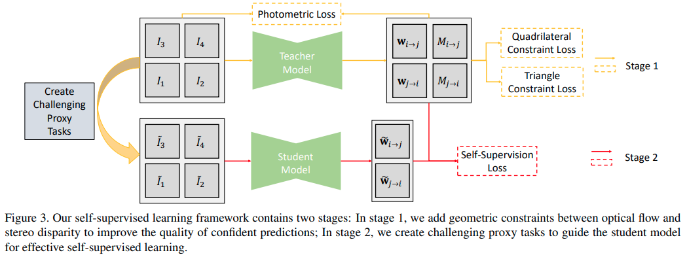

## What You See is What You Get: Exploiting Visibility for 3D Object Detection
[pdf](http://openaccess.thecvf.com/content_CVPR_2020/papers/Hu_What_You_See_is_What_You_Get_Exploiting_Visibility_for_CVPR_2020_paper.pdf)

本文主要针对的就是Nuscene场景中被遮挡比较严重的物体。通过用点云建立的occupancy map,网络可以infer什么地方是可能被遮挡而可能有物体的。

本文有一个比较好的[中文博客](https://leijiezhang001.github.io/paper-reading-What-You-See-is-What-You-Get-Exploiting-Visibility-for-3D-Object-Detection/),提到了本文几个重要的有趣的细节，第一个是3D世界的Fast Voxel Traversal生成occupancy map;第二个是数据增强，采取的方法与occupancy map进行增强；第三个是online bayesian grid mapping.

## Instance Shadow Detection
[pdf](http://openaccess.thecvf.com/content_CVPR_2020/papers/Wang_Instance_Shadow_Detection_CVPR_2020_paper.pdf) [code](https://github.com/stevewongv/InstanceShadowDetection)

本文提出了一个新的任务，新的dataset以及baseline方法。任务是物体与影子的instance segmentation以及一一对应。

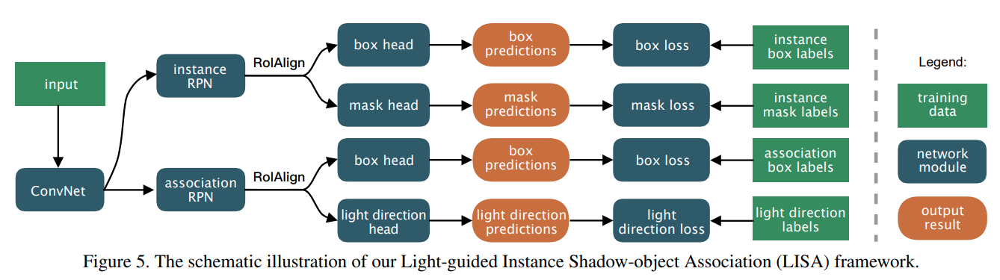

## A Model-driven Deep Neural Network for Single Image Rain Removal
[pdf](http://openaccess.thecvf.com/content_CVPR_2020/papers/Wang_A_Model-Driven_Deep_Neural_Network_for_Single_Image_Rain_Removal_CVPR_2020_paper.pdf)
 [code](https://github.com/hongwang01/RCDNet)

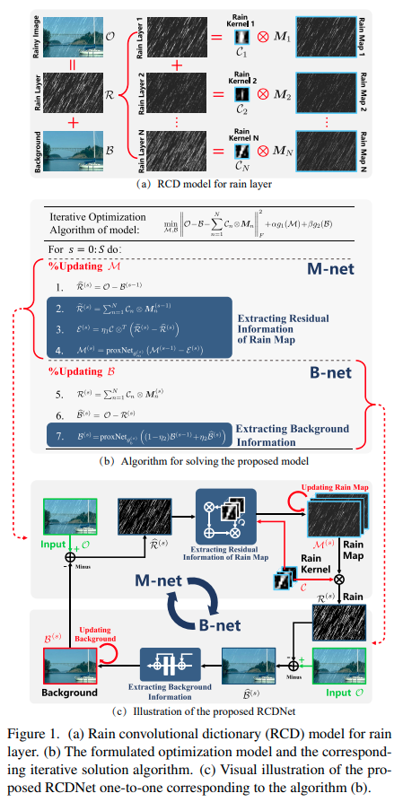
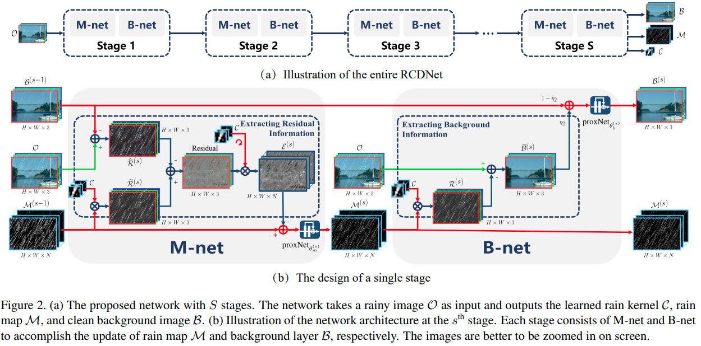

## Single Image Optical Flow Estimation with an Event Camera

[pdf](https://arxiv.org/pdf/2004.00347.pdf)

本文是基于DAVIS的event + gray scale设计的算法，一个重要的idea是event信息本身可以直接存储光流相关的信息，而灰度图的动态模糊也可以用于指引光流估计。因此本文提出同时估计光流场以及latent image $\mathcal{L}$.

能量函数设计为

$$\min _{\mathbf{L} . \mathbf{u}} \mu_{1} \phi_{\mathrm{eve}}(\mathbf{L}, \mathbf{u})+\mu_{2} \phi_{\mathrm{blur}}(\mathbf{L}, \mathbf{u})+\phi_{\mathrm{flow}}(\nabla \mathbf{u})+\phi_{\mathrm{im}}(\nabla \mathbf{L})$$

首先是考虑了光照变化的光流-光照一致条件
$$\begin{aligned}
\phi_{\mathrm{eve}}(\mathbf{L}, \mathbf{u})=\sum_{\mathbf{x} \in \Omega} \| &\mathbf{L}(\mathbf{x}, f)(\exp (c \mathbf{E}(\mathbf{x}, t))-1) \\
&+\left[u_{\mathbf{x}}, v_{\mathbf{x}}\right]^{\mathrm{T}} \nabla \mathbf{L}(\mathbf{x}, f) \|_{1}
\end{aligned}$$

模糊:
模糊后的图片$B$可以由模糊核$K$以及latent 图片$L$卷积表达:
$$\begin{aligned}
\mathbf{B}(\mathbf{x}) &=\sum_{\mathbf{y} \in \Omega} \mathbf{k}(\mathbf{y}) \mathbf{L}(\mathbf{x}-\mathbf{y}) \\
&=\sum_{\mathbf{y} \in \Omega} \mathbf{k}_{\mathbf{u}^{\prime}(\mathbf{x})}(\mathbf{y}) \mathbf{L}(\mathbf{x}-\mathbf{y})
\end{aligned}$$

$$k_{\mathbf{u}^{\prime}(\mathbf{x})}(\mathbf{y})=\left\{\begin{array}{ll}
\frac{1}{\left|\mathbf{u}^{\prime}(\mathbf{x})\right|}, & \text { if } \mathbf{y}=\alpha \mathbf{u}^{\prime}(\mathbf{x}),|\alpha| \leq \frac{1}{2} \\
\mathbf{0}, & \text { otherwise }
\end{array}\right.$$
模糊条件:
$$\phi_{\text {blur }}(\mathbf{L}, \mathbf{u})=\sum_{\mathbf{x}, \mathbf{y} \in \Omega}\left\|\mathbf{k}_{\mathbf{u}^{\prime}(\mathbf{x})}(\mathbf{y}) \mathbf{L}(\mathbf{x}-\mathbf{y})-\mathbf{B}(\mathbf{x})\right\|^{2}$$

后两项为连续性要求，文中的设计比较精细。
优化方法上本文迭代进行光流估计以及图片的deblur

## $\Pi$ - nets: Deep Polynomial Neural Networks

[pdf](http://openaccess.thecvf.com/content_CVPR_2020/papers/Chrysos_P-nets_Deep_Polynomial_Neural_Networks_CVPR_2020_paper.pdf)

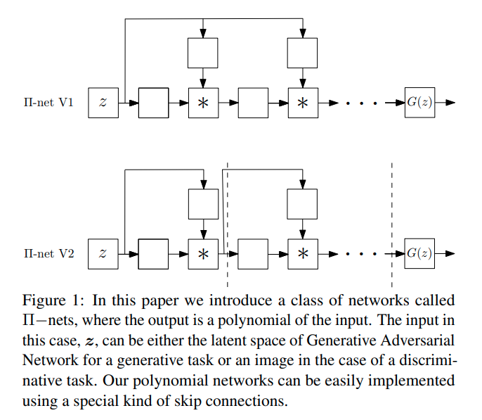

可学习参数的多项式计算模块(最终输出为输入的多项式表达)
