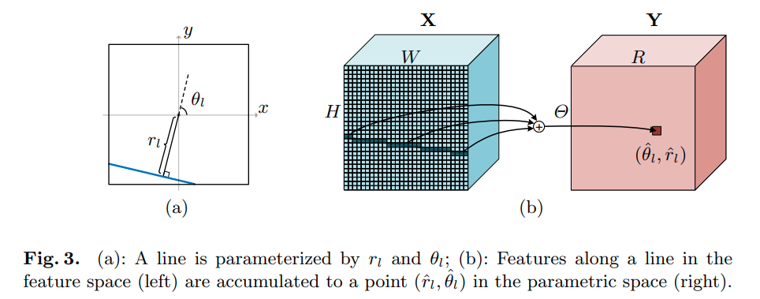
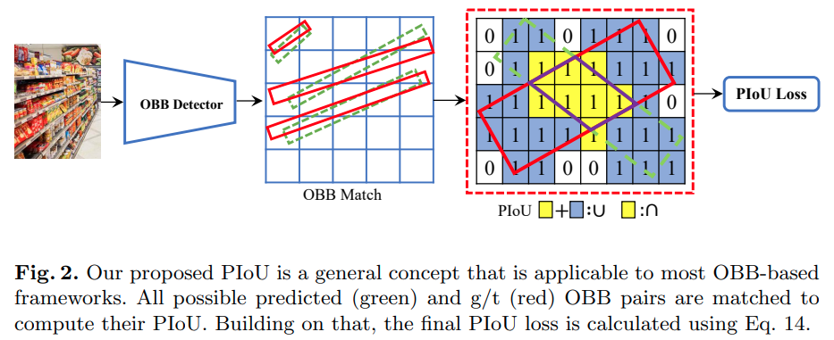
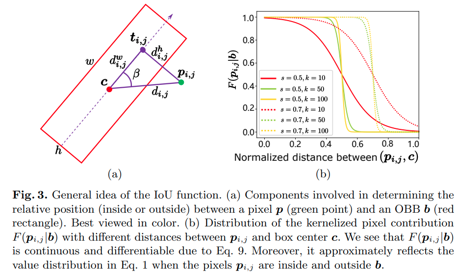
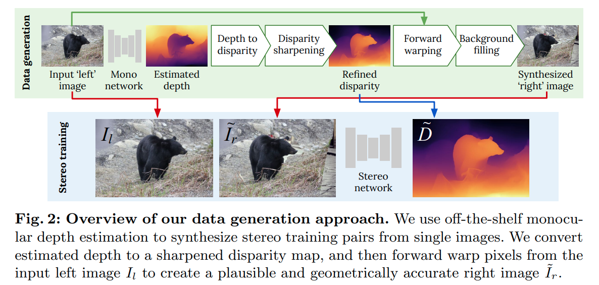
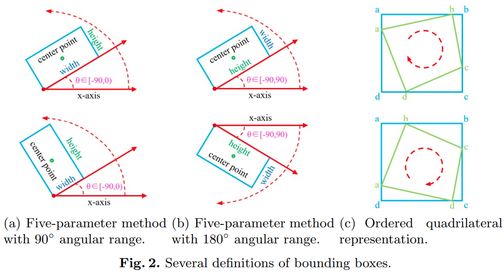
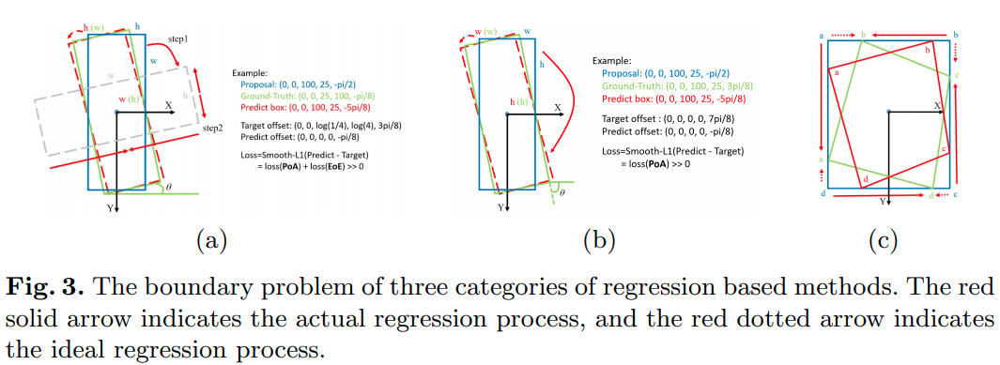
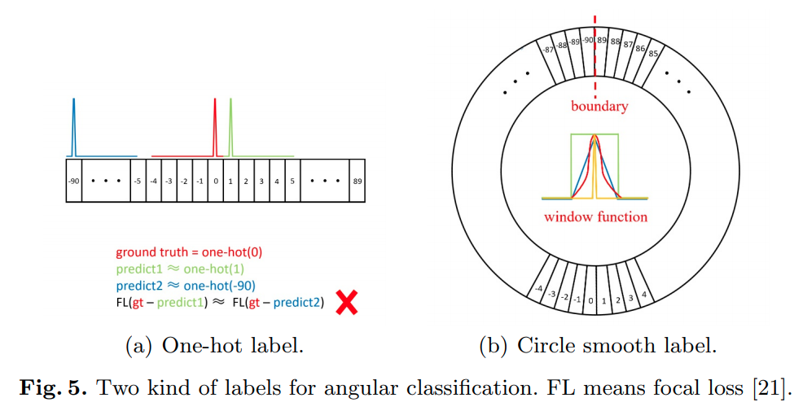
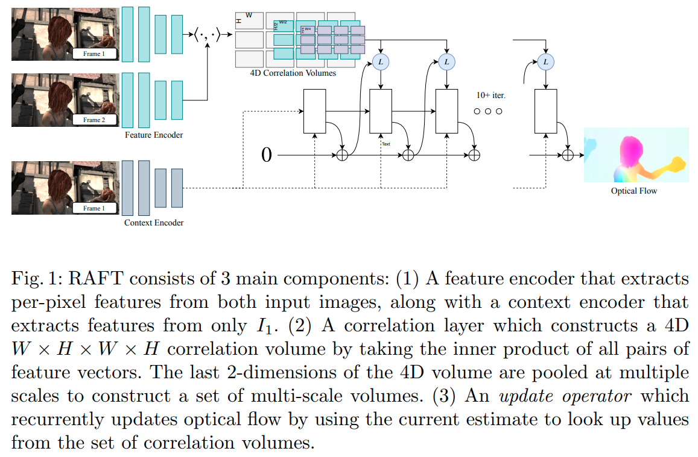
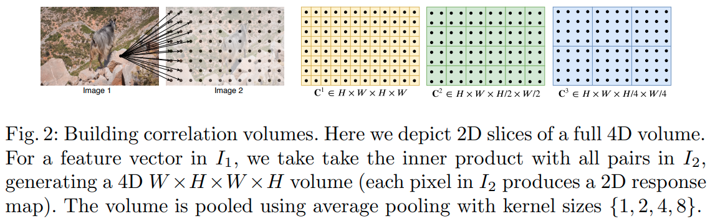

time: 20200913
short_title: ECCV 2020 clips

# Summaries for several ECCV 2020 papers

目录:

- [Summaries for several ECCV 2020 papers](#summaries-for-several-eccv-2020-papers)
  - [Deep Hough Transform for Semantic Line Detection](#deep-hough-transform-for-semantic-line-detection)
    - [整体推理结构](#整体推理结构)
    - [DHT 运算示意图](#dht-运算示意图)
    - [EA Score $\rightarrow$ Euclidean distance and Angular distance](#ea-score-rightarrow-euclidean-distance-and-angular-distance)
  - [PIoU Loss: Towards Accurate Oriented Object Detection in Complex Environments](#piou-loss-towards-accurate-oriented-object-detection-in-complex-environments)
  - [Learning Stereo from Single Images](#learning-stereo-from-single-images)
    - [Occlusion and Collisions Aware Forward Warping](#occlusion-and-collisions-aware-forward-warping)
    - [Depth Sharpening](#depth-sharpening)
  - [Attentive Normalization](#attentive-normalization)
  - [TIDE: A General Toolbox for Identifying Object Detection Errors](#tide-a-general-toolbox-for-identifying-object-detection-errors)
  - [Arbitrary-Oriented Object Detection with Circular Smooth Label](#arbitrary-oriented-object-detection-with-circular-smooth-label)
  - [RAFT: Recurrent All-Pairs Field Transforms for Optical Flow](#raft-recurrent-all-pairs-field-transforms-for-optical-flow)


## Deep Hough Transform for Semantic Line Detection

[pdf](https://arxiv.org/abs/2003.04676) [code](https://github.com/Hanqer/deep-hough-transform)

本文的主要贡献:

- DHT 操作，对整个feature map操作,作者提供了cuda 加速的[code](https://github.com/Hanqer/deep-hough-transform/tree/master/model/_cdht).将直线特征转换为点特征
- 提出EA score 替代IoU用于评价直线的detection. (Segmentation的IoU对直线特征的评价比较粗糙)

与Segmentation检测直线的区别:

- 只能给出线的方程，若需要检测的是线段，本文给出的方案似乎没有办法处理.

### 整体推理结构


### DHT 运算示意图


### EA Score $\rightarrow$ Euclidean distance and Angular distance

角度距离,基于与水平方向的夹角的差:
$$\mathcal{S}_\theta = 1 - \frac{\theta(l_i, l_j)}{\pi / 2}$$

欧氏距离,基于直线在图上的中点的 normalized 距离 (先将图片归一化为一个单位方块)

$$\mathcal{S}_d = 1 - D(l_i, l_j)$$

EA Score:

$$\mathcal{S} = (\mathcal{S}_\theta \cdot \mathcal{S}_d) ^ 2$$

## PIoU Loss: Towards Accurate Oriented Object Detection in Complex Environments

[pdf](https://arxiv.org/pdf/2007.09584.pdf) [code](https://github.com/clobotics/piou)

本文的主要贡献是提出了PIoU (pixel IoU) Loss,一个基于IoU的，针对旋转bounding box (OBB)的， 可微分的，更高效率的损失函数

- 与Rotated IoU Loss相比，运算速度更快
- 与目前更常用的L1 Loss相比，回归旋转 bounding box的性能更好，也与最终评判指标IoU更相近。
- 提供了piou的cuda加速[代码](https://github.com/clobotics/piou/tree/master/src/lib/piou_loss)



结合上图，本文的发展思路:

- PIoU 实质相当于数出两个旋转bounding box相交部分有多少个pixel，结合box的大小可以得到pixel 上的IoU.
- 如何快速地判断一个pixel是否在bounding box内? $\rightarrow$ piou算法
- 判断操作是不可导的，如何软化(soften)这个判断操作使得PIoU 对预测框的中心点位置,长宽，转角可导?



由 (a)可知判断算法为:

$$\delta\left(\boldsymbol{p}_{i, j} \mid \boldsymbol{b}\right)=\left\{\begin{array}{ll}
1, & d_{i, j}^{w} \leq \frac{w}{2}, d_{i, j}^{h} \leq \frac{h}{2} \\
0, & \text { otherwise }
\end{array}\right.$$

$$\begin{aligned}
d_{i j} &=d(i, j)=\sqrt{\left(c_{x}-i\right)^{2}+\left(c_{y}-j\right)^{2}} \\
d_{i j}^{w} &=\left|d_{i j} \cos \beta\right| \\
d_{i j}^{h} &=\left|d_{i j} \sin \beta\right| \\
\beta &=\left\{\begin{array}{ll}
\theta+\arccos \frac{c_{x}-i}{d_{i j}}, & c_{y}-j \geq 0 \\
\theta-\arccos \frac{c_{x}-i}{d_{i j}}, & c_{y}-j<0
\end{array}\right.
\end{aligned}$$

使用一个 $1 - sigmoid$的函数软化这个逻辑判断.

$$
K(d, s) = 1 - \frac{1}{1 + e^{-k(d-s)}}
$$

$$F\left(\boldsymbol{p}_{i, j} \mid \boldsymbol{b}\right)=K\left(d_{i, j}^{w}, w\right) K\left(d_{i, j}^{h}, h\right)$$

$$S_{\boldsymbol{b} \cap \boldsymbol{b}^{\prime}} \approx \sum_{\boldsymbol{p}_{i, j} \in B_{\boldsymbol{b}, b^{\prime}}} F\left(\boldsymbol{p}_{i, j} \mid \boldsymbol{b}\right) F\left(\boldsymbol{p}_{i, j} \mid \boldsymbol{b}^{\prime}\right)$$

## Learning Stereo from Single Images

[pdf](https://arxiv.org/pdf/2008.01484.pdf) [code](https://github.com/nianticlabs/stereo-from-mono)

这篇paper做了一个比较神奇的任务，也就是从单目图片生成双目训练集

简单来说就是 单目图片 $\underrightarrow{CNN 单目深度生成}$ RGBD图片 $\underrightarrow{虚拟baseline}$ 视差图 $\underrightarrow{采样与图片生成}$ 双目数据。 作者使用这样生成的双目作为训练数据得到了相当好的双目匹配性能。



核心新的内容在与 disparity sharpening还有forward warping这两步

### Occlusion and Collisions Aware Forward Warping

直接地采样会导致两个问题，一个是因为遮挡产生的孔(新视角可观察，旧视角不可观察的内容)，一个是碰撞(旧视角可观察，新视角与其他像素重合)

多个像素对应一个像素(碰撞)时，选取保留视差较大的点.

对于空白的区域,本文提出从数据库中随机选取另一张图$I_b$，使用[color transfer]算法将$I_b$的颜色风格转换为$I_l$的。然后填补上空白的部分.填补的方式按照[Cut, Paste and Learn].

[color transfer]的做法是将RGB图片转变为[CIE Lab](https://www.wikiwand.com/en/CIELAB_color_space)格式，将Source 图各个Channel的均值与方差转换为Target 图的即可。

[Cut, Paste and Learn]的在填补的时候使用的是 Gaussian以及Poisson Blending. 其中[Poisson Blending](https://www.cs.jhu.edu/~misha/Fall07/Papers/Perez03.pdf), 是将填补过程理解为一个带有狄利克雷边界条件的泊松偏微分方程，这个做法的intuition以及证明可以在[一个lecture ppt](https://www.cs.tau.ac.il/~dcor/Graphics/adv-slides/PoissonImageEditing06.pdf)中找到.


### Depth Sharpening

作者也指出了单目深度估计很容易在物体的边缘生成过渡形态的点，和[CDN](../../3dDetection/CDN.md)指出的现象相同。本文作者的思路则是对于 Sobel edge filter相应大于三的点标记为"flying pixels"，将其disparity赋值为离它最近的"non-flying" pixel.

[color transfer]:https://www.cs.tau.ac.il/~turkel/imagepapers/ColorTransfer.pdf
[Cut, Paste and Learn]:https://arxiv.org/pdf/1708.01642.pdf

## Attentive Normalization 

[pdf](https://arxiv.org/pdf/1908.01259.pdf) [code](https://github.com/iVMCL/AttentiveNorm_Detection)

这篇paper提出了一个Normalization + SE的融合

```python
class hsigmoid(nn.Module):
    """ Hard Linear Sigmoid
    """
    def forward(self, x):
        out = F.relu6(x + 3, inplace=True) / 6
        return out


class AttentionWeights(nn.Module):
    def __init__(self, num_channels, k, attention_mode=0):
        super(AttentionWeights, self).__init__()
        self.k = k
        self.avgpool = nn.AdaptiveAvgPool2d(1)
        layers = []
        if attention_mode == 0:
            layers = [ nn.Conv2d(num_channels, k, 1),
                       hsigmoid() ]
        elif attention_mode == 2:
            layers = [ nn.Conv2d(num_channels, k, 1, bias=False),
                        hsigmoid() ]
        else:
            raise NotImplementedError("Unknow attention weight type")
        self.attention = nn.Sequential(*layers)

    def forward(self, x):
        b, c, _, _ = x.size()
        y = self.avgpool(x)#.view(b, c)
        var = torch.var(x, dim=(2, 3)).view(b, c, 1, 1)
        y *= (var + 1e-3).rsqrt()
        #y = torch.cat((y, var), dim=1)
        return self.attention(y).view(b, self.k)


class AttentiveGroupNorm(nn.GroupNorm):
    def __init__(self, num_groups, num_channels, k, eps=1e-5):
        super(AttentiveGroupNorm, self).__init__(num_groups, num_channels, eps=eps, affine=False)
        self.k = k
        self.weight_ = nn.Parameter(torch.Tensor(k, num_channels))
        self.bias_ = nn.Parameter(torch.Tensor(k, num_channels))

        self.attention_weights = AttentionWeights(num_channels, k)

        self._init_params()

    def _init_params(self):
        nn.init.normal_(self.weight_, 1, 0.1)
        nn.init.normal_(self.bias_, 0, 0.1)

    def forward(self, input):
        output = super(AttentiveGroupNorm, self).forward(input)
        size = output.size()
        y = self.attention_weights(input)

        weight = y @ self.weight_
        bias = y @ self.bias_
        weight = weight.unsqueeze(-1).unsqueeze(-1).expand(size)
        bias = bias.unsqueeze(-1).unsqueeze(-1).expand(size)

        return weight * output + bias
```


## TIDE: A General Toolbox for Identifying Object Detection Errors
[pdf](https://dbolya.github.io/tide/paper.pdf) [code](https://github.com/dbolya/tide)

这篇paper给了一个Python工具箱, 更为详细地去分析object detection的error,

<iframe width="560" height="315" src="https://www.youtube.com/embed/Pz4uggQzJXU" frameborder="0" allow="accelerometer; autoplay; encrypted-media; gyroscope; picture-in-picture" allowfullscreen></iframe>

## Arbitrary-Oriented Object Detection with Circular Smooth Label

[pdf](https://arxiv.org/pdf/2003.05597.pdf) [code](https://github.com/Thinklab-SJTU/CSL_RetinaNet_Tensorflow)

这篇paper review了回归旋转 bounding boxes的方法，同时指出了目前几个回归参数化方法的弊端，提出的方案主要是解决了角度的不连续性问题.

三种已有的参数化回归旋转bounding boxe的方法:



在某个特殊情况下，以上三种参数方法病态的回归过程:



作者提出在角度上采用窗函数平滑后的、基于分类的训练方案



## RAFT: Recurrent All-Pairs Field Transforms for Optical Flow

[pdf](https://arxiv.org/pdf/2003.12039.pdf) [code](https://github.com/princeton-vl/RAFT)

这篇paper是eccv2020的best paper.对于光流的计算有比较大的创新。主要实现的是在高分辨率下对大尺度光流搜索的优化方案。





核心的创新在于在scale 8 预计算两帧之间每两个像素之间的匹配score(dot product),在迭代优化的过程中"LookUp" Operator负责将sample光流对应位置的cost. 避免了多次重复计算cost volume. 使得在scale 8上搜索长距离的光流成为可能，对快速移动的小物体的检测能力变强。


