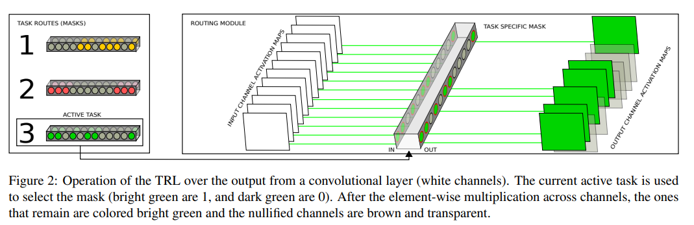
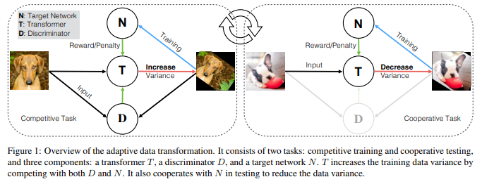
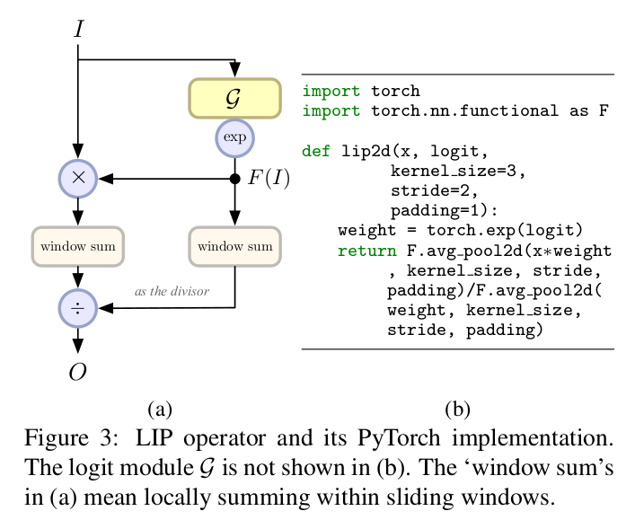

time: 20191104
short_title: ICCV 2019 Clips

# Summaries for several ICCV 2019 papers

目录:

- [Summaries for several ICCV 2019 papers](#summaries-for-several-iccv-2019-papers)
  - [Many Task Learning With Task Routing](#many-task-learning-with-task-routing)
  - [AdaTransform: Adaptive Data Transformation](#adatransform-adaptive-data-transformation)
  - [LIP: Local Importance-based Pooling](#lip-local-importance-based-pooling)
  - [Anchor Loss: Modulating Loss Scale based on Prediction Difficulty](#anchor-loss-modulating-loss-scale-based-on-prediction-difficulty)

## Many Task Learning With Task Routing

[pdf](https://arxiv.org/abs/1903.12117) [code](https://github.com/gstrezoski/TaskRouting)

这篇文章解决多任务学习的问题，解决的方案是一次train只activate有限个任务，然后随机激活。这扩展成一个广义的层，train时随机激活有限个输出。

## AdaTransform: Adaptive Data Transformation

[pdf](http://openaccess.thecvf.com/content_ICCV_2019/papers/Tang_AdaTransform_Adaptive_Data_Transformation_ICCV_2019_paper.pdf)

这篇文章作者有类似任务的[旧repo](https://github.com/zhiqiangdon/pose-adv-aug).这篇文章训练一个专注于数据增强的agent，在竞争模式中能挑战原网络，在合作模式中能提升原网络的Generalization能力。使用强化学习训练这个agent，另外也需要一个分类器用于在竞争模式时鉴别agent的网络是否过于偏离原分布。

## LIP: Local Importance-based Pooling
[pdf](http://openaccess.thecvf.com/content_ICCV_2019/papers/Gao_LIP_Local_Importance-Based_Pooling_ICCV_2019_paper.pdf) [code](https://github.com/sebgao/LIP)

如图模块

## Anchor Loss: Modulating Loss Scale based on Prediction Difficulty
[pdf](http://openaccess.thecvf.com/content_ICCV_2019/papers/Ryou_Anchor_Loss_Modulating_Loss_Scale_Based_on_Prediction_Difficulty_ICCV_2019_paper.pdf)

$$
\ell(p, q ; \gamma)=-\underbrace{(1+\overbrace{q-q_{*}}^{\text {predicion difficulty }})}_{\text {modulator }} \underbrace{(1-p) \log (1-q)}_{\text {cross entropy }}
$$

这篇文章讨论了一个基于Focal Loss开发的一个损失函数，如上公式。本文对$q_*$进行了讨论，在分类以及姿态估计(本质上都是分类问题)中得到了SOTA的结果。

