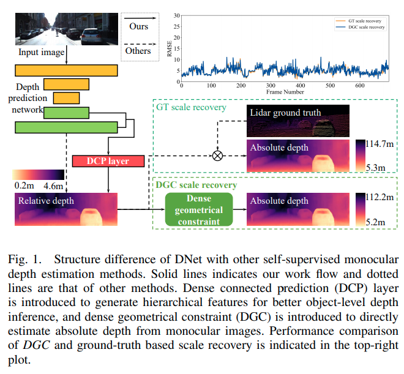
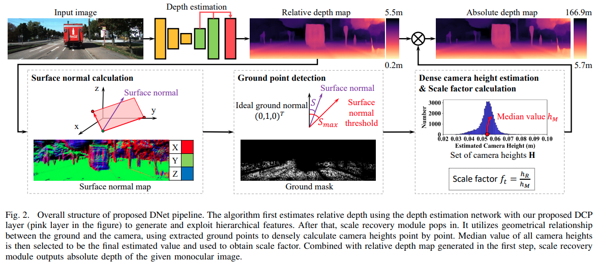
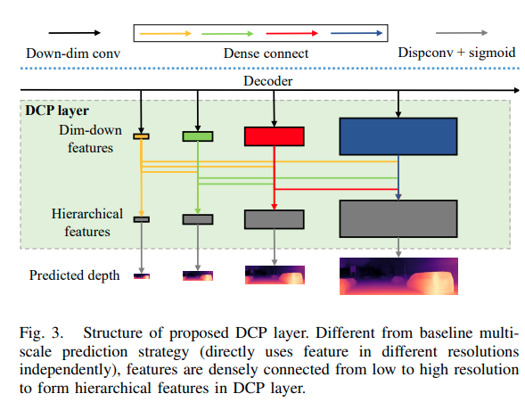
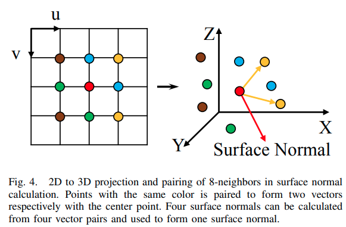
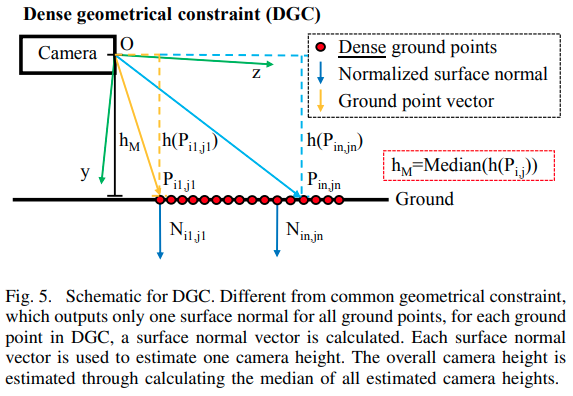

time: 20200916
pdf_source: https://arxiv.org/pdf/2004.05560.pdf
code_source: https://github.com/TJ-IPLab/DNet
short_title: DNet for Depth Prediction

#  Toward Hierarchical Self-Supervised Monocular Absolute Depth Estimation for Autonomous Driving Applications

本文指出目前的深度预测网络有两大缺陷，一个是对object level的深度预测不准确，另一个是缺乏scale信息。

本文分别提出 DCP layer 以及 DGC layer 分别处理这两个问题.

下图展示了与传统方案的对比

## PipeLine

网络首先使用DCP网络预测实现相对深度预测，然后利用地面与相机之间的几何关系，提取出地面点，然后计算相机的高度，其中位数用来估计scale factor. 得到的scale factor与相对深度相乘得到绝对深度。

基准模型为[MonoDepth2](https://github.com/nianticlabs/monodepth2), 网络上基于MonoDepth2的修改部分:

- 总体Loss对低resolution的权重下降了，作者的[code](https://github.com/TJ-IPLab/DNet/blob/e286ba3312a1baf36e9763af2dc7ea4807947110/trainer.py#L483)是按照 $2 ** scale$
- DCP Layer，其实就是Densely connected layers.
  

**Scale Recovery**:

#### 计算surface Norm

在图片坐标上，以目标点为中心的附近8个点，如图中的颜色一样分成四组，由同颜色的两个矢量叉乘一共能得到四个法向量的估计，最终估计的法向量为:
$$\mathbf{N}\left(\mathbf{P}_{i, j}\right)=\frac{\sum_{g} \mathbf{n} /\left\|\mathbf{n}_{g}\right\|_{2}}{4}$$

其[code](https://github.com/TJ-IPLab/DNet/blob/master/layers.py#L266) 高度暴力。

#### 地面检测
理想的地面的法向为　$\tilde{\bold{n}} = (0, 1, 0)^\top$

作者使用基于角度的相似度函数 
$S=s\left(\mathbf{P}_{i, j}\right)=\left|\angle\left(\tilde{\mathbf{n}}, \mathbf{N}\left(\mathbf{P}_{i, j}\right)\right)\right|=\left|\arccos \frac{\tilde{\mathbf{n}} \cdot \mathbf{P}_{i, j}}{\|\tilde{\mathbf{n}}\|\left\|\mathbf{P}_{i, j}\right\|}\right|$

由于相机不一定是与地面法向完全垂直的，所以作者留了一个threshold, 代码中这个角度差的阈值为正负五度。

#### 相对高度估计

由上图，可以根据地面点与相机的相对矢量以及其该点的法向计算相机的高度，

$$h\left(\mathbf{P}_{i, j}\right)=\mathbf{N}\left(\mathbf{P}_{i, j}\right)^{\top} \cdot \overline{\mathbf{O P}_{i, j}}$$tu