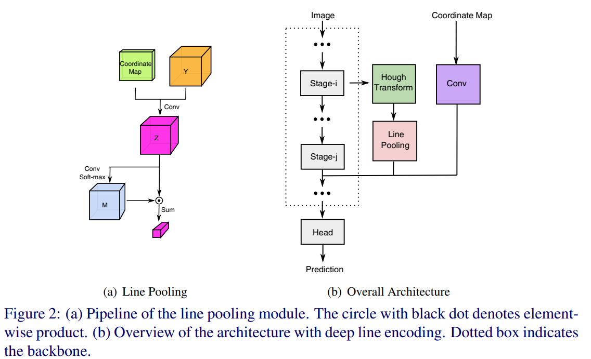

time:20211230
pdf_source: https://www.bmvc2021-virtualconference.com/assets/papers/0299.pdf
code_source: https://github.com/cnexah/DeepLineEncoding
# Deep Line Encoding for Monocular 3D Object Detection and Depth Prediction

这篇paper在[GAC](../../3dDetection/GroundAwareConvultion.md) 文章与代码的基础进一步开发.

由于驾驶场景地面不一定是平整的,但是地面上的线特征可以辅助网络学习这些信息.本文就着重从线特征提取来入手进一步提升GAC的性能.




其主要修改了Core Module的流程代码.
```python
class SelfMask(nn.Module):
    """
        The Conv Soft-max operation on (a) subgraph to select the most significant line at each channel.
    """
    def __init__(self, c):
        super(SelfMask, self).__init__()
        self.mask1 = nn.Conv2d(c, c, kernel_size=1)
        self.max1 = nn.Softmax(dim=-1)

    def forward(self, x):

        mask1 = self.mask1(x)
        n, c, h, w = mask1.shape[0], mask1.shape[1], mask1.shape[2], mask1.shape[3]
        mask1 = mask1.view(n, c, -1)
        mask1 = self.max1(mask1)
        mask1 = mask1.view(n, c, h, w)
        x1 = x * mask1
        x1 = x1.sum(dim=-1,keepdim=True).sum(dim=-2,keepdim=True)
        return x1


class YoloMono3DCore(nn.Module):
    """Some Information about YoloMono3DCore"""
    def __init__(self, backbone_arguments=dict()):
        super(YoloMono3DCore, self).__init__()
        self.backbone =resnet(**backbone_arguments)

        self.cord = nn.Sequential(
                CoordinateConv(256+512, 512, kernel_size=3, padding=1),
                nn.BatchNorm2d(512),
                nn.ReLU(True),
                nn.Conv2d(512, 512, kernel_size=3, padding=1),
                nn.BatchNorm2d(512),
                nn.ReLU(True)) # The coorindate Conv after line pooling on (b) subgraph

        self.vote_index = hough_transform(72,320,3.0,3.0)
        self.vote_index = torch.tensor(self.vote_index).cuda().contiguous().float()
        self.dht = HT(self.vote_index) # Hough Transform Layer


        self.dht_backbone = nn.Sequential(
                CoordinateConv(16, 64, kernel_size=3, padding=1),
                nn.BatchNorm2d(64),
                nn.ReLU(True),
                nn.Conv2d(64, 256, kernel_size=3, padding=1),
                nn.BatchNorm2d(256),
                nn.ReLU(True),
                SelfMask(256)) # Line Pooling Module

        self.bt = nn.Sequential(
                nn.Conv2d(256, 64, kernel_size=1),
                nn.BatchNorm2d(64),
                nn.ReLU(True),
                nn.Conv2d(64, 16, kernel_size=1),
                nn.BatchNorm2d(16),
                nn.ReLU(True)) # Compress the number of channels for hough transform.

    def forward(self, x):
        #x = self.backbone(x['image'])
        #x = x[0]

        x1, x2 = self.backbone.forward1(x['image']) # Take the ResNet's output from layer1 and layer2; scale 4, 8
        x1 = 0.1 * x1 + 0.9 * x1.detach()
        x1 = self.bt(x1) # Reduce features before hough transform
        dht = self.dht(x1) # hough transform
        dht = self.dht_backbone(dht) # Line Pooling

        h, w = x2.shape[2], x2.shape[3]
        dht = dht.expand(-1, -1, h, w)
        
        x2 = torch.cat([x2, dht], 1)
        x2 = self.cord(x2) # Merge back
        x2 = self.backbone.forward2(x2) # ResNet at Scale 16
        return x2
```