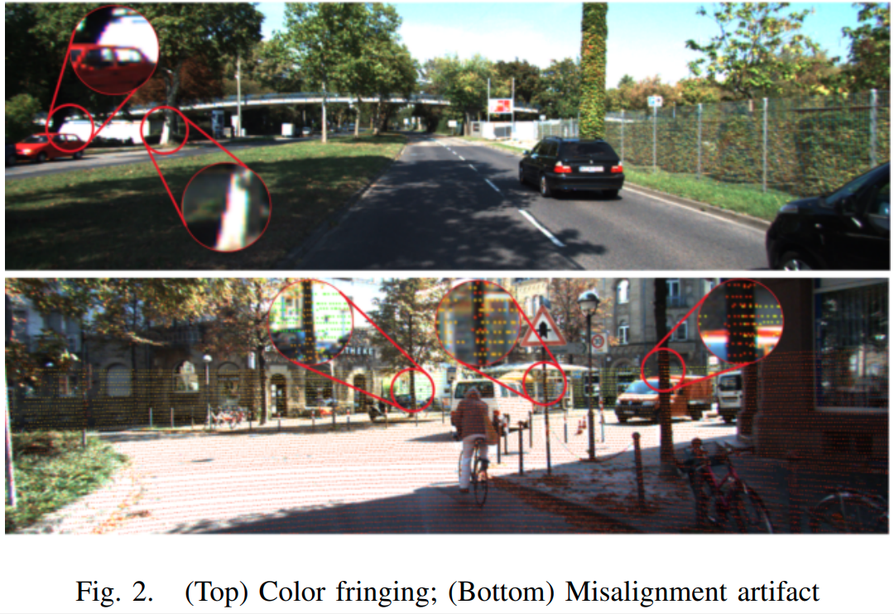

time: 20210615
pdf_source: https://arxiv.org/pdf/2106.07256.pdf

# Deterministic Guided LiDAR Depth Map Completion

这篇paper提出了一套不用learning的深度补全算法。与 [IP-basic](../others/In_Defense_of_Classical_Image_Processing_Fast_Depth_Completion_on_the_CPU.md) 相比，功能更齐全，分析更有深度。且可以和其他方法相互配合.

## 相关工作

这篇paper提到的related works 里面，提到了TOF image 超分辨率问题，这个在性质上与LiDAR的深度补全在几何性上是有很强的相似性的。

其中提到了 [基于约束的bilateral solver](https://arxiv.org/pdf/1511.03296.pdf) 对深度补全,等偏微分方程问题的效果.

## 主要提出内容

### 影响LiDAR深度补全的一些常见问题

这里文章给出了很细但是非常高质量的图

- 图像artifacts, 在一些比较远的物体边缘，可能会因为扰动产生不自然的颜色变换;如上侧的图的上半部分。这种误差很难处理，除非有图像更原始的数据。
- 可反射的表面。
- 离散化误差，因为我们需要将点云投射到图片坐标系下，并且给一个像素对应一个深度。这里就涉及到了点的离散化
- Misalignment. 由于相机和雷达的放置位置不同，因此点云有时候能看到相机看不到的后面的点比如上侧图下班部分的树干上的背景点。
- 不同的获取时间，点云的运动畸变也是一个典型问题。

### 语义分割超像素

图片的不同语意区域是需要用不同的几何逻辑去处理的，整个图的几何特性太难。所以我们还是需要先做语义分割，这里本文采用快捷的 Simple Linear Iterative Clustering [(SLIC)](https://blog.csdn.net/matrix_space/article/details/78618917), 实际上是一个考虑了彩色以及空间位置的 K-mean 算法.

### 平面近似与插值

计算平面的算法其实就是用一个平面去拟合超像素里面的所有点云点.

可以被描述为一个优化问题:

$$
\min _{\mid \vec{n} \|_{2}=1} E_{T L S}(\vec{n})=\min _{\|\vec{n}\|_{2}=1}\|A \vec{n}\|_{2}
$$
可以用SVD求解

对于同一超像素的点，可以用平面插值得到一个预估。

至于用一个平面是否可以，我们可以通过valid check(现有点和平面的距离)，判断平面是否正确拟合了。

### 凸包方式.

如果平面近似失败了，那么会采用凸包估计的方式。

### 多层级融合

为了增加能够插值的区域，图片会在不同的分辨率下被segment多册，得到不同的深度。最后的深度为同一个点所有深度中位数.这也能允许这个算法和其他深度学习算法进行融合。