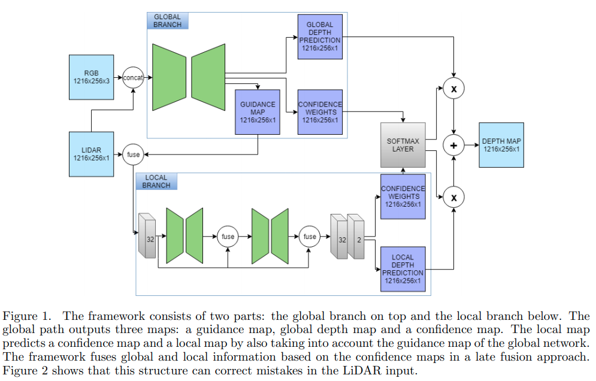
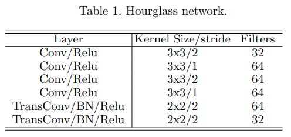

time: 20191203
pdf_source: https://arxiv.org/pdf/1902.05356.pdf
code_source: https://github.com/wvangansbeke/Sparse-Depth-Completion
short_title: LiDAR completion with RGB uncertainty
# Sparse and noisy LiDAR completion with RGB guidance and uncertainty

这篇论文提出了一个不算复杂的方式，在20ms钟内完成对$1256 \times 256$分辨率的图像与稀疏点云进行图像补全。

## 总体框架

做法总体比较直观，首先RGB图像与稀疏的投影后的lidar深度图进行concat,输入到以[ERFNet]为主干的encoder-decoder网络中，(需要注意的是根据[ERFNet]的github网页显示，其模型需要私聊才可获得),输出三个部分，一个是lidar map的局部残差,一个是全局深度预测，一个是全局深度的置信度。

而稀疏的投影后的Lidar深度图补上残差后同时输入到局部分支中，使用数个残差连接的[StackedHourGlass]模块,再卷积输出两个分支，一个是局部深度预测，一个是局部深度的置信度。

全局分支与局部分支，将两分支的置信度连接并使用使用softmax层形成分别的权重，再将两者的深度预测值加权求和得到。

本文具体使用的[StackedHourGlass]模块如图

## 训练细节

训练顺序上，作者使用pretrained [ERFNet]先单独对两个分支进行训练，然后再加入guidance部分以及加权部分进行端到端训练.

损失函数方面作者提出了一个新的所谓focal-MSE Loss。数学表达为:

$$
    \lambda(\hat y, y) = \frac{1}{n} \sum^n_{i=1}(1+0.05 * epoch * |y_i - \hat y_i|) * (y_i - \hat y_i)^2
$$

最终损失为
$$
\Lambda=w_{1} \cdot \lambda\left(\hat{y}_{g l o b a l}, y\right)+w_{2} \cdot \lambda\left(\hat{y}_{l o c a l}, y\right)+w_{3} \cdot \lambda\left(\hat{y}_{o u t}, y\right)
$$
其中三个参数分别为0.1, 0.1, 1

[ERFNet]:https://github.com/Eromera/erfnet_pytorch
[StackedHourGlass]:../../Building_Blocks/Stacked_Hourglass_Networks_for_Human_Pose_Estimation.md