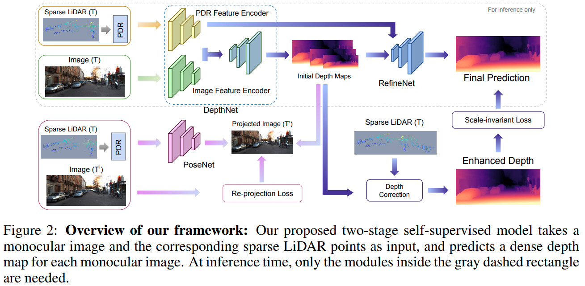

time: 20210928
pdf_source: https://arxiv.org/pdf/2109.09628.pdf

# Advancing Self-supervised Monocular Depth Learning with Sparse LiDAR

这篇paper与无监督的深度估计又有一点不同，本质上是一个无监督深度补全的任务，但是这个任务本身的研究就比较少又有相当的拓展前景，因而同样值得了解。

## Architecture

概念上的要点
- 这是一个二阶段的自监督网络，并不需要稠密深度或者完整点云进行监督
- 输入网络的点云从64线中采样4线

设计与前文的连接与大致思想:

- 与[Monodepth2](../others/monodepth_collections.md)一致，通过posenet和depthnet完成一个基础的监督.
- 使用[Plidar++](../../3dDetection/RecentCollectionForStereo3D.md)中的 GDC (graph-based depth correction)算法直接根据稀疏点云优化稠密的深度估计; 但是为了整个推理过程的实时性，使用额外的refinenet去拟合这个GDC的优化过程，这个refinenet由GDC监督.

### Pseudo Dense Representations (PDR):

PDR由两个channel组成

- 深度
$$
\begin{aligned}
r(x, y) &=\sqrt{\left(u_{i}-x\right)^{2}+\left(v_{i}-y\right)^{2}} \\
D(x, y) &=\left\{\begin{array}{ll}
Z_{i}, & \text { if } r(x, y)<R \\
0, & \text { otherwise }
\end{array}\right.
\end{aligned}
$$
- 置信度.
$$
C(x, y)=\left\{\begin{array}{ll}
\frac{1}{r}(x, y), & \text { if } r(x, y)<R \\
0, & \text { otherwise }
\end{array}\right.
$$

### GDC 

GDC采用的是PLiDAR++ 的方法. [代码](https://github.com/mileyan/Pseudo_Lidar_V2/tree/master/gdc)
