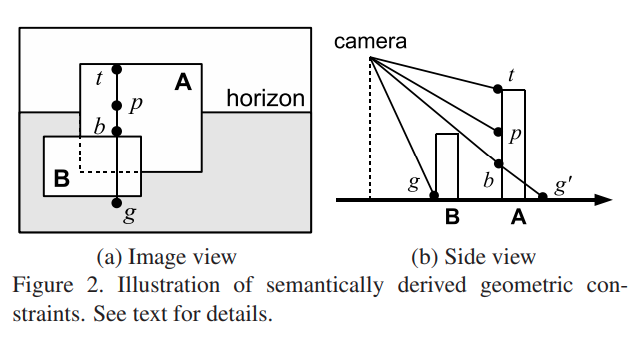
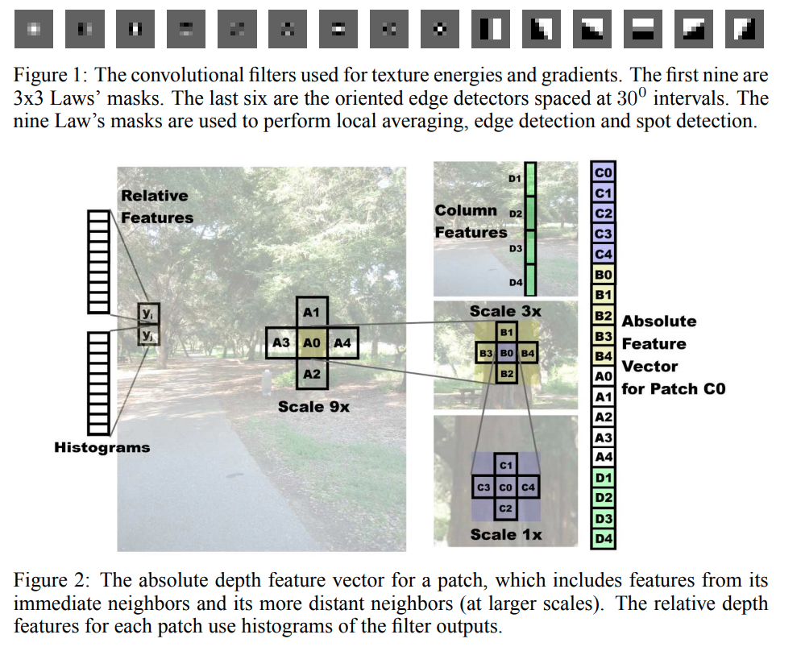

time: 20200813
pdf_source: https://ieeexplore.ieee.org/stamp/stamp.jsp?tp=&arnumber=5539823
short_title: Depth Prediction before DL

# Depth Prediction Before Deep Learning

本文记录几篇在深度学习时代之前的单目深度相关的工作。

## Single Image Depth Estimation From Predicted Semantic Labels
[pdf](https://ieeexplore.ieee.org/stamp/stamp.jsp?tp=&arnumber=5539823)

### Semantic Segmentation with MRF

MRF能量定义为:

$$\mathbf{E}(\mathbf{L} \mid \mathcal{I})=\sum_{p} \psi_{p}\left(L_{p}\right)+\lambda \sum_{p q} \psi_{p q}\left(L_{p}, L_{q}\right)$$

对于单项势能选择的则是与[这篇文章](https://www.microsoft.com/en-us/research/wp-content/uploads/2016/02/criminisi_iccv2005.pdf)一致的17种卷积核的特征。色彩空间选择[CIE Lab](https://www.wikiwand.com/en/CIELAB_color_space),三个方差为1,2,4的高斯核分别用在三个channel上，四个Laplacian Gaussian filters (方差为1,2,4,8)仅在L频道上，在x,y方向上以方差(2, 4)共作4个高斯一阶导的卷积核(仅 L频道)。共17个频道。

### Scene Geometry

对每一个$p$点，其中$g$为图片上同一x轴上最高的地面点，$b$点为图片上同一x轴上同一instance的最低点，$t$为图片上同一x轴上同一instance的最高点，则点p的深度范围为:

$$d_{g}\left(\frac{r_{g}^{T} e_{3}}{r_{p}^{T} e_{3}}\right) \leq d_{p} \leq d_{g}\left(\frac{r_{g}^{T} e_{2}}{r_{b}^{T} e_{2}}\right)\left(\frac{r_{b}^{T} e_{3}}{r_{p}^{T} e_{3}}\right)$$

对每一个像素点，作者对training set上每一张图每一个像素点位置(u, v)计算了其平均的log-depth.同时用前文geometric hints里面提到的几个相关pixel的prior depth对当前点深度进行估算，作为第二个MRF的features。

## Learning Depth from Single Monocular Images
[pdf](http://www.cs.cornell.edu/~asaxena/learningdepth/NIPS_LearningDepth.pdf)

这篇paper也是使用MRF进行分析。

核心新意有两个，第一个是multi-scale,第二个是计算上下相邻的两个feature的histgram vector的差值来预测两者的深度差。