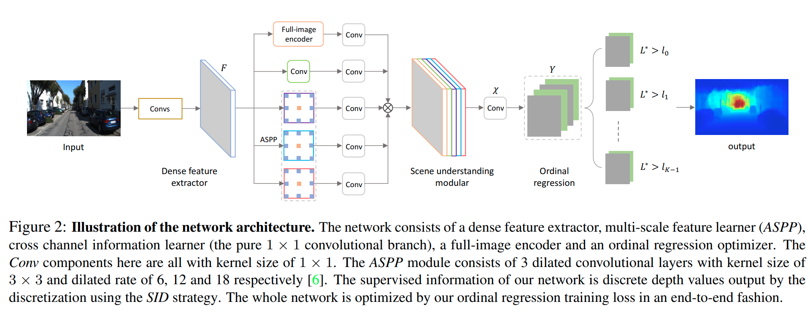

pdf_source: https://arxiv.org/pdf/1806.02446.pdf
time: 20200526
code_source: https://github.com/dontLoveBugs/SupervisedDepthPrediction
short_title: DORN Depth Prediction

# Deep Ordinal Regression Network for Monocular Depth Estimation

这篇paper时间虽然比较早，但是是属于单目深度估计的SOTA结果。重点在于如何对跨度很大的深度值进行回归计算。

## 网络结构

## Ordinal Regression

损失函数计算:

$$\begin{aligned}
\mathcal{L}(\chi, \Theta)=&-\frac{1}{\mathcal{N}} \sum_{w=0}^{W-1} \sum_{h=0}^{H-1} \Psi(w, h, \chi, \Theta) \\
\Psi(h, w, \chi, \Theta)=& \sum_{k=0}^{l_{(w, h)-1}} \log \left(\mathcal{P}_{(w, h)}^{k}\right) \\
&+\sum_{k=l_{(w, h)}}^{K-1}\left(\log \left(1-\mathcal{P}_{(w, h)}^{k}\right)\right) \\
\mathcal{P}_{(w, h)}^{k}=& P\left(\hat{l}_{(w, h)}>k | \chi, \Theta\right)
\end{aligned}$$

推理时：
$$\begin{aligned}
\hat{d}_{(w, h)} &=\frac{t_{\hat{l}_{(w, h)}}+t_{\hat{l}_{(w, h)}+1}}{2}-\xi \\
\hat{l}_{(w, h)} &=\sum_{k=0}^{K-1} \eta\left(\mathcal{P}_{(w, h)}^{k}>=0.5\right)
\end{aligned}$$

翻译成中文，就是说首先这个问题被考虑为一个multi-bin分类的问题，如果物体在第$t$个bin里面，则前面t个节点的分类都应该为正，推理的时候先计算预测为正的节点有多少个，判断物体的深度在哪一个bin上，然后输出的target值为均值。
