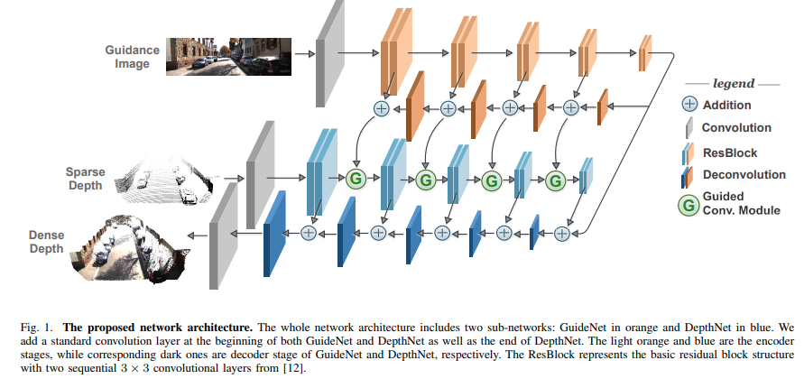
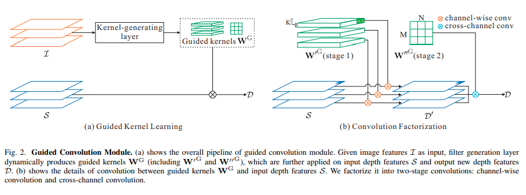

time: 20200214
pdf_source:https://arxiv.org/pdf/1908.01238.pdf
code_source: https://github.com/kakaxi314/GuideNet
short_title: GuideNet
# Learning Guided Convolutional Network for Depth Completion

这篇文章基于[Dynamic Filtering Networks]的理念。

## 总体结构

输入是RGB图片以及稀疏的深度图，最终输出的是稠密的深度图。整体结构很类似于基础的FPN

## Guided Convolution Module

左图表达了总体的思路，就是使用RGB image的特征作为引导层，局部地生成卷积核，对稀疏深度图进行卷积(与[DFN]的第二种实现相似)。
但是这种类似于局部卷积的方式对GPU显存消耗很大。作者提出模仿Mobile Net的思路。第一阶段使用Channel-wise 局部卷积，第二阶段使用Spatial-invariant的普通卷积.

[Dynamic Filtering Networks]:../../Building_Blocks/DynanicFilteringNetwork.md
[DFN]:../../Building_Blocks/DynanicFilteringNetwork.md
