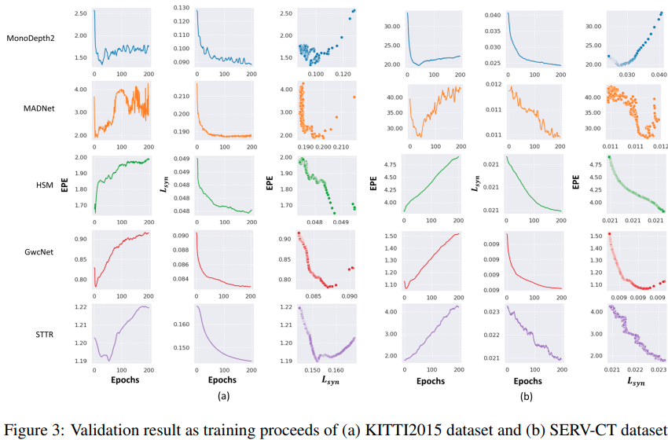
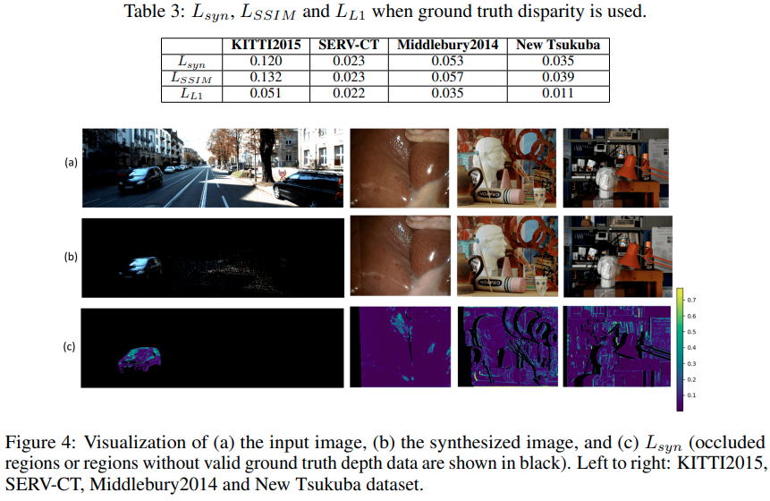
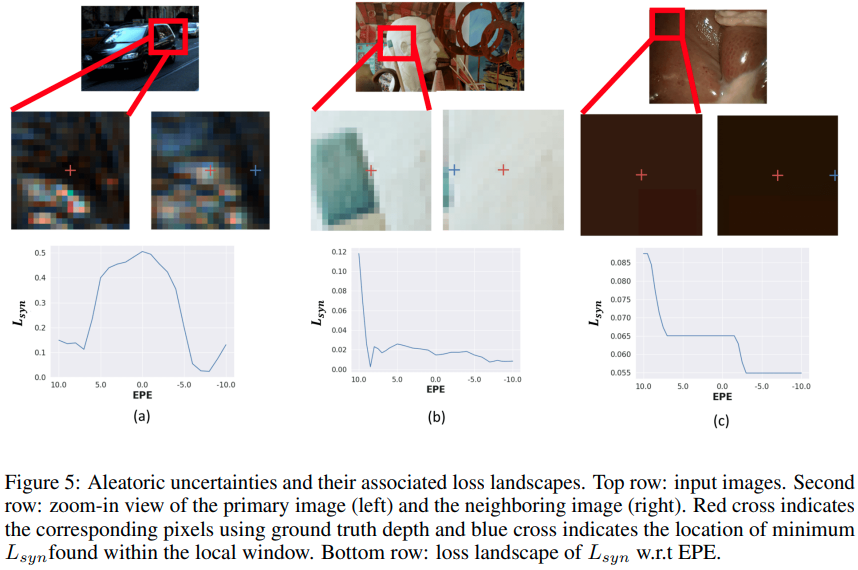

time: 20210915
pdf_source: https://arxiv.org/pdf/2109.06163.pdf

# On the Sins of Image Synthesis Loss for Self-supervised Depth Estimation

新近主流的无监督深度预测 [1](../others/monodepth_collections.md) [2](manydepth.md) [3](../others/Unsupervised_depth_prediction.md), 无监督的光流预测 [4](https://github.com/lliuz/ARFlow), 无监督的双目估计 [5](../others/self_supervised_stereo.md) 都有一个共同点，就是使用图片之间的相互的重建作为网络学习的监督信号。其中一个很强的假设在于，假设环境的深度是被正确感知的，那么在不同图片(时序图片, 双目图片)之间重投影就会是完美的，**并且反之亦然**. 这篇paper没有给出新的解决方案，但是对前面提到的假设提出了质疑并给出了相关的反例证据。核心的几个结论:

- 图片重建合成的质量作为深度估计网络的一个辅助训练网络是否有效? 回答：有效，但是只到一定程度。在一个阈值之上继续推进优化图片重建的质量会降低深度估计的准确率.
- 使用真实的深度值是否能够实现完美的图片重建? 回答: 是*不可以*的. 且如果图片重建是唯一的损失函数，在得到真实深度的网络附近，损失函数的导数不为0， 因而网络不会稳定停留在输出真实深度的位置.
- 是什么造成了图片合成质量和深度估计准确度之间的divergence? 本文分析了相关的损失平面 (loss manifold), 最终将这个问题归因于图片数据中的一些问题或特征。

实验分析上，本文主要是利用几个带有label的双目数据集，观察训练开始前后 图片合成的监督损失$L_{syn}$与 绝对disparity error EPE (end-point-error). 

可以从图里面发现有很多网络中能观察到,随着训练进行，$L_{syn}$与EPE并不能一起进步。

使用真实深度进行还原:

Loss还是很巨大的。

观察一些特殊的点， 这些点在EPE=0的地方都展现出非凸的合成损失:

可以总结出几个特点:

- 镜面反射 (non-Lambertian surfaces, non-diffusely reflecting surface)与影子，镜面反射和影子会在图片上表现出比较其他的光学效果，影响在不同位置的观测。
- 物体边缘以及遮挡边缘.
- 无特征或重复纹理区域。即使使用了光滑的regularization, 估计的准确性也是无法保证的.
