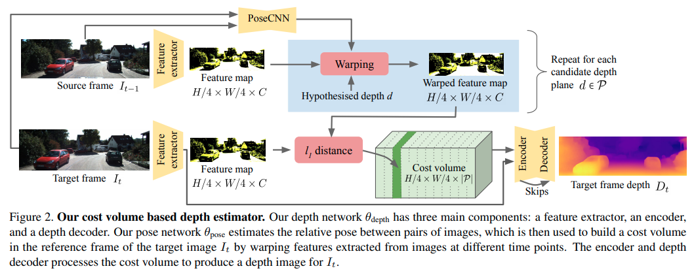

time: 20210502
pdf_source: https://arxiv.org/pdf/2104.14540.pdf
code_source: https://github.com/nianticlabs/manydepth
short_title: ManyDepth

# The Temporal Opportunist: Self-Supervised Multi-Frame Monocular Depth (ManyDepth)

这篇paper将像素级的帧间匹配引入了深度预测中，使得时序单目深度预测有了更加科学的方向。同时本文提供了代码以及相关附带的Tricks,使得这一切变得真的可行.

## 网络结构

### 自监督训练:

将相邻帧的图片根据posenet的结果重投影到主图片上，然后计算重投影的误差，重投影误差由 SSIM与L1 组成，这个和 MonoDepth一致。

### Cost Volume Bulding:

通过给定一系列的深度平面$P$, 将相邻帧的feature map投影到主feature map上，计算他们的L1距离，与双目匹配的类似，不过这里要考虑更复杂的坐标转换，且用深度而不是disparity作为转换标准。

同时由于无监督的深度预测网络无论如何学习到的深度和pose都只是'up to a scale'. 也就是深度平面的$d_{min}$, $d_{max}$很难确认，本文让这个超参变成一个可以学习的参数。带上一个比较强的momentum.

### Cost volume overfitting:

作者指出，如果直接用 cost volume, 单目的结果会有很多artifacts, 包括运动物体上会有很大的holes.

其实，从直觉上来说，一个高标准的monodepth2 baseline,加上额外的 cost volume的加持，性能应当提升了才对。但是cost volume一般只在静态、有texture的区域有效，当物体运动、无texture的时候，cost volume的信息反而会不准确。如果网络变得过度依赖像素匹配，这些问题就会很严重。我们需要教会网络避开这些难点。

本文用一个单独的单目深度估计网络，他会单独产生$\hat D_t$. 然后对Cost volume每一个像素计算 $\text{argmin}$, 得到$D_{cv}$. 那么$D_{cv}$应该和$D_{t}$接近，才认为这是值得信赖的区域。

mask公式 (如果差一倍则认为不可靠)
$$
M=\max \left(\frac{D_{\mathrm{cv}}-\hat{D}_{t}}{\hat{D}_{t}}, \frac{\hat{D}_{t}-D_{\mathrm{cv}}}{D_{\mathrm{cv}}}\right)>1
$$

### Static Camera and Start of sequences

如果相机不动，或者如果是在Sequence的开始，深度应该如何计算呢? 为了克服第一个这个问题， 在训练的时候，有$p$的概率，cost volume会用一个零矩阵替代。对这些图片，我们会鼓励网络只用单图的特征进行预测；测试第一张图的时候用零矩阵替代就可以饿了。为了客服第二个问题，在训练的时候，有$q$的概率，我们将$I_{t-1}$替换为数据增强后的$I_{t}$, 但是仍然用$I_{t-1}$做重采样并计算自监督损失。也就会促使网络不要过于依赖cost volume，并在cost volume是来自静态图的时候也能有可靠的深度估计.

