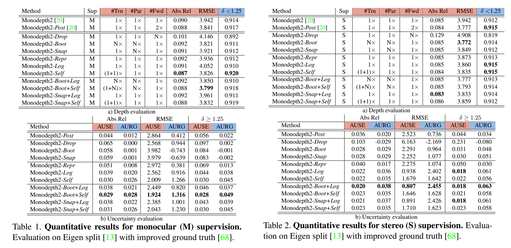

time: 20220804
pdf_source: https://arxiv.org/pdf/2005.06209.pdf
code_source: https://github.com/mattpoggi/mono-uncertainty
short_title: MonoUncertainty
# On the uncertainty of self-supervised monocular depth estimation

这篇paper的主要目标是研究单目深度估计中的不确定性，遍历研究了一系列计算不确定性的方案，并提出了对不确定性的估计方法。

注意本文关注的是不确定性的相对值。也就是目标是找出图片中不确定性从大到小的正确排列，而不是关注不确定性的绝对值。

## Uncertainty Computation : Overview

- Image Flipping. 将图片翻转，计算两次深度预测结果的差值，各个位置上的差值就是不确定性的大小 $u_{post} = |d - d_{flip}|$
- Dropout Sampling. 与传统的Monte Carlo Network uncertainty 相似，利用dropout生成$N$个概率上相对独立的模型，通过计算每一个像素深度在$N$个随机dropout网络中的方差与均值，得到不确定性。
- Bootstrapped Ensemble. 用$N$个网络在$N$个不同的网络子集上训练，推理的时候近似能得到一个分布，与dropout有相似的理念。
- Snapshot Ensemble. 用循环的学习率， 循环$C > N$个周期，在一次训练过程中选取得到$N$个模型。然后做ensemble。
以上三个方法归类为Empirical Estimation,都是想通过采样$N$个模型获取不确定性。另外一类方法则是通过网络预测输出不确定性 (Predicted Estimation)。

- Learned Reprojection error. 在预测方法是一个分类任务(光流和双目)的情况下，我们可以训练一个输出层，预测每个像素上的图片重建误差。直觉来说就是重建误差越大的地方，不确定性越高，而这些往往和阻挡、无纹理等语义信息有关，所以在一定程度上可以学出来。
- Log-likelihood Maximization. 有一些预测方案是让网络预测网络参数的均值与方差(bayesian network中的参数不确定性的描述)，
- Self-Teaching, 加入teacher网络作为额外的回归监督。使得不确定性估计成为可能。

- Bayesian Estimation.也就是融合了 Empirical Estimation and Predicted Estimation.

## Metric : How to evaluate uncertainty

本文提出了两个metric来描述这个不确定性估计的质量。直观来说就是，按照高不确定性到低不确定性排序，逐步地(每次2%)剔除像素，计算剩余像素的预测准确性，可以得到一个 substract w.r.t. accuracy 的 曲线。这个曲线面积越高，证明剔除像素的顺序越正确(大误差的点先被剔除，准确的点较后剔出)。对于一般有效的不确定性估计算法来说，accuracy 会随 substraction逐步上升 (error则为下降)。

以上是一个与深度预测准确度耦合的数值。我们需要的是一个相对值。所以这个像素的排序的依据再引入两种极端情况作为比较，第一种是这个不确定性就是根据真实与雷达点的误差值得到的(uncertainty 完美的情况， Sparsification Error). 第二种是随机剔除，这种实际计算时就是让substract-accuracy曲线保持一个水平线。

网络给出的不确定性曲线与第一种方式的差为 AUSE(area under the sparsification error), 一般越小越好。 曲线与第二种方式的差为 AURG (area under the random gain), 一般越大越好。

本文主要关注 absRel error, RMSE 和 $a_1$ score.

大概的数值比较如图:

