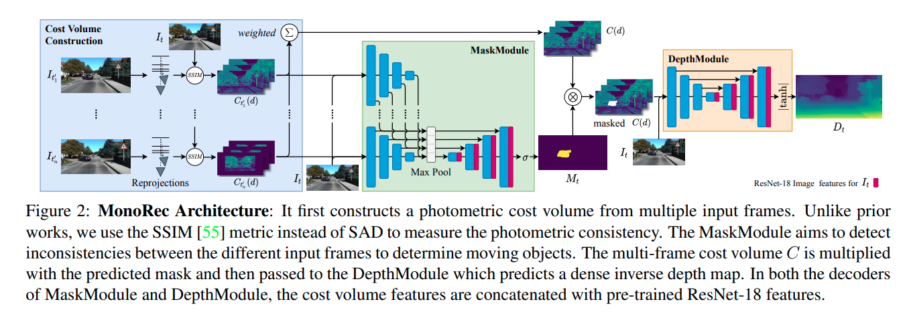
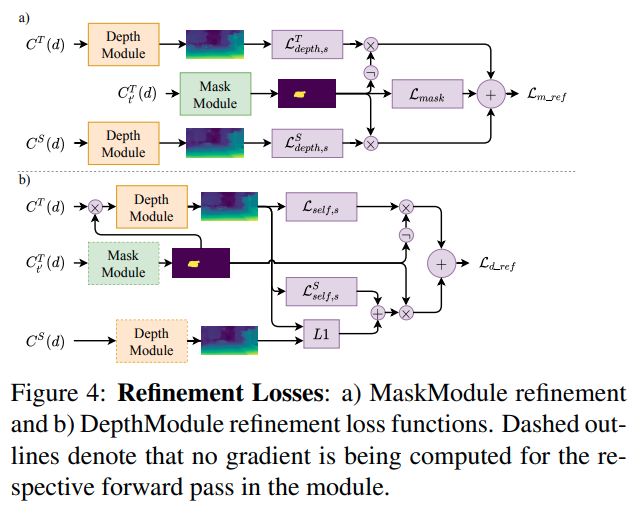

time: 20210706
pdf_source: https://arxiv.org/pdf/2011.11814.pdf
code_source: https://github.com/Brummi/MonoRec

# MonoRec: Semi-Supervised Dense Reconstruction in Dynamic Environments from a Single Moving Camera

[官方页面](https://vision.in.tum.de/research/monorec)

这篇paper实现了使用单一相机序列输入实现三维重建. 

## Network Architecture

### SSIM based cost volume

以key frame为基准，设像素深度为$d$, 将图片$I^t_{t'}$投影到$I_t$, 基于SSIM计算photometric error $pe$

$$
p e(\mathbf{x}, d)=\frac{1-\operatorname{SSIM}\left(I_{t^{\prime}}^{t}(\mathbf{x}, d), I_{t}(\mathbf{x})\right)}{2}
$$

对一系列的图片的$t'$, Cost volume的每一个位置存储值为:

$$
C(\mathbf{x}, d)=1-2 \cdot \frac{1}{\sum_{t^{\prime}} \omega_{t^{\prime}}} \cdot \sum_{t^{\prime}} p e_{t^{\prime}}^{t}(\mathbf{x}, d) \cdot \omega_{t^{\prime}}(\mathbf{x})
$$

其中权重$w$

$$
\begin{aligned}
w_{t^{\prime}}(\mathbf{x})=& 1-\frac{1}{M-1} \\
& \sum_{d \neq d^{*}} \exp \left(-\alpha\left(p e_{t^{\prime}}^{t}(\mathbf{x}, d)-p e_{t^{\prime}}^{t}\left(\mathbf{x}, d^{*}\right)\right)^{2}\right)
\end{aligned}
$$

$d*_{t'} = \argmin_d{pe_{t'}^t(x, d)}$指的是特定图片上某一点在不同深度。若深度分布越平整(matching不确定性越高)，则权重$w$越小。

### Mask Module

这个部分负责输出一个概率，预测keyframe的每一个像素是不是属于moving object.作者认为，两帧图片之间inconsistent的matching结果是moving object的主要预测手段. 本文最终用一个Res18提取$I_t$的特征，然后与$各个C_{t'}$进行融合，

### Depth Module

这个部分负责输出dense pixel-wise inverse depth prediction.

首先用$M_t$ mask掉$C$中的移动像素，然后用一个U-Net结构输出多尺度深度.

## Multi-stage Training

- 起始阶段: MaskModule和DepthModule分开训练。深度模块用无mask的$C$作为输入预测$D_t$, 深度由稠密的自监督损失以及稀疏的来自VO的深度作为稀疏监督

$$
\mathcal{L}_{\text {depth }}=\sum_{s=0}^{3} \mathcal{L}_{\text {self }, s}+\alpha \mathcal{L}_{\text {sparse }, s}+\beta \mathcal{L}_{\text {smooth } s}
$$

MaskModule采用Mask-RCNN与深度预测产生一个假ground truth. 首先使用Mask-RCNN分辨出*movable* 物体。然后如果一个movable 物体有很多像素是temporal inconsistent的，那么就会被标记为*moving* 物体.

- MaskModule Refinement, 利用双目的深度辅助mask的训练: 

$$
\begin{aligned}
\mathcal{L}_{m_{-} r e f}=& \sum_{s=0}^{3}\left(M_{t} \mathcal{L}_{\text {depth }, s}^{\prime S}+\left(1-M_{t}\right) \mathcal{L}_{\text {depth,s }}^{\prime T}\right) \\
&+\mathcal{L}_{\text {mask }}
\end{aligned}
$$

- DepthModule Refinement, 初始阶段没有考虑mask的存在。所以refine这个部分关注于阻止静态物体的传播

$$
\begin{aligned}
\mathcal{L}_{d_{-} r e f, s}=&\left(1-M_{t}\right)\left(\mathcal{L}_{\text {self }, s}+\alpha \mathcal{L}_{\text {sparse,s }}\right) \\
&+M_{t}\left(\mathcal{L}_{\text {self }, s}^{S}+\gamma\left\|D_{t}-D_{t}^{S}\right\|_{1}\right) \\
&+\beta \mathcal{L}_{\text {smooth,s }} .
\end{aligned}
$$