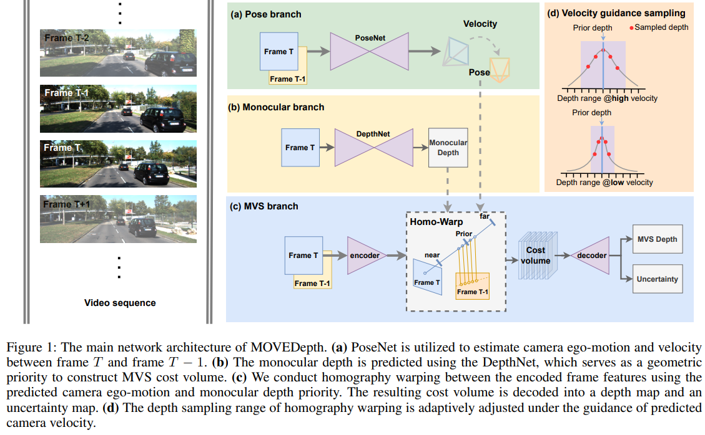
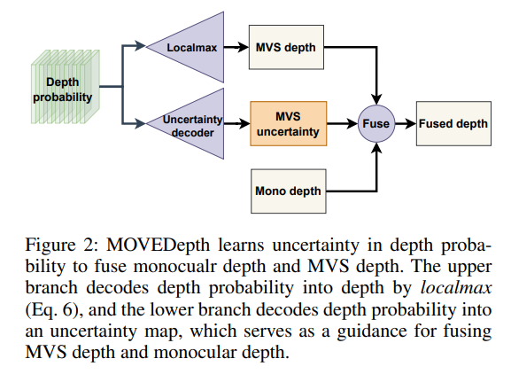

time: 20220822
code_source: https://github.com/JeffWang987/MOVEDepth
pdf_source: https://arxiv.org/pdf/2208.09170.pdf

# Crafting Monocular Cues and Velocity Guidance for Self-Supervised Multi-Frame Depth Learning

这篇Paper提出MoveDepthNet,使用多(两)帧RGB图预测深度，与[ManyDepth]一致。

核心的创新思路在于使用MonoDepth预测一个prior depth,然后以此为基准缩小多帧匹配的时候的需要进行的深度搜索范围，提高深度搜索精度。

这里的搜索方式是把以 $\[d/1.3, 1.3d\]$之间划分16个等分假设，以此构建cost volume.这个幅度在训练后期与预测的速度相关。

与[ManyDepth]相似,在输出的时候采用一个置信度mask输出，与MonoDepth协同输出。

其次本文引入了大量MVS的trick，从MVS的视角处理多帧MonoDepth的算法:

- [group correlation](../others/patchmatchnet.md), 在构建cost volume的时候，把$C$通道转换为$g$组$C/g$的薄特征，每一组薄特征分别correlation, 不同组之间则采用 mean融合。
- [local-max](https://arxiv.org/abs/2112.05126), 在从深度mult-channel weight生成深度的时候，采用的是local-max,也就是把预测概率最高的点以及附近(正负1)一个范围内的weight 局部normalized 加权求均值。
- [convex interpolation, RAFT](../Summaries/Summary_of_serveral_eccv2020.md),在 1/4的双帧匹配输出到全尺寸时，采用的是
- [Aug](https://arxiv.org/abs/2104.05374), 这里的做法是在训练的时候，除了主干的网络推理与训练之外，把本帧输出图片随机mask 一个方块为0输入网络中得到特征，与正常推理得到的特征进行匹配，得到cost volume和深度，与主干网络得到的深度和特征计算L1-loss,确保他们之间的相似性 (要求除了masked方块之外的像素都相似)。

最后得到了比manydepth更优的性能。

[ManyDepth]:manydepth.md
