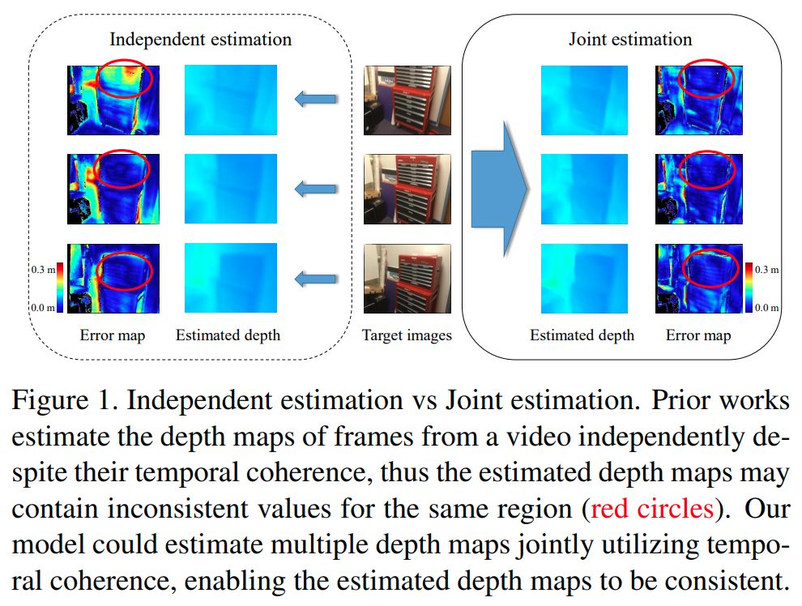
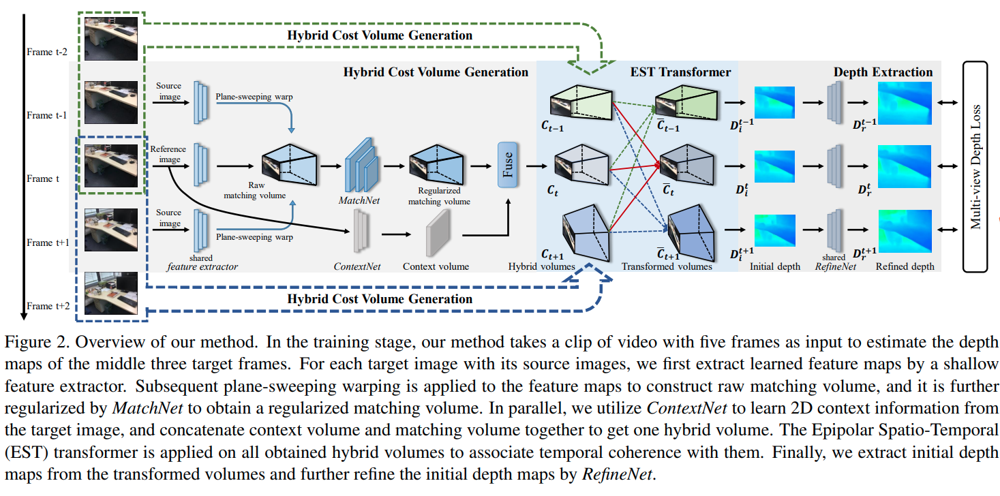
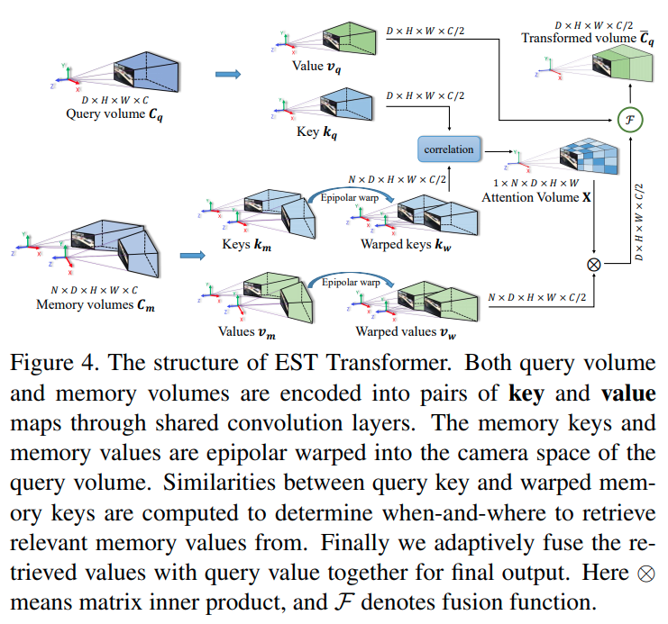

time: 20210717
pdf_source: https://arxiv.org/pdf/2011.13118.pdf
code_source: https://github.com/xxlong0/ESTDepth

# Multi-view Depth Estimation using Epipolar Spatio-Temporal Networks

这篇paper做的是基于视频的 Multi-view Stereo(MVS) 这样一个三维重建问题。重点要解决的是视频中不同帧预测出来的深度的不一致问题。

如果所示连续几帧的预测中，对于同一个物体的估计可能会发生很强的抖动，这在基于视频的重建来说并不好.

## 网络基本结构

基础架构来说，这个网络的hybrid Cost Volume Generation与一般的MVS算法还算相似。Cost Volume采用的是concat的做法。然后在最后的Fuse 部分，把cost volume和单通道在深度维度上concat在一起。

## EST Transformer

本文进一步将不同时间frame的 cost volume进行融合，提升他们的consistency.

本文提出的方法类似于一个[non-local 3D](../../Building_Blocks/Non-local_Neural_Networks.md)
