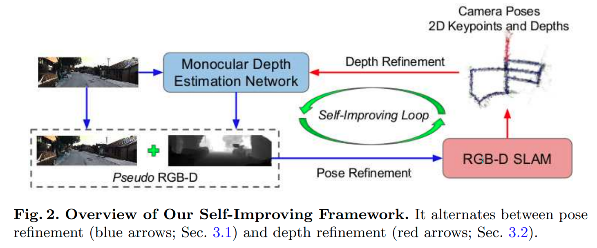
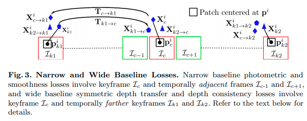

time: 20200824
pdf_source: https://arxiv.org/pdf/2004.10681.pdf

# Pseudo RGB-D for Self-Improving Monocular SLAM and Depth Prediction

这篇paper融合了单目无监督的深度预测以及SLAM，在训练数据只有单目视频的情况下完成对单目深度预测的训练以及SLAM。

## 对SLAM使用的优化

本文使用的SLAM基准是RGB-D 版本的 ORB-SLAM, 在RGBD设定下，ORB-SLAM会将depth图转换为disparity 图，从而复用Stereo-ORBSLAM的框架。需要设定虚拟双目的基线，对每一个输入序列,先计算网络预测的最大深度$d_{max}$， baseline的设定:

$$b = \frac{b^{KITTI}}{d_{max}^{KITTI}} * d_{max}$$

## 深度优化

网络深度的网络是MonoDepth2, 但是优化的方法进一步考虑长期的consistency,

图片中$I_c, I_{k1}, I_{k2}$为 keyframes.

**Depth Transfer Loss**

$$\mathcal{T}_{c \leftrightarrow k 1}^{i}(\mathbf{w})=\left|d_{c \rightarrow k 1}^{i}(\mathbf{w})-d_{k 1}^{i}(\mathbf{w})\right|+\left|d_{k 1 \rightarrow c}^{i}(\mathbf{w})-d_{c}^{i}(\mathbf{w})\right|$$

也即是将$c$帧的通过SLAM得到的3D keypoint通过SLAM得到的transformation 转移到$k1$帧视角中，要求两者的深度预测值相等。反方向的转换亦然。

transfer loss同样作用于$c \leftrightarrow k2, k1 \leftrightarrow k2$

**Depth Consistency Loss**

$$
\mathcal{D}_{c}=\frac{\sum_{i \in \mathcal{X}}\left|d_{c}^{i}(\mathbf{w})-d_{c}^{i}(\operatorname{sLAM})\right|}{|\mathcal{X}|}
$$

**Photometric Reconstruction Loss**

$$\mathcal{P}_{c}=p e\left(\mathcal{I}_{c+1 \rightarrow c}\left(d_{c}(\mathbf{w}), \mathbf{T}_{c+1 \rightarrow c}^{\mathrm{s} \mathrm{LAM}}, \mathbf{K}\right), \mathcal{I}_{c}\right)+p e\left(\mathcal{I}_{c-1 \rightarrow c}\left(d_{c}(\mathbf{w}), \mathbf{T}_{c-1 \rightarrow c}^{\mathrm{SLAM}}, \mathbf{K}\right), \mathcal{I}_{c}\right)$$

利用$c+1$的深度，相对位移用$c+1$帧的图像重建$c$帧的图像，按照MonoDepth2的paper计算损失
