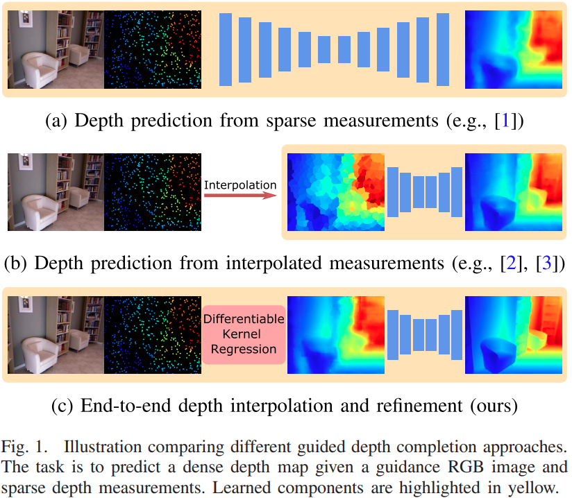
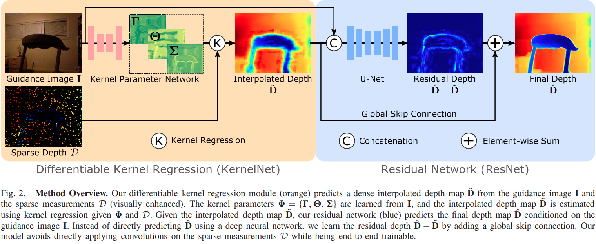

pdf_source: https://april.zju.edu.cn/wp-content/papercite-data/pdf/liu2021lsk.pdf
time: 20210915

# Learning Steering Kernels for Guided Depth Completion

这篇paper研究的是深度补全问题，现有相当一部分的基于学习的深度补全网络都是使用卷积网络对稀疏的深度图直接进行处理 [1](Sparse_and_noisy_LiDAR_completion.md) [2](guideNet.md). 也有一些非learning的方法尝试对深度进行插值，图片是作为其中的一个提示 [3](Deterministic_Guided_LiDAR_Depth_Map_Completion.md). 前者在理论上存在一定的问题，由于稀疏的深度图中有很多像素的'0'是没有特殊的意义的，直接使用卷积进行计算从直觉与理论来说并不合理，且如此网络对于输入点的稀疏度就没有了鲁棒性；后者在理论上经常都比较干净且合理，计算速度也会很快，但是也由于不能数据驱动地学习，对整体的性能有一定的影响，大量的hand-craft操作也影响了后续优化的上限。

这篇paper的特点在于给出一个端到端的完整方案：

- 提出了一个可微分的 kernel regression layer作为可微分插值的方法
- 把插值后结果与RGB图片融合输出真实深度与插值后深度图的残差。

## Kernel Regression

[wiki](https://www.wikiwand.com/en/Kernel_regression)

深度预测值可以由已有的稀疏测量中插值获得，计算表达为:

$$\tilde{\mathbf{D}}(\mathbf{x})=\frac{\sum_{i=1 . . P} \mathbf{K}_{\mathbf{H}}\left(\mathbf{x}_{i}-\mathbf{x}\right) d_{i}}{\sum_{i=1 \ldots P} \mathbf{K}_{\mathbf{H}}\left(\mathbf{x}_{i}-\mathbf{x}\right)}$$

其中 $\tilde{D}$为预测深度， $K_H{x_i - x}$是所谓的核函数，也就是每一个稀疏样本对应的一个权重。输出值正是一个加权平均.

通用的直觉上来说，kernel regression 核回归的本质是一种最近邻插值，得出预测的值可以近似理解为附近样本点之间的插值，近的样本点权重高，远的权重低。进一步的需要设计一个好的核函数，用来计算点的"距离"(可以是图片上的欧氏距离，也可以是Feature的其他特殊度量值), 或者计算基于"距离"的权重值。常用的权重函数是一个高斯函数。

### Data-Independent Kernel

常用的选择是一个固定的高斯核:

$$\mathbf{K}_{\mathbf{H}}\left(\mathbf{x}_{i}-\mathbf{x}\right)=\frac{1}{2 \pi \sqrt{\operatorname{det}\left(\mathbf{H}^{2}\right)}} \exp \left\{-\frac{\left(\mathbf{x}_{i}-\mathbf{x}\right)^{T} \mathbf{H}^{-2}\left(\mathbf{x}_{i}-\mathbf{x}\right)}{2}\right\}$$

接近于简单地基于空间距离的平滑. 通过定义不同的$H \in \mathbb{R}^{2\times 2}$ 可以得到不同的插值和平滑效果.

### Data-Dependent Kernel

$$\mathbf{K}_{\mathbf{H}_{i}}\left(\mathbf{x}_{i}-\mathbf{x}\right)=\frac{1}{2 \pi \sqrt{\operatorname{det}\left(\mathbf{H}_{i}^{2}\right)}} \exp \left\{-\frac{\left(\mathbf{x}_{i}-\mathbf{x}\right)^{T} \mathbf{H}_{i}^{-2}\left(\mathbf{x}_{i}-\mathbf{x}\right)}{2}\right\}$$

其中的H由RGB图片中的每一个点附近的梯度方向决定，每一个点都可以有自己的$H$矩阵，来指示具体方向。

### Differentiable Kernel Regression

定义每一个点上的$H$矩阵为

$$
\begin{aligned}
    H_i &= h \mu_i C_{i}^{-\frac{1}{2}} \\
        &= h \mu_i \gamma_i U_{\theta_i} \Lambda_i U_{\theta_i}^T\\
    U_{\theta_i} &= \begin{bmatrix} \text{cos}\theta_i & \text{sin}\theta_i \\ -\text{sin}\theta_i & \text{cos} \theta_i \end{bmatrix} \\
    \Lambda_i &=  \begin{bmatrix}\sigma_i & 0 \\ 0 & \sigma_i^{-1} \end{bmatrix}
\end{aligned}
$$

其中$h$, $\mu_i$设定为常数。$\gamma, \theta, \sigma$ 分别表达 scaling, rotation以及 elongation.

网络会输出稠密的三个$\Gamma, \Theta, \Sigma$矩阵，用来计算每一个点的Kernel Formulation.整个kernel regression流程会维持可微分。

