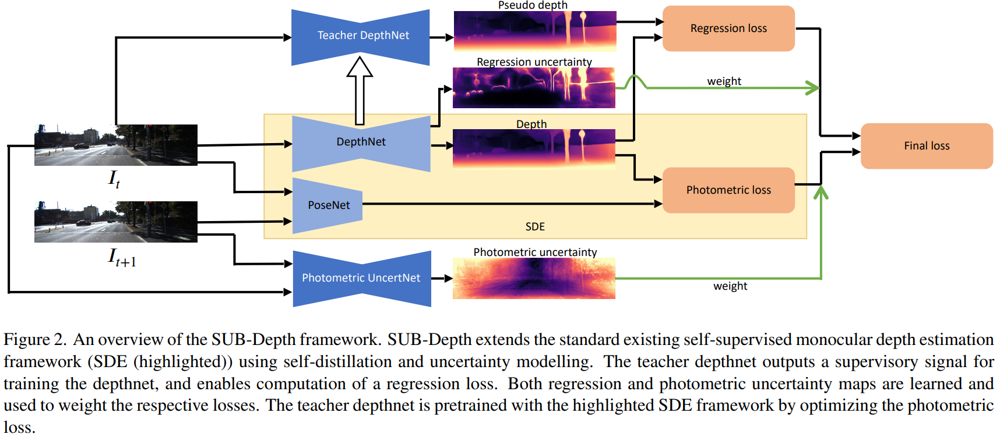

time: 20211207
pdf_source: https://arxiv.org/abs/2111.09692

# SUB-Depth: Self-distillation and Uncertainty Boosting Self-supervised Monocular Depth Estimation

这篇论文在自监督深度预测的问题上引入了蒸馏以及不确定性估计。

## 网络架构

教师网络输出一个监督信号，给自网络训练，教师网络是用自监督预训练，只使用高亮的基本方案训练。

尽管教师网络的训练方法仍然还只是用原来的无监督方案训练，实验证明这样的self-distillation也能有提升，

不确定性上，把系统的不确定性建模为Laplace分布(L1训练)， 分别时图片重建的不确定性以及自蒸馏的不确定性。

$$l_{reconstruction} = \frac{l_{photometric}}{\sigma_{pho}} + log(\sigma_{pho})$$

$$l_{distillation} = \frac{l_{regression}}{\sigma_{reg}} + log(\sigma_{reg})$$

