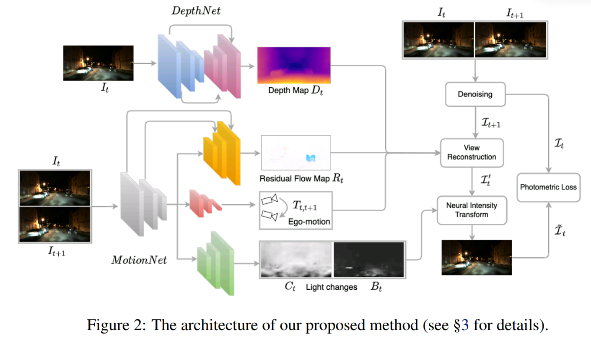

time: 20220708
pdf_source: https://arxiv.org/abs/2206.13850

# When the Sun Goes Down: Repairing Photometric Losses for All-Day Depth Estimation

这篇paper解决的是在夜间环境下的monodepth2训练问题。

首先作者总结了一下monodepth2训练需要的假设：

- 时序上光照的一致性
- 静止场景
- 没有图片噪声与遮挡

在白天环境下，主要的光源是太阳光，太阳光只会随着时间缓慢变化，但是在夜晚环境下，主要的光源是路灯、车灯等点光源，随着摄像机与这些光源的位置变化，画面整体的光照会有比较大的变化，车灯的点光源更是运动物体。且相机为了拍摄夜晚的图片，往往会有比较大的随机噪点；且随着相机曝光时间的增长，图片中动态物体的动态模糊会更加严重。

整体的计算公式

$$
\begin{aligned}
D_{t} &=\mathcal{D}\left(I_{t}\right), f_{n}=\mathcal{M} \mathcal{E}_{1: n}\left(\left[I_{t}, I_{t+1}\right]\right) \\
T_{t, t+1} &=\mathcal{M D}\left(f_{N}\right), R_{t}=\mathcal{R F} \mathcal{F}\left(\left\{f_{n}: 1 \leq n \leq N\right\}\right),\left(C_{t}, B_{t}\right)=\mathcal{L C D}\left(f_{N}\right) \\
\mathcal{I}_{t} &=\mathcal{D N}\left(I_{t}\right), \mathcal{I}_{t+1}=\mathcal{D N}\left(I_{t+1}\right) \\
\mathcal{I}_{t}^{\prime} &=\operatorname{reconstruct}\left(\mathcal{I}_{t+1}, V_{t}+R_{t}\right) \\
\tilde{\mathcal{I}}_{t} &=C_{t} \odot \mathcal{I}_{t}^{\prime}+B_{t} \\
L_{p}^{(t)} &=\frac{1}{\left|M_{t}\right|} \sum_{\mathbf{u} \in M_{t}}\left(\alpha \frac{1-\operatorname{SSIM}\left(\mathcal{I}_{t}(\mathbf{u}), \tilde{\mathcal{I}}_{t}(\mathbf{u})\right)}{2}+(1-\alpha)\left|\mathcal{I}_{t}(\mathbf{u})-\tilde{\mathcal{I}}_{t}(\mathbf{u})\right|\right)
\end{aligned}
$$

与monodepth2附加的主要内容是:

- 使用一个无监督的去噪声网络$\mathbf{DN}$在计算损失的时候进行去噪。采用的方案是neighbour2neighbour.
- 使用网络预测一个 pixel-wise residual flow $R_t$, 在重建图片的时候对重投影坐标加一个偏移。
- 使用网络预测一个 pixel-wise photometric augmentation. $C_t, B_t$如公式使用。
- 损失函数除了原有的photometric loss函数之外，还加上residual flow的sparcity regularization.

$$
L_{r}^{(t)}=\sum_{s=0}^{3}\left\langle\left|R_{t, s}\right|\right\rangle / 2^{s} \sum_{\mathbf{u} \in \Omega\left(I_{t, s}\right)} \sqrt{1+\left|R_{t, s}(\mathbf{u})\right| /\left\langle\left|R_{t, s}\right|\right\rangle}
$$
