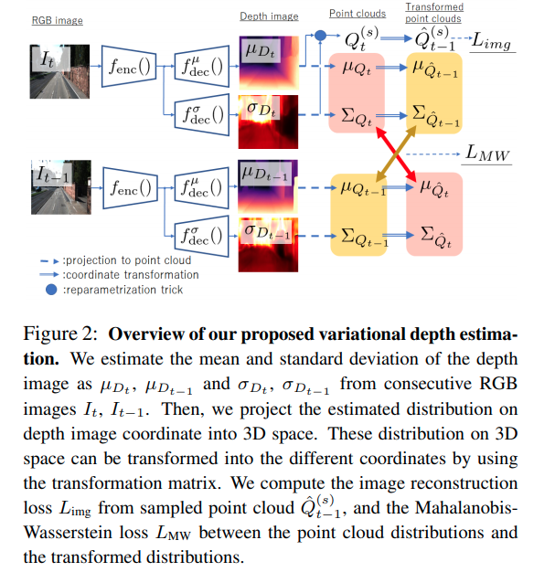

time: 20201129
pdf_source: https://arxiv.org/pdf/2011.11912.pdf

# Variational Monocular Depth Estimation for Reliability Prediction

这篇paper以网络输出每个点的深度的概率值为独立的高斯分布为基础，正面地从概率推导了单目深度的variational inference 方法.

## From Probabilistic to Loss function

设图片序列$\mathcal{I} = \{I_0, ..., I_{N_t}\}$. 假设深度图是由点云$Q$这一隐变量决定的. 

从图片中估计出点云的概率记为$p_{\theta^*}(Q_{t-1} | I_{t-1})$. 下一时刻的图片也是有相同的点云生成的 $p_{\theta^*}(I_t | I_{t-1}, Q_{t-1})$

$$\theta^*  = \underset{\theta}{\text{argmax}} \log p_\theta(\mathcal{I})$$

定义每一个点$Q_{t-1, j}$ variational posterior $q_\phi(Q_{t-1} | I_{t-1}, I_t) = \mathcal{N}(T[\mu^T_{Q_{t-1},j}, 1]^T, R\Sigma_{Q_{t-1, j}}R^T)$. 可以理解为$t-1$时刻生成的点云在$t$时刻坐标系下的不确定度.

$$
\begin{aligned}
\log &p\left(I_{t} \mid I_{t-1}\right) \\
=& \log \int p_{\theta}\left(I_{t} \mid I_{t-1}, Q_{t-1}\right) p_{\theta}\left(Q_{t-1} \mid I_{t-1}\right) d Q_{t-1} \\
=& \log \int q_{\phi}\left(Q_{t-1} \mid I_{t}, I_{t-1}\right) \\
\quad & \cdot \frac{p_{\theta}\left(I_{t} \mid I_{t-1}, Q_{t-1}\right) p_{\theta}\left(Q_{t-1} \mid I_{t-1}\right)}{q_{\phi}\left(Q_{t-1} \mid I_{t}, I_{t-1}\right)} d Q_{t-1} \\
\geq & \int q_{\phi}\left(Q_{t-1} \mid I_{t}, I_{t-1}\right) \\
\quad & \cdot \log \frac{p_{\theta}\left(I_{t} \mid I_{t-1}, Q_{t-1}\right) p_{\theta}\left(Q_{t-1} \mid I_{t-1}\right)}{q_{\phi}\left(Q_{t-1} \mid I_{t}, I_{t-1}\right)} d Q_{t-1} \\
=&-\int q_{\phi}\left(Q_{t-1} \mid I_{t}, I_{t-1}\right) \log q_{\phi}\left(Q_{t-1} \mid I_{t}, I_{t-1}\right) d Q_{t-1} \\
&+\int q_{\phi}\left(Q_{t-1} \mid I_{t}, I_{t-1}\right) \log p_{\theta}\left(Q_{t-1} \mid I_{t-1}\right) d Q_{t-1} \\
&+\int q_{\phi}\left(Q_{t-1} \mid I_{t}, I_{t-1}\right) \log p_{\theta}\left(I_{t-1}\right) \\
= &- H[q_\phi(Q_{t-1} | I_t, I_{t-1})]\\
&+\mathbb{E}_{q_{\phi}\left(Q_{t-1} \mid I_{t}, I_{t-1}\right)}\left[\log p_{\theta}\left(Q_{t-1} \mid I_{t-1}\right)\right] \\
&+\mathbb{E}_{q_{\phi}\left(Q_{t-1} \mid I_{t}, I_{t-1}\right)}\left[\log p_{\theta}\left(I_{t-1} \mid Q_{t-1}, I_{t-1}\right)\right]
\end{aligned}
$$

其中：

$H[q_\phi(Q_{t-1} | I_t, I_{t-1})]$ 为高斯分布的熵， 可以证明高斯分布的熵仅与其方差有关 $h(X) = \ln(\sigma\sqrt{2\pi})$

$p_\theta(Q_{t-1,i}| I_{t-1}$ 定义为 
$$
p_{\theta}\left(Q_{t-1, i} \mid I_{t-1}\right)=\prod_{j=1}^{N} \mathcal{N}\left(\mu_{Q_{t-1, j}}, \Sigma_{Q_{t-1, j}}\right)^{\pi_{t-1}^{(i, j)}}
$$ 
其中$\pi$是$t, t-1$时刻点的0,1对应值。作者要求两帧点云的点一一对应，

$$
\begin{aligned}
& \frac{1}{S} \sum_{s=1}^{S} \log \prod_{i=1}^{N} \prod_{j=1}^{N} \mathcal{N}\left(\hat{Q}_{t-1}^{(s)} \mid \mu_{Q_{t-1, j}}, \Sigma_{Q_{t-1, j}}\right)^{\pi_{t-1}^{(i, j)}} \\
=&-\frac{1}{2} \sum_{j=1}^{N} \log \left|\Sigma_{Q_{t-1, j}}\right|-\frac{1}{2 S} \sum_{s=1}^{S} \sum_{i=1}^{N} \sum_{j=1}^{N} \pi_{t-1}^{(i, j)} \Delta_{t-1}^{(i, j)}+C
\end{aligned}
$$

## 网络输出结构

$\Delta_{t-1}^{(i,j)} = (\hat Q_{t-1}^{(s)} - \mu Q_{t-1,j}) \Sigma^{-1}_{Q_{t-1,j}}(\hat Q_{t-1}^{(s)} - \mu Q_{t-1,j})^T$, 是将T时刻的点云投回T-1时刻后的匹配损失。 $\pi\Delta$关于$\pi$的最小化可以用一个[Optimal Transport](../Summaries/Collections_StereoMatching_KITTI.md) 来求解这个一一对应问题.

第三项则可以理解为重建:

$$
\frac{1}{S} \sum_{s=1}^{S} \log \mathcal{N}\left(\hat{I}_{t}^{(s)}, \Sigma_{I_{t}}\right)=-\frac{\lambda_{\mathrm{img}}}{S} \sum_{s=1}^{S}\left\|I_{t}-\hat{I}_{t}^{(s)}\right\|_{2}^{2}+C
$$
