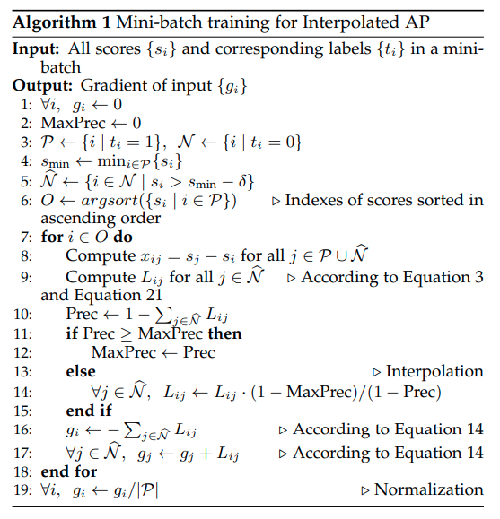

time: 20200921
pdf_source: https://arxiv.org/pdf/2008.07294v1.pdf
code_source: https://github.com/cccorn/AP-loss

# AP-Loss for Accurate One-Stage Object Detection

这篇TPAMI paper 将 average precision 这个detection的评判标准变为可以直接优化的loss(gradient 产生的依据)。

本文提出这个AP loss,作者声称能更好的处理正负样本比例失调以及类别之间样本失调的问题。但是 average precision的计算是无法求导的，本文结合 perceptron learning algorithm 的思想给出梯度的计算方式。最终这个AP loss可以像是一般的loss一样嵌入在目标检测框架中。

## Background of Perceptron Learning Algorithm

[blog](https://towardsdatascience.com/perceptron-learning-algorithm-d5db0deab975)  [wiki](https://www.wikiwand.com/en/Perceptron#/Learning_algorithm)

### 基本更新算法
Perceptron learning algorithm 是给单神经元分类器训练的算法，是一个gradient-free的算法，其思路是error-driven update. 也即是说更新步长直接来源于目标输出以及当前输出的差值.

1. 初始化权重
2. 计算输出权重 $y = sign(w^T x)$
3. 更新权重$w(t+1) = w(t) + \alpha (y_{des} - y_t)x$

### Convergence

单层神经元是一个线性分类器;如果数据线性可分，有证明这个算法会收敛，且step数量有上限，但是不能保证解的质量；如果数据不可分，算法不会收敛到一个接近的解，而是会坏掉。

## AP Loss Computation

[code](https://github.com/cccorn/AP-loss/blob/master/lib/model/aploss.py)

AP Loss $\mathcal{L}_{AP}$定义为$1 - AP$. 而插值AP的计算方式可见 [evaluation metrics](../../3dDetection/Metric_3d.md).

这里采用了 rank-based 的描述方式进行入手
$$\begin{array}{l}
\mathcal{L}_{A P}=1-\mathrm{AP}=1-\frac{1}{|\mathcal{P}|} \sum_{i \in \mathcal{P}} \frac{\operatorname{rank}^{+}(i)}{\operatorname{rank}(i)} \\
=1-\frac{1}{|\mathcal{P}|} \sum_{i \in \mathcal{P}} \frac{1+\sum_{j \in \mathcal{P}, j \neq i} H\left(x_{i j}\right)}{1+\sum_{j \in \mathcal{P}, j \neq i} H\left(x_{i j}\right)+\sum_{j \in \mathcal{N}} H\left(x_{i j}\right)} \\
=\frac{1}{|\mathcal{P}|} \sum_{i \in \mathcal{P}} \sum_{j \in \mathcal{N}} L_{i j}=\frac{1}{|\mathcal{P}|} \sum_{i, j} L_{i j} \cdot y_{i j}=\frac{1}{|\mathcal{P}|}\langle\boldsymbol{L}(\boldsymbol{x}), \boldsymbol{y}\rangle
\end{array}$$

几个符号:

- $rank(i), rank^+(i)$指该样本的score在所有正确匹配的样本以及所有正样本(网络输出为正即可)中的score 排名
- $\mathcal{P}, \mathcal{N}$ 分别指annotation中的正样本与负样本的集合。
- $H(x_{ij})$在这个阶段是一个阶跃函数，$x_{ij} = s_j - s_i$嵌套的结果既是如果$j$比$i$ score更高，则为1否则为0.

几个解释：论文中是先介绍了几个化简用的中间函数$L, H$等，然后再入手计算$AP$，但是对于理解AP前后向运算的逻辑来说，中间量并不必要，就是一个化简的方式而已

算法:



其中输入$s_i, t_i$形状为$[B, N, C]$, $t_i \in \{-1, 0, 1\}$, 其中-1指省略。

循环中则是可以理解为threshold逐步提升,recall逐渐下降的过程。注意计算precision时，本文采用的是分段step function,可以理解为soft positive & negative label.

$$f(x)=\left\{\begin{array}{cc}
0, & x<-\delta \\
\frac{x}{2 \delta}+0.5, & -\delta \leq x \leq \delta \\
1, & \delta<x
\end{array}\right.$$

代码实现上还有paper里面几个有的点：
1. 梯度与forward是一起计算的，因而作者是写成了一个functional,并重载其backward来实现的。
2. mini-batch training，作者担心不同image之间会有score-shift使得AP的计算不准确。(极端的情况下一张图的最低score高于另一张图的最高score)，因而batch ranking是必须的
3. 对最小的负样本点直接舍弃，如果一些负样本点score很低了就不会参与梯度的计算,后面大幅度加速计算。

```python
def AP_loss(logits:torch.Tensor,targets:torch.Tensor):
    """
    logits: Conv output, shape [B, N, Classes] (flatten from multi-scale)
    targets: Int Tensor, shape [B, N, Classes] (-1: ignore, 0: negative, 1:positive)
    """
    
    delta=1.0 # delta paramater for piecewise Step function -> soft step function

    grad=torch.zeros(logits.shape).cuda()
    metric=torch.zeros(1).cuda()

    if torch.max(targets)<=0:
        return grad, metric
  
    labels_p=(targets==1)
    fg_logits=logits[labels_p]
    threshold_logit=torch.min(fg_logits)-delta

    ######## Ignore those negative j that satisfy (L_{ij}=0 for all positive i), to accelerate the AP-loss computation.
    valid_labels_n=((targets==0)&(logits>=threshold_logit))
    valid_bg_logits=logits[valid_labels_n] 
    valid_bg_grad=torch.zeros(len(valid_bg_logits)).cuda()
    ########

    fg_num=len(fg_logits)
    prec=torch.zeros(fg_num).cuda()
    order=torch.argsort(fg_logits)
    max_prec=0

    for ii in order:
        tmp1=fg_logits-fg_logits[ii] 
        tmp1=torch.clamp(tmp1/(2*delta)+0.5,min=0,max=1)
        tmp2=valid_bg_logits-fg_logits[ii]
        tmp2=torch.clamp(tmp2/(2*delta)+0.5,min=0,max=1)
        a=torch.sum(tmp1)+0.5
        b=torch.sum(tmp2)
        tmp2/=(a+b)
        current_prec=a/(a+b)
        if (max_prec<=current_prec):
            max_prec=current_prec
        else:
            tmp2*=((1-max_prec)/(1-current_prec))
        valid_bg_grad+=tmp2
        prec[ii]=max_prec 

    grad[valid_labels_n]=valid_bg_grad
    grad[labels_p]=-(1-prec) 

    fg_num=max(fg_num,1)

    grad /= (fg_num)
    
    metric=torch.sum(prec,dim=0,keepdim=True)/fg_num

    return grad, 1-metric
```