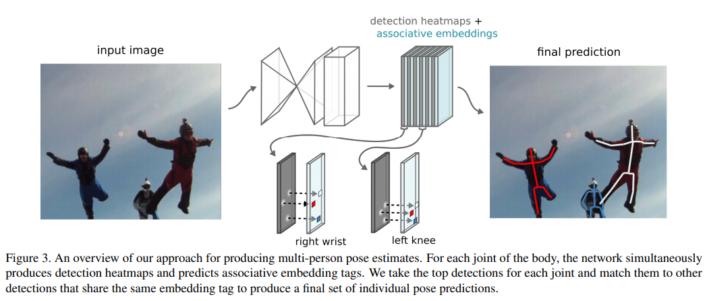

time:20191014
pdf_source:https://arxiv.org/pdf/1611.05424.pdf
code_source:https://github.com/princeton-vl/pose-ae-train
short_title: Associative Embedding
# Associative Embedding: End-to-End Learning for Joint Detection and Grouping

这篇论文对我来说是[CornerNet](CornerNet_Detecting_Objects_as_Paired_Keypoints.md)的前置.两篇也是同一个作者。

## Associative Embedding 简介

这篇论文使用1D embedding，目的是训练网络对来自同一个group的detection输出相似的tags，different tags for detection。

## Stacked Hourglass Architecture

hourglass结构可以在[这篇论文](../../Building_Blocks/Stacked_Hourglass_Networks_for_Human_Pose_Estimation.md)看到也在[CornerNet](CornerNet_Detecting_Objects_as_Paired_Keypoints.md)这篇论文用过，大家稍有不同，不过总体思路一致。

## 多人肢体估计

本文使用前面的backbone预测每一个pixel的detection score for each joint("left writst", "right shoulder")，

要进一步完成整个keypoint detections。如果有$m$个关节,则输出$2m$个channel,其中$m$个作为detection的heatmap, $m$个作为grouping的
tags。

整个cost:

$$
\begin{aligned} L_{g}(h, T)=& \frac{1}{N} \sum_{n} \sum_{k}\left(\bar{h}_{n}-h_{k}\left(x_{n k},\right)\right)^{2} \\ &+\frac{1}{N^{2}} \sum_{n} \sum_{n^{\prime}} \exp \left\{-\frac{1}{2 \sigma^{2}}\left(\bar{h}_{n}-\bar{h}_{n^{\prime}}\right)^{2}\right\} \end{aligned}
$$

其中$h(x)$是pixel $x$对应的tag value。$T = {(x_{nk})}$,其中$x_{nk}$是第$n$个人的第$k$个身体关节的pixel位置.$\bar{h}_{n}=\frac{1}{K} \sum_{k} h_{k}\left(x_{n k}\right)$

inference时的流程

首先对第一个关节，给一个阈值，然后做non-max suppression.得到各个人物的初始估计。

之后对其他每一个关节，做一个maximum matching，同时基于tag value以及detection score。